# SQL Learning Path

This repository contains a structured, multi-part learning path for mastering SQL, from fundamental concepts to advanced, real-world query skills.

---

**Repository Content Overview:**

```mermaid
graph TB
    subgraph "📚 Learning Materials"
        A[learning-path.md<br/>Master Index & Roadmap]
        B[GLOSSARY.md<br/>Key Terms & Definitions]
    end
    
    subgraph "🏗️ Core Content"
        C[fundamentals/<br/>6 Files<br/>Basic SQL Skills]
        D[theory/<br/>4 Files<br/>Database Concepts]
        E[advanced/<br/>6 Files<br/>Complex Techniques]
    end
    
    subgraph "🔧 Practical Applications"
        F[practical/<br/>5 Files<br/>Real-world Tasks]
        G[ops/<br/>3 Files<br/>Operations & Security]
    end
    
    subgraph "🎯 Practice & Testing"
        H[exercises/<br/>Practice Problems]
        I[devtools/<br/>Testing Framework]
    end
    
    A --> C
    A --> D
    A --> E
    A --> F
    A --> G
    
    C --> H
    D --> H
    E --> H
    F --> H
    G --> H
    
    J[Docker Environment] -.-> I
    K[PostgreSQL] -.-> J
    L[Sample Data] -.-> J
    M[Smoke Tests] -.-> I
```


**Content Distribution by Difficulty:**


**Learning Progression Timeline:**


**Technology Stack:**

```mermaid
graph TB
    subgraph "🗄️ Databases"
        A[(PostgreSQL<br/>Primary)]
        B[(MySQL<br/>Examples)]
        C[(SQL Server<br/>References)]
        D[(SQLite<br/>Testing)]
    end
    
    subgraph "🛠️ Tools"
        E[Docker<br/>Environment]
        F[pgTAP<br/>Testing]
        G[PostgreSQL<br/>Client]
        H[Mermaid<br/>Diagrams]
    end
    
    subgraph "📊 Content"
        I[Markdown<br/>Documentation]
        J[SQL Examples<br/>All Dialects]
        K[Visual Diagrams<br/>70+ Charts]
        L[Interactive<br/>Exercises]
    end
    
    subgraph "🚀 Deployment"
        M[GitHub<br/>Hosting]
        N[GitHub Actions<br/>CI/CD]
        O[Docker Hub<br/>Images]
    end
    
    A --> E
    B --> F
    C --> G
    
    E --> M
    F --> N
    G --> O
    
    I --> M
    J --> M
    K --> M
    L --> N
```


**Quick Reference Guide:**


---

## Structure

The content is organized into topic-based folders. The recommended starting point is the **Master Index**.

- **[learning-path.md](learning-path.md)**: The master index for the entire learning path. It provides a structured route through all the content.
- **`fundamentals/`**: The starting point for beginners. Covers all core SQL concepts.
- **`theory/`**: Contains documents on the fundamental concepts of SQL and databases.
- **`practical/`**: Holds hands-on guides for common, practical database tasks.
- **`advanced/`**: Covers powerful, advanced SQL features for complex problems.
- **`ops/`**: Includes topics related to database operations, security, and maintenance.
- **`exercises/`**: Contains practice problems and solutions.
- **`GLOSSARY.md`**: A glossary of key SQL terms.

## How to Use

1.  Start with the **[learning-path.md](learning-path.md)** file. It provides a structured path through all the topics.
2.  If you are a beginner, start with the **`fundamentals/`** section.
3.  Use the learning path to navigate to the different sections in the `theory`, `practical`, `advanced`, and `ops` folders.
4.  Refer to the `GLOSSARY.md` for definitions of key terms.

Quickstart (local)
1. Install Docker and Docker Compose.
2. From repo root run:

```bash
cd /home/arif/projects/sql-learning
docker-compose -f devtools/docker/docker-compose.yml up --build -d
# wait a few seconds for DB to initialize
./devtools/tests/sql-smoke/run_tests.sh
```

This brings up a local PostgreSQL with seeded sample data and runs a small smoke test.

Contributing & roadmap
- See `CONTRIBUTING.md` and `devtools/TODO.md` for next steps and how to contribute new content.

If you don't have Docker/compose available locally

1. Install `psql` (Postgres client).
2. Create a local Postgres and run the seed SQL in `devtools/docker/seed/seed.sql` manually.
3. Run `./devtools/tests/sql-smoke/run_tests.sh` to execute smoke queries.
