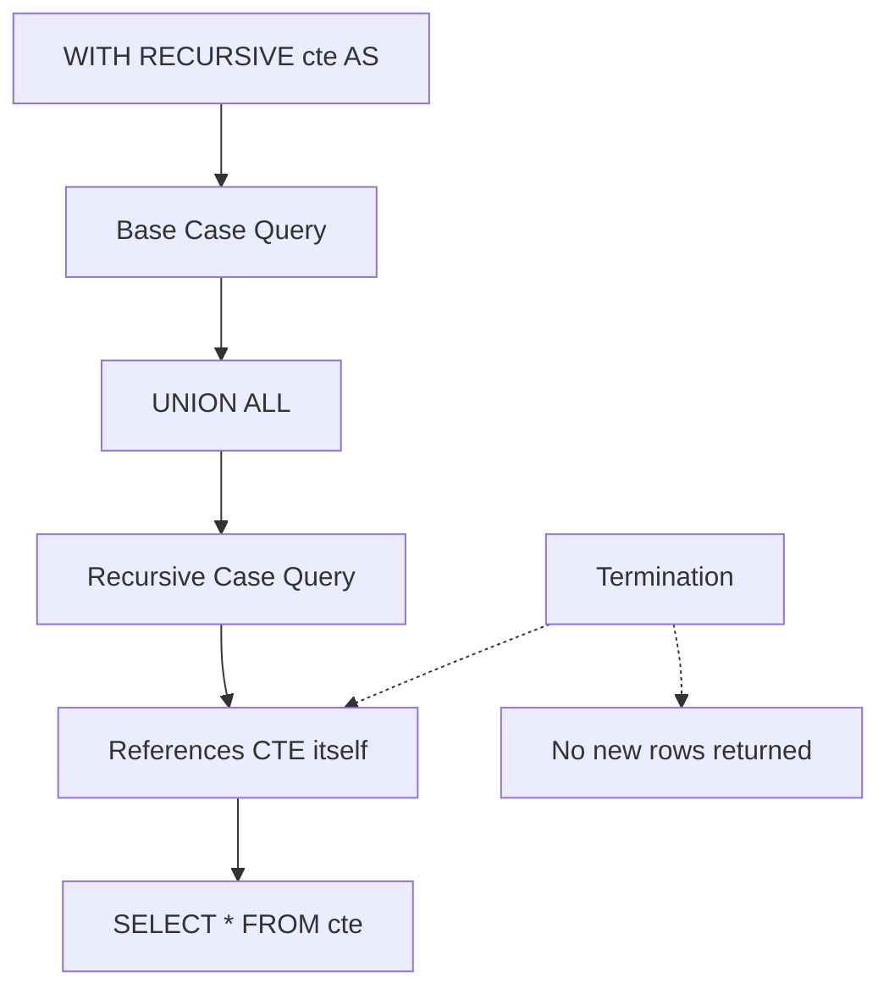
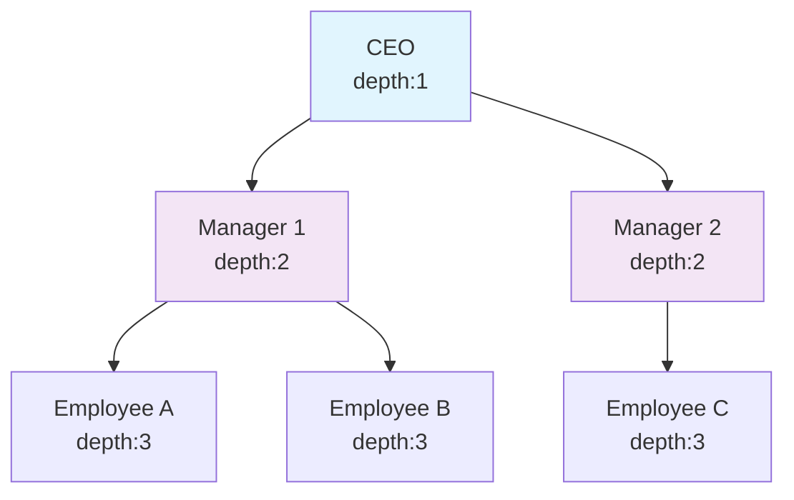
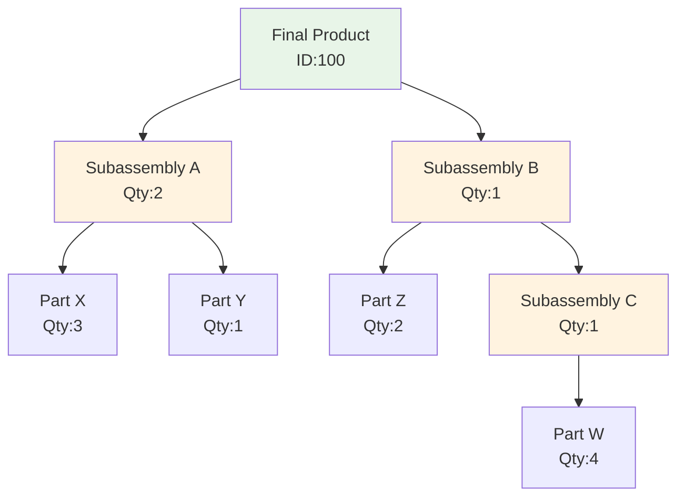

# Recursive CTEs & Hierarchies

**Level:** Advanced  
**Time Estimate:** 35 minutes  
**Prerequisites:** CTEs, joins, hierarchies.

## TL;DR
Recursive CTEs handle hierarchical data like org charts or BOMs using WITH RECURSIVE for self-referencing queries.

## Learning Objectives
By the end of this lesson, you'll be able to:
- Write recursive CTEs for tree structures.
- Handle depth limits and cycles.
- Apply to real-world hierarchies.

## Motivation & Real-World Scenario
Managing employee hierarchies or product assemblies requires traversing parent-child relationships. Recursive CTEs make this efficient without loops.

## Theory: Recursive CTE Structure

### Base Case
- Initial non-recursive query.

### Recursive Case
- References the CTE itself.
- UNION ALL combines results.
- Termination when no new rows.

**Visual Structure of Recursive CTE:**


## Worked Examples

### Organizational Hierarchy
```sql
WITH RECURSIVE org AS (
    SELECT id, name, manager_id, 1 AS depth, name::text AS path
    FROM employees
    WHERE manager_id IS NULL
    UNION ALL
    SELECT e.id, e.name, e.manager_id, o.depth + 1, o.path || ' > ' || e.name
    FROM employees e
    JOIN org o ON e.manager_id = o.id
)
SELECT * FROM org ORDER BY depth, name;
```

**Visual Hierarchy Traversal:**


### Bill-of-Materials (BOM)
```sql
WITH RECURSIVE parts(item_id, child_id, qty, level) AS (
    SELECT parent_item_id, child_item_id, qty, 1 FROM bom WHERE parent_item_id = 100
    UNION ALL
    SELECT p.item_id, b.child_item_id, p.qty * b.qty, level + 1
    FROM parts p
    JOIN bom b ON p.child_id = b.parent_item_id
)
SELECT child_id, SUM(qty) AS total_qty FROM parts GROUP BY child_id;
```

**Visual BOM Assembly Tree:**


## Quick Checklist / Cheatsheet
- Base: Non-recursive seed.
- Recursive: Self-reference with UNION ALL.
- Terminate: When recursive part returns no rows.

## Exercises

1. **Easy:** Build hierarchy for employees under manager ID 1.
2. **Medium:** Add cycle detection to prevent infinite loops.
3. **Hard:** Compute total cost in BOM with pricing.

## Solutions

1. `WITH RECURSIVE ... WHERE manager_id = 1 ...`
2. Add a visited set or depth limit.
3. Join with prices table and aggregate.

## Notes: Vendor Differences / Performance Tips
- PostgreSQL/MySQL: Full support.
- SQL Server: WITH RECURSIVE.
- Limit depth to avoid stack overflows.

## Next Lessons
- Lateral Joins (for correlated subqueries).

