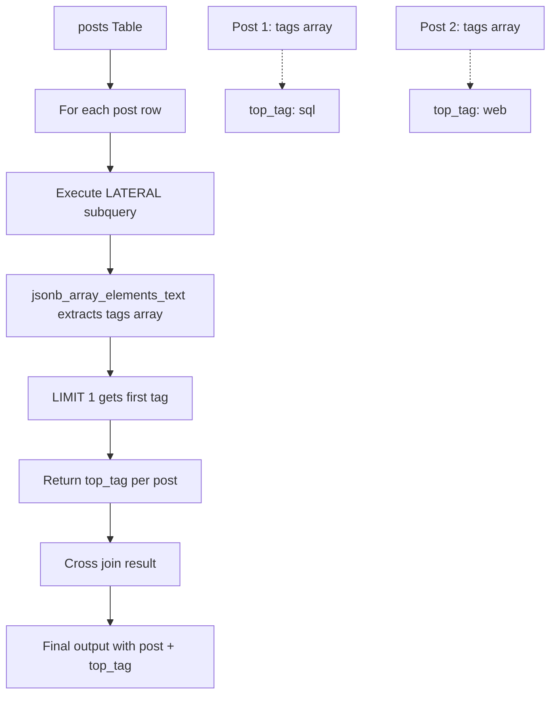

# Lateral Joins and JSON Functions

**Level:** Advanced  
**Time Estimate:** 30 minutes  
**Prerequisites:** Joins, subqueries, JSON.

## TL;DR
LATERAL allows correlated subqueries in FROM; JSON functions query semi-structured data efficiently.

## Learning Objectives
By the end of this lesson, you'll be able to:
- Use LATERAL for correlated subqueries.
- Query JSON/JSONB with operators.
- Index and optimize JSON data.

## Motivation & Real-World Scenario
Handling user preferences as JSON or finding top items per group requires advanced joins and JSON handling for flexible schemas.

## Theory: LATERAL and JSON

### LATERAL
- References outer query columns in subquery.
- Enables correlated computations per row.

### JSON Operators (Postgres)
- `->`: Access field.
- `->>`: As text.
- `@>`: Contains.

**LATERAL vs Regular Joins:**
```
Regular JOIN:
posts p ──── tags t
  │           │
  └── p.id ───┼─ t.post_id
              │
           Result

LATERAL JOIN:
posts p ──── LATERAL subquery
  │              │
  └── p.tags ───┼─ jsonb_array_elements(p.tags)
                 │
              Result (per-row computation)
```

## Worked Examples

### LATERAL Example
```sql
SELECT p.id, p.name, s.top_tag
FROM posts p
CROSS JOIN LATERAL (
    SELECT tag as top_tag FROM jsonb_array_elements_text(p.tags) tag LIMIT 1
) s;
```

**LATERAL Execution Flow:**


### JSON Querying
```sql
SELECT data->>'user_id' AS user_id, data->>'type' AS event_type
FROM events
WHERE data @> '{"user_id": 123}';
```

**JSON Operators & Structure:**
```
JSON Document: {"user_id": 123, "type": "login", "details": {"ip": "192.168.1.1"}}

Operators:
├── data->'user_id'     → 123 (JSON)
├── data->>'user_id'    → "123" (text)
├── data->'details'     → {"ip": "192.168.1.1"} (JSON)
├── data->'details'->>'ip' → "192.168.1.1" (text)
├── data @> '{"user_id": 123}' → true (contains)
└── data ? 'type'       → true (key exists)

Query Flow:
1. Parse JSON column
2. Apply operators
3. Filter rows
4. Extract values
```

### Indexing JSON
```sql
CREATE INDEX idx_events_data_gin ON events USING GIN (data);
```

## Quick Checklist / Cheatsheet
- LATERAL: For per-row subqueries.
- JSON: Use -> for access, GIN for indexing.

## Exercises

1. **Easy:** Get first tag per post using LATERAL.
2. **Medium:** Query events by nested JSON field.
3. **Hard:** Optimize JSON queries with indexes.

## Solutions

1. `CROSS JOIN LATERAL (SELECT ... LIMIT 1)`
2. `WHERE data->'details'->>'status' = 'active'`
3. `CREATE INDEX ... USING GIN`

## Notes: Vendor Differences / Performance Tips
- Postgres: Best JSON support.
- MySQL: JSON functions since 5.7.
- Index JSON for performance.

## Next Lessons
- Temporal Tables (for time-based data).

