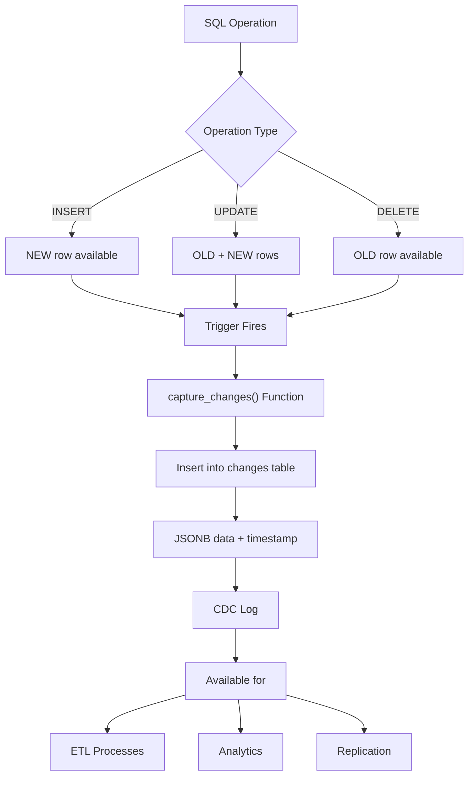

# Temporal Tables and Change Data Capture

**Level:** Advanced  
**Time Estimate:** 40 minutes  
**Prerequisites:** Transactions, auditing.

## TL;DR
Temporal tables track data changes over time; CDC captures modifications for replication or analytics.

## Learning Objectives
By the end of this lesson, you'll be able to:
- Implement temporal tables for history.
- Set up CDC with triggers or logs.
- Query historical data.

## Motivation & Real-World Scenario
Auditing salary changes or tracking inventory requires seeing data as it was at any point in time.

## Theory: Temporal and CDC

### Temporal Tables
- System-versioned: Automatic history.
- Application-managed: Manual versioning.

### CDC
- Capture inserts/updates/deletes.
- Use for ETL or real-time sync.

**Visual Overview:**
```
Temporal Tables: Time Travel for Data
┌─────────────────────────────────────┐
│ Current Table                       │
│ +─────────────┬─────────────┬───────┤
│ │ Employee    │ Salary      │ Valid │
│ │             │             │ Range │
│ +─────────────┼─────────────┼───────┤
│ │ John        │ $50,000     │ ──────┼──► Now
│ └─────────────┴─────────────┴───────┘
│ 
│ History Table (Automatic)
│ +─────────────┬─────────────┬─────────────┐
│ │ Employee    │ Salary      │ Valid Range │
│ +─────────────┼─────────────┼─────────────┤
│ │ John        │ $45,000     │ Jan-Mar     │
│ │ John        │ $40,000     │ Oct-Dec     │
│ └─────────────┴─────────────┴─────────────┘
└─────────────────────────────────────┘

CDC: Change Capture for Replication
┌─────────┐    ┌─────────┐    ┌─────────┐
│ Source  │───▶│ Capture │───▶│ Target  │
│ DB      │    │ Changes │    │ DB      │
└─────────┘    └─────────┘    └─────────┘
     │              │              │
     ▼              ▼              ▼
  INSERT         Log Event     Replicate
  UPDATE         to Queue      to Target
  DELETE
```

## Worked Examples

### Temporal Table (SQL Server)
```sql
CREATE TABLE employees (
    id INT IDENTITY PRIMARY KEY,
    name NVARCHAR(100),
    salary DECIMAL(10,2),
    valid_from DATETIME2 GENERATED ALWAYS AS ROW START,
    valid_to DATETIME2 GENERATED ALWAYS AS ROW END,
    PERIOD FOR SYSTEM_TIME (valid_from, valid_to)
) WITH (SYSTEM_VERSIONING = ON (HISTORY_TABLE = dbo.employees_history));
```

**Visual Timeline of Changes:**
```
Employee: John Doe
Salary History:

Time ──────────────────────────────────────────────►
     │
2023 │  ┌─────────────────────────────────────────┐
     │  │ Salary: $40,000                         │
     │  │ Valid: 2023-01-01 to 2023-06-30         │
     │  └─────────────────────────────────────────┘
     │
2024 │           ┌─────────────────────────────────┐
     │           │ Salary: $45,000                 │
     │           │ Valid: 2023-07-01 to 2024-03-31 │
     │           └─────────────────────────────────┘
     │
2025 │                        ┌───────────────────┐
     │                        │ Salary: $50,000   │
     │                        │ Valid: 2024-04-01 │
     │                        │ to current        │
     │                        └───────────────────┘

Query: FOR SYSTEM_TIME AS OF '2023-12-01'
Result: Returns $45,000 (active salary at that time)
```

### CDC (Postgres with Triggers)
```sql
CREATE TABLE changes (id SERIAL, table_name TEXT, operation TEXT, data JSONB, changed_at TIMESTAMP);
CREATE OR REPLACE FUNCTION capture_changes() RETURNS TRIGGER AS $$
BEGIN
    INSERT INTO changes (table_name, operation, data, changed_at)
    VALUES (TG_TABLE_NAME, TG_OP, row_to_json(OLD), now());
    RETURN COALESCE(NEW, OLD);
END;
$$ LANGUAGE plpgsql;
CREATE TRIGGER cdc_trigger AFTER INSERT OR UPDATE OR DELETE ON employees
FOR EACH ROW EXECUTE FUNCTION capture_changes();
```

**Visual CDC Trigger Flow:**


## Quick Checklist / Cheatsheet
- Temporal: FOR SYSTEM_TIME queries.
- CDC: Triggers or WAL parsing.

## Exercises

1. **Easy:** Query historical salary for an employee.
2. **Medium:** Set up CDC on a table.
3. **Hard:** Implement point-in-time recovery.

## Solutions

1. `SELECT * FROM employees FOR SYSTEM_TIME AS OF '2023-01-01'`
2. Create audit table and trigger.
3. Use CDC logs to replay changes.

## Notes: Vendor Differences / Performance Tips
- SQL Server: Native temporal.
- Postgres: Manual or extensions.
- Index temporal columns.

## Next Lessons
- Vendor Notes (for RDBMS differences).

