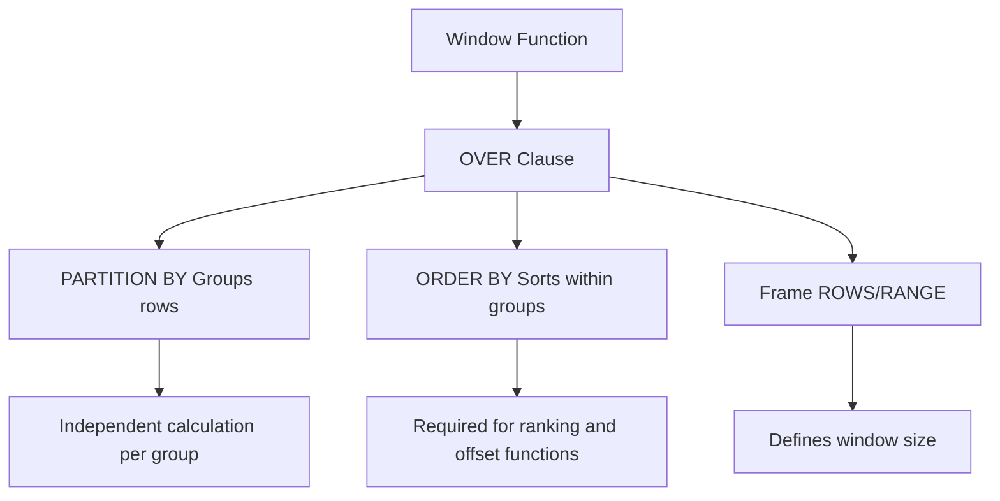

# Window Functions

**Level:** Advanced  
**Time Estimate:** 45 minutes  
**Prerequisites:** Intermediate SQL, aggregations.

## TL;DR
Window functions perform calculations across a set of table rows that are somehow related to the current row. Unlike aggregate functions, they do not collapse rows; they return a value for each row.

## Motivation & Real-World Scenario
Imagine you need to calculate a running total of sales for each day or rank employees by salary within their department. Window functions are designed specifically for these kinds of analytical tasks, making them much simpler and more efficient than complex self-joins or subqueries.

## Theory: The OVER() Clause

Window functions are distinguished by the `OVER()` clause. This clause determines the set of rows (the "window") the function is applied to.

- **`PARTITION BY`**: Divides the rows into partitions (groups). The window function is applied independently to each partition. This is similar to `GROUP BY` but doesn't collapse the rows.
- **`ORDER BY`**: Orders rows within each partition. This is crucial for functions that depend on order, like `RANK()` or `LAG()`.
- **`ROWS` / `RANGE`**: Further specifies the window frame within a partition (e.g., `ROWS BETWEEN 1 PRECEDING AND 1 FOLLOWING`).

**Visual Structure of Window Functions:**


## Worked Examples

### a. Ranking Functions

These functions assign a rank to each row within a partition based on the `ORDER BY` clause.

- **`RANK()`**: Assigns a rank, with gaps for ties (e.g., 1, 2, 2, 4).
- **`DENSE_RANK()`**: Assigns a rank, with no gaps for ties (e.g., 1, 2, 2, 3).
- **`ROW_NUMBER()`**: Assigns a unique number to each row, regardless of ties.

**Example 1: Simple Ranking (from original `3-Advanced.md`)**
This example shows a simple ranking of all employees by age.
```sql
SELECT 
    name, 
    age, 
    RANK() OVER (ORDER BY age DESC) AS age_rank
FROM employees;
```

**Example 2: Partitioned Ranking (from original `5-Pro-SQL-Skills.md`)**
This more advanced example ranks employees by salary *within* each department, demonstrating the power of `PARTITION BY`.
```sql
SELECT 
    name, 
    department_id,
    salary,
    RANK() OVER (PARTITION BY department_id ORDER BY salary DESC) AS dept_rank
FROM employees;
```

**Visual Partitioning Example:**
```
Raw Data:
┌────────────┬──────────────┬────────┐
│ name       │ department_id│ salary │
├────────────┼──────────────┼────────┤
│ Alice      │ HR           │ 50000  │
│ Bob        │ HR           │ 55000  │
│ Charlie    │ IT           │ 60000  │
│ David      │ IT           │ 58000  │
│ Eve        │ HR           │ 52000  │
└────────────┴──────────────┴────────┘

After PARTITION BY department_id:
┌────────────┬──────────────┬────────┬──────────┐
│ Partition: │ HR           │        │ IT      │
├────────────┼──────────────┼────────┼──────────┤
│ Alice      │ 50000        │ → 3    │          │
│ Bob        │ 55000        │ → 1    │          │
│ Eve        │ 52000        │ → 2    │          │
├────────────┼──────────────┼────────┼──────────┤
│ Charlie    │              │        │ 60000 → 1│
│ David      │              │        │ 58000 → 2│
└────────────┴──────────────┴────────┴──────────┘
```

### b. Offset Functions

These functions access data from a different row relative to the current row.

- **`LAG()`**: Access data from a previous row.
- **`LEAD()`**: Access data from a subsequent row.

**Example: Compare each employee's salary to the previous employee (within the same department).**
```sql
SELECT 
    name, 
    department_id,
    salary,
    LAG(salary, 1, 0) OVER (PARTITION BY department_id ORDER BY salary) AS previous_salary
FROM employees;
```

### c. Aggregate Window Functions

You can use standard aggregate functions (`SUM`, `AVG`, `COUNT`, etc.) as window functions.

**Example: Calculate a running total of sales.**
```sql
SELECT
    sale_date,
    amount,
    SUM(amount) OVER (ORDER BY sale_date) AS running_total
FROM sales;
```

**Visual Window Frame Concepts:**
```
ROWS vs RANGE:

Data: [1, 2, 3, 4, 5] ordered by value

For current row = 3:

ROWS BETWEEN 1 PRECEDING AND 1 FOLLOWING:
  Window: [2, 3, 4]  (physical rows)

RANGE BETWEEN 1 PRECEDING AND 1 FOLLOWING:  
  Window: [2, 3, 4]  (same values ±1)

For ties, RANGE includes all matching values:
Data: [1, 2, 2, 2, 3] 
For current row = 2 (second one):
  ROWS: [2, 2, 2]    (3 physical rows)
  RANGE: [1, 2, 2, 2, 3]  (all values 1-3)
```

## Quick Checklist / Cheatsheet
- Use `PARTITION BY` to create groups.
- Use `ORDER BY` for ranking and sequence.
- `RANK()` has gaps, `DENSE_RANK()` does not.
- `LAG()` looks backward, `LEAD()` looks forward.

## Exercises

1.  **Easy**: Write a query to assign a `ROW_NUMBER()` to all users, ordered by their join date.
2.  **Medium**: Find the second-highest salary in each department.
3.  **Hard**: Calculate the percentage change in sales from the previous day.

## Notes: Vendor Differences / Performance Tips
- Window functions are supported in all modern RDBMS (PostgreSQL, MySQL 8+, SQL Server, Oracle).
- Ensure that columns in the `PARTITION BY` and `ORDER BY` clauses are indexed for better performance on large datasets.