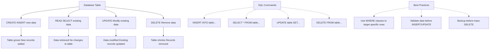
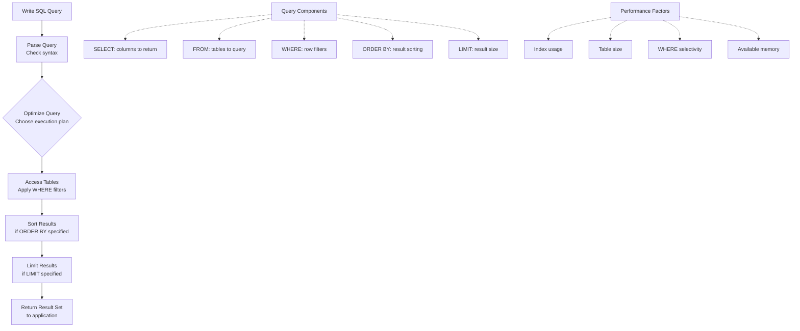

# Part 1: SQL Fundamentals

**Level:** Beginner  
**Time Estimate:** 45 minutes  
**Prerequisites:** None.

## TL;DR
SQL fundamentals cover creating tables, inserting/selecting data, filtering, sorting, and constraints to build a strong base for database interactions.

## Learning Objectives
By the end of this lesson, you'll be able to:
- Understand databases and tables.
- Perform basic CRUD operations.
- Filter and sort data.
- Apply constraints for data integrity.

## Motivation & Real-World Scenario
Databases store and manage data for apps like e-commerce sites. Mastering basics lets you query user info or product catalogs efficiently.

## Theory: Database Basics

### What is a Database?
A database is a structured collection of data stored electronically. RDBMS (Relational Database Management System) organizes data in tables with relationships via keys.

**Visual Representation:**
```
Database
├── users Table
│   ├── Row 1: id=1, name='Alice', email='a@email.com'
│   └── Row 2: id=2, name='Bob', email='b@email.com'
├── orders Table
│   └── ...
└── products Table
    └── ...
```

### Table Structure
Tables have rows (records) and columns (fields). Example:

```
Table: Users
+----+--------+-------------+
| id | name   | email       |
+----+--------+-------------+
| 1  | Alice  | a@email.com |
| 2  | Bob    | b@email.com |
+----+--------+-------------+
```

- **id**: Primary key, unique identifier.
- **name/email**: Data fields.

**CRUD Operations Overview:**


**SQL Query Execution Flow:**



## Worked Examples

### a. Create Table
```sql
CREATE TABLE users (
    id SERIAL PRIMARY KEY,  -- Auto-incrementing ID
    name VARCHAR(100),      -- Variable-length string
    email VARCHAR(100) UNIQUE  -- Unique email
);
```
**Explanation**: SERIAL creates auto-incrementing integers. PRIMARY KEY ensures uniqueness. VARCHAR limits string length.

### b. Insert Data
```sql
INSERT INTO users (name, email)
VALUES ('Alice', 'alice@email.com'),
       ('Bob', 'bob@email.com');
```
**Explanation**: Inserts multiple rows. Columns match values in order.

### c. Select Data
```sql
SELECT * FROM users;  -- All columns
SELECT name FROM users;  -- Specific column
```
**Explanation**: * selects all. Specify columns for efficiency.

### d. Update Data
```sql
UPDATE users SET name = 'Alice Smith' WHERE id = 1;
```
**Explanation**: Modifies existing rows. WHERE prevents updating all.

### e. Delete Data
```sql
DELETE FROM users WHERE id = 2;
```
**Explanation**: Removes rows. Use WHERE to avoid deleting everything.

## Filtering with WHERE

```sql
SELECT * FROM users WHERE name = 'Alice';
```
**Explanation**: Filters rows where condition is true.

### With Conditions
```sql
SELECT * FROM users WHERE name LIKE 'A%' AND id > 0;
```
**Explanation**: LIKE matches patterns (% wildcard). AND combines conditions.

## Sorting & Limiting

### Order by name:
```sql
SELECT * FROM users ORDER BY name ASC;  -- ASCending
SELECT * FROM users ORDER BY name DESC; -- DESCending
```
**Explanation**: Sorts results. ASC is default.

### Limit results:
```sql
SELECT * FROM users LIMIT 1;
```
**Explanation**: Restricts rows returned. Useful for pagination.

## Advanced Filtering

### a. DISTINCT - Select unique values
```sql
SELECT DISTINCT department FROM employees;
```
**Explanation**: Removes duplicates from results.

### b. IN - Match any value in a list
```sql
SELECT * FROM employees WHERE department IN ('HR', 'Engineering');
```
**Explanation**: Shorter than multiple ORs.

### c. BETWEEN - Select from a range
```sql
SELECT * FROM products WHERE price BETWEEN 10.00 AND 20.00;
```
**Explanation**: Inclusive range check.

### d. IS NULL - Find empty values
```sql
SELECT * FROM employees WHERE manager_id IS NULL;
```
**Explanation**: NULL means missing data. Use IS NULL, not = NULL.

## Constraints (Deep Dive)

Constraints enforce rules on data.

- **PRIMARY KEY**: Uniquely identifies each record (e.g., id).
- **UNIQUE**: No duplicate values in column.
- **NOT NULL**: Column cannot be empty.
- **FOREIGN KEY**: Links to another table's PRIMARY KEY.
- **CHECK**: Validates values (e.g., age >= 18).
- **DEFAULT**: Sets default value if none provided.

### Example with constraints:
```sql
CREATE TABLE employees (
    id SERIAL PRIMARY KEY,
    name VARCHAR(100) NOT NULL,
    email VARCHAR(100) UNIQUE NOT NULL,
    age INT CHECK (age >= 18),
    department_id INT,
    role VARCHAR(50) DEFAULT 'Employee',
    
    FOREIGN KEY (department_id) REFERENCES departments(id)
);
```
**Explanation**: Ensures data integrity. Violations cause errors.

## Quick Checklist / Cheatsheet
- CREATE: Define table structure.
- INSERT: Add data.
- SELECT: Retrieve data.
- UPDATE/DELETE: Modify/remove with WHERE.
- Constraints: Enforce rules.

## Exercises

1. **Easy:** Create a `products` table with id, name, price.
2. **Medium:** Insert 3 products, then select those over $10.
3. **Hard:** Add a UNIQUE constraint on name, try duplicate insert.

## Notes: Vendor Differences / Performance Tips
- SERIAL: PostgreSQL/MySQL. SQL Server uses IDENTITY.
- VARCHAR: Similar across vendors.
- Use constraints for data quality.
