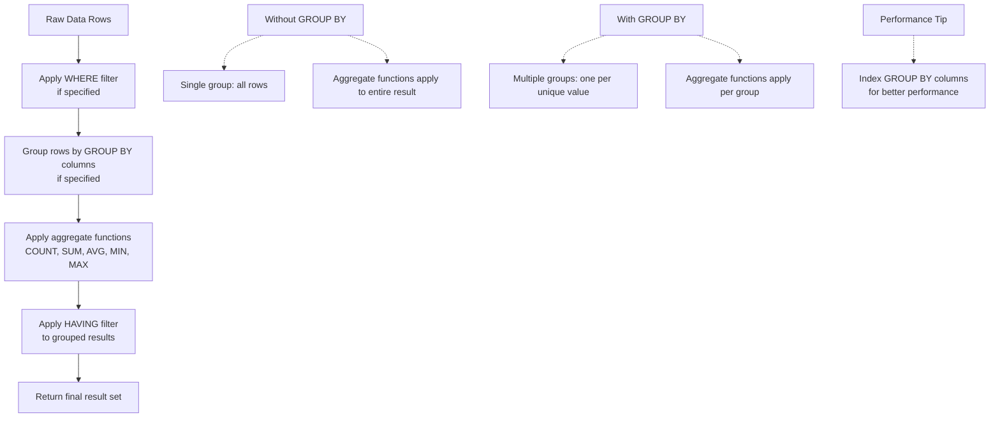

# Intermediate SQL: Aggregations & Grouping

**Level:** Beginner to Intermediate  
**Time Estimate:** 20 minutes  
**Prerequisites:** SQL Fundamentals.

## TL;DR
Aggregate functions perform a calculation on a set of rows and return a single summary value. The `GROUP BY` clause is used with aggregate functions to group rows that have the same values in specified columns into summary rows.

## Learning Objectives
By the end of this lesson, you'll be able to:
- Use common aggregate functions like `COUNT`, `SUM`, `AVG`, `MIN`, and `MAX`.
- Group data using the `GROUP BY` clause.
- Filter grouped data using the `HAVING` clause.

## Motivation & Real-World Scenario
To run a business, you need to answer questions like "How many orders did we get today?", "What is our average sale amount?", or "Which product category is the most popular?". These questions are all answered using aggregations and grouping.

## Theory & Worked Examples

**Aggregation Process Flow:**


**WHERE vs HAVING:**
```mermaid
graph TD
    A[Raw Data] --> B[WHERE Clause<br/>Filters individual rows<br/>Before grouping]
    B --> C[GROUP BY<br/>Creates groups]
    C --> D[Aggregate Functions<br/>Calculate per group]
    D --> E[HAVING Clause<br/>Filters groups<br/>After aggregation]
    E --> F[Final Result]
    
    G[WHERE Example] -.-> H[WHERE salary > 50000<br/>Filters employees before grouping]
    I[HAVING Example] -.-> J[HAVING COUNT(*) > 5<br/>Filters departments after counting]
    
    K[Key Difference] -.-> L[WHERE: Row-level filtering<br/>HAVING: Group-level filtering]
```

### a. Aggregate Functions
These functions summarize data.

- `COUNT()`: Counts the number of rows.
- `SUM()`: Calculates the sum of a set of values.
- `AVG()`: Calculates the average of a set of values.
- `MIN()`: Gets the minimum value in a set.
- `MAX()`: Gets the maximum value in a set.

**Example: Get total number of employees and average age.**
```sql
SELECT 
    COUNT(*) AS total_employees,
    AVG(age) AS average_age
FROM employees;
```

### b. The `GROUP BY` Clause
The `GROUP BY` statement groups rows that have the same values into summary rows, like "find the total sales for each city". It is almost always used with aggregate functions.

**Example: Count the number of employees in each department.**
```sql
SELECT 
    department_id, 
    COUNT(*) AS number_of_employees
FROM employees
GROUP BY department_id;
```
**Explanation**: The `GROUP BY department_id` clause tells the database to create a separate group for each unique `department_id`. The `COUNT(*)` function then counts the number of rows within each of those groups.

**Visual Representation:**
```
Raw Table Data:
+-------------+--------+
| employee_id | dept   |
+-------------+--------+
| 1           | Sales  |
| 2           | Sales  |
| 3           | HR     |
| 4           | Sales  |
+-------------+--------+

After GROUP BY dept:
+--------+----------------+
| dept   | employees      |
+--------+----------------+
| Sales  | [1,2,4] → 3    |
| HR     | [3] → 1        |
+--------+----------------+
```

### c. Filtering Groups with `HAVING`

The `HAVING` clause was added to SQL because the `WHERE` keyword could not be used with aggregate functions. `HAVING` allows you to filter groups based on the results of an aggregate function.

**Key Difference:**
- `WHERE` filters rows **before** they are grouped.
- `HAVING` filters groups **after** they have been created.

**Example: Find departments with more than 2 employees.**
```sql
SELECT 
    department_id, 
    COUNT(*) AS total
FROM employees
GROUP BY department_id
HAVING COUNT(*) > 2;
```
**Explanation**: The query first groups all employees by their department and counts them. Then, the `HAVING` clause removes the groups that do not have a count greater than 2.

**Visual Representation:**
```
After GROUP BY:
+--------+----------------+
| dept   | count          |
+--------+----------------+
| Sales  | 3              |
| HR     | 1              |
| IT     | 4              |
+--------+----------------+

After HAVING COUNT(*) > 2:
+--------+----------------+
| dept   | count          |
+--------+----------------+
| Sales  | 3              |
| IT     | 4              |
+--------+----------------+
(HR group filtered out)
```

## Quick Checklist / Cheatsheet
- Use `COUNT`, `SUM`, `AVG`, etc., to summarize data.
- Use `GROUP BY` to create summary groups.
- Use `HAVING` to filter the results of your aggregations.

## Exercises
1.  **Easy**: Write a query to find the total `amount` of sales from the `sales` table.
2.  **Medium**: Write a query to find the total sales amount for each `product_id`.
3.  **Hard**: Write a query to find the `product_id`s that have been sold more than 100 times.
