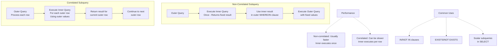
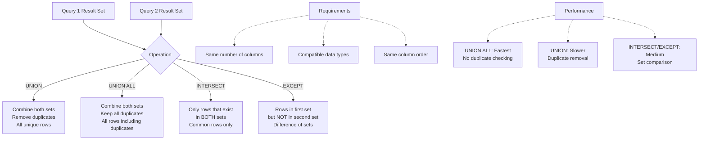

# Intermediate SQL: Subqueries and Set Operations

**Level:** Intermediate  
**Time Estimate:** 25 minutes  
**Prerequisites:** SQL Fundamentals, Joins.

## TL;DR
Subqueries (queries nested inside another query) allow for more complex filtering and data retrieval. Set operations (`UNION`, `INTERSECT`, `EXCEPT`) combine the results of two or more `SELECT` statements.

## Learning Objectives
By the end of this lesson, you'll be able to:
- Write subqueries in `WHERE` clauses.
- Understand the difference between a standard and a correlated subquery.
- Combine result sets with `UNION`, `UNION ALL`, `INTERSECT`, and `EXCEPT`.

## Motivation & Real-World Scenario
To find all employees who work in the 'HR' department, you could first look up the department ID for 'HR' and then run a second query to find employees with that ID. A subquery lets you do this in a single, dynamic step. Set operations are useful for comparing two sets of data, like finding customers who are in one mailing list but not another.

## Theory & Worked Examples

**Subquery Types & Execution:**


### a. Subqueries
A subquery is a `SELECT` statement nested inside another statement.

**Example: Using a subquery in a `WHERE` clause.**
This is the most common use case. The subquery returns a list of values that are then used by the outer query.
```sql
-- Find all employees who work in the 'HR' department
SELECT * FROM employees
WHERE department_id IN (
    SELECT id FROM departments WHERE name = 'HR'
);
```
**Explanation**: The inner query runs first, returning the `id` for the 'HR' department. The outer query then uses this `id` to find all matching employees.

**Visual Representation:**
```
Outer Query: SELECT * FROM employees WHERE department_id IN (...)
                                                            |
                                                            ↓
Inner Query: SELECT id FROM departments WHERE name = 'HR' → [1]
                                                            |
                                                            ↓
Result: Employees with department_id = 1
```

**Example: Correlated Subquery**
A correlated subquery is a subquery that depends on the outer query for its values. It is evaluated once for each row processed by the outer query, which can be inefficient.
```sql
-- Find all employees whose age is above the average for their own department
SELECT name, age, department_id
FROM employees e
WHERE age > (
    SELECT AVG(age) FROM employees WHERE department_id = e.department_id
);
```
**Explanation**: For each employee (`e`) in the outer query, the inner query calculates the average age for that specific employee's department (`e.department_id`) and uses it for comparison.

**Visual Representation:**
```
For each employee row (e):
  Outer: Check if e.age > (Inner: AVG(age) for e.department_id)
  
Example:
  Employee John (dept=1, age=30)
    Inner: AVG(age) for dept=1 → 25
    30 > 25 → Include John
  
  Employee Jane (dept=2, age=28)
    Inner: AVG(age) for dept=2 → 32
    28 > 32 → Exclude Jane
```

### b. Set Operations

**Set Operations Visual Guide:**


**`UNION` vs `UNION ALL`**
- **`UNION`**: Combines the result sets of two queries and **removes duplicate records**.
- **`UNION ALL`**: Combines the result sets and **includes all duplicate records**. It is much faster as it doesn't check for duplicates.

```sql
-- Get a single list of all employee and contractor names, with no duplicates
SELECT name FROM employees
UNION
SELECT name FROM contractors;

-- Get a combined list of all names, including duplicates
SELECT name FROM employees
UNION ALL
SELECT name FROM contractors;
```

**Visual Representation:**
```
UNION (removes duplicates):
Employees: [A, B, C]
Contractors: [B, C, D]
Result: [A, B, C, D]

UNION ALL (keeps duplicates):
Employees: [A, B, C]
Contractors: [B, C, D]
Result: [A, B, C, B, C, D]
```

**`INTERSECT`**
Returns only the rows that appear in **both** result sets.
```sql
-- Find names that exist in both the employees and contractors tables
SELECT name FROM employees
INTERSECT
SELECT name FROM contractors;
```

**Visual Representation:**
```
Employees: [A, B, C]
Contractors: [B, C, D]
INTERSECT: [B, C]  (common to both)
```

**`EXCEPT`**
Returns rows from the first result set that **do not** appear in the second result set.
```sql
-- Find all employees whose names are not also in the contractors list
SELECT name FROM employees
EXCEPT
SELECT name FROM contractors;
```

**Visual Representation:**
```
Employees: [A, B, C]
Contractors: [B, C, D]
EXCEPT: [A]  (in employees but not in contractors)
```

## Quick Checklist / Cheatsheet
- Subqueries in `WHERE IN (...)` are great for dynamic filters.
- Correlated subqueries can be slow; often a `JOIN` is a better alternative.
- `UNION` removes duplicates; `UNION ALL` is faster and keeps them.
- `INTERSECT` finds common records; `EXCEPT` finds differences.

## Notes: Vendor Differences
- `INTERSECT` and `EXCEPT` are standard but were not supported in older versions of MySQL. They are available in MySQL 8+.
