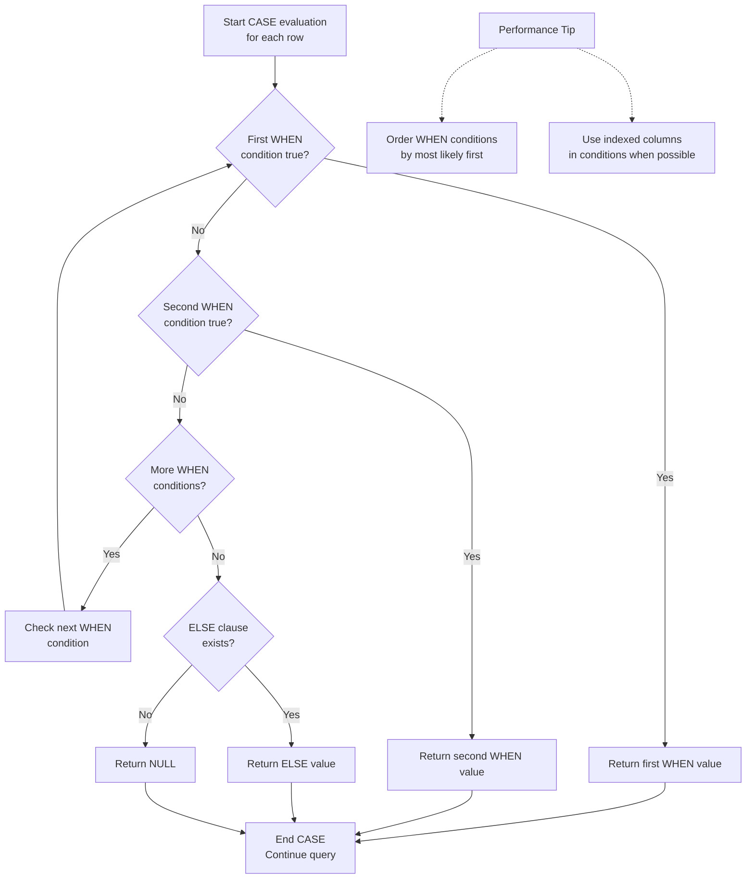

# Intermediate SQL: Conditional Logic

**Level:** Intermediate  
**Time Estimate:** 15 minutes  
**Prerequisites:** SQL Fundamentals.

## TL;DR
The `CASE` statement is SQL's way of handling if/then/else logic. It allows you to return different values based on specified conditions.

## Learning Objectives
By the end of this lesson, you'll be able to:
- Use the `CASE` statement to create conditional columns.
- Apply `CASE` within aggregate functions for conditional counting or summing.

## Motivation & Real-World Scenario
You need to categorize your customers into different tiers (`'Bronze'`, `'Silver'`, `'Gold'`) based on their total spending, or label sales as `'High Value'` or `'Low Value'`. The `CASE` statement is the perfect tool for creating these kinds of custom labels in your queries.

## Theory & Worked Examples

**CASE Statement Logic Flow:**


The `CASE` statement goes through conditions and returns a value when the first condition is met. If no condition is true, it returns the value in the `ELSE` clause. If there is no `ELSE` part and no conditions are true, it returns `NULL`.

### a. Basic `CASE` Statement

This example creates a new column called `age_category` based on the value in the `age` column.

```sql
SELECT 
    name, 
    age,
    CASE
        WHEN age >= 60 THEN 'Senior'
        WHEN age >= 30 THEN 'Mid-Level'
        ELSE 'Junior'
    END AS age_category
FROM employees;
```
**Explanation**: For each row, the database checks the `age`. If it's 60 or greater, it returns 'Senior'. If not, it checks if it's 30 or greater, returning 'Mid-Level'. Otherwise, it returns 'Junior'.

**Visual Representation (Flowchart):**
```
Start (for each row)
  ↓
age >= 60?
  ├── Yes → 'Senior'
  └── No
      ↓
    age >= 30?
      ├── Yes → 'Mid-Level'
      └── No → 'Junior'
```

### b. `CASE` inside an Aggregate Function

This is a very powerful technique for creating pivot tables or conditional summaries.

**Example: Count the number of high-priority and low-priority orders in one query.**
```sql
SELECT
    COUNT(CASE WHEN priority = 'HIGH' THEN 1 END) AS high_priority_orders,
    COUNT(CASE WHEN priority = 'LOW' THEN 1 END) AS low_priority_orders
FROM orders;
```
**Explanation**: The `CASE` statement returns a `1` if the condition is met and `NULL` otherwise. `COUNT()` only counts non-NULL values, so this effectively gives you a conditional count.

## Quick Checklist / Cheatsheet
- `CASE WHEN [condition] THEN [result] ... ELSE [default_result] END`.
- The `ELSE` clause is optional but recommended.
- `CASE` can be used in `SELECT`, `WHERE`, `GROUP BY`, and `ORDER BY` clauses.

## Exercises
1.  **Easy**: Write a query that returns the name of each product and a column named `price_tier` that is 'Expensive' if the price is > $100 and 'Cheap' otherwise.
2.  **Medium**: Write a query to count the number of employees in the 'Engineering' and 'Sales' departments in a single row.
