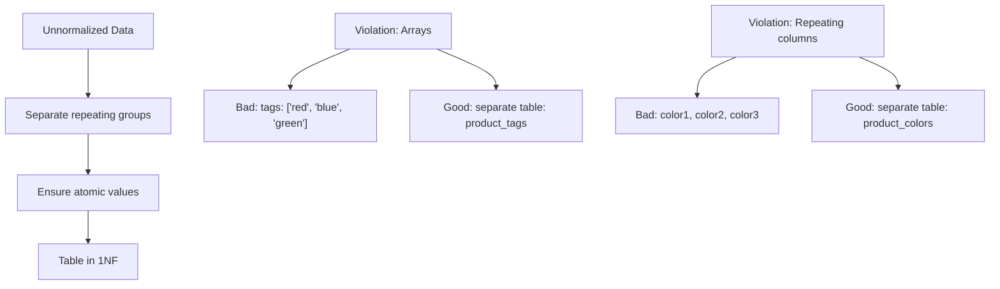

# Database Normalization

**Level:** Intermediate  
**Time Estimate:** 45 minutes  
**Prerequisites:** Basic SQL, table creation, constraints.

## TL;DR
Database normalization is the process of organizing data in a database to reduce redundancy and improve data integrity. It involves applying a series of rules called normal forms (1NF, 2NF, 3NF, etc.) to structure database tables.

## Learning Objectives
By the end of this lesson, you'll be able to:
- Understand the purpose and benefits of database normalization
- Identify and apply First Normal Form (1NF), Second Normal Form (2NF), and Third Normal Form (3NF)
- Recognize signs of unnormalized data and how to fix them
- Balance normalization with performance considerations

## Motivation & Real-World Scenario
Consider an e-commerce system where customer information is repeated in every order record. If a customer changes their address, you'd need to update dozens of order records. Normalization solves this by organizing data to minimize redundancy while maintaining data integrity.

## Theory: Normal Forms

Normalization follows a hierarchy of rules called "normal forms." Each form builds upon the previous one.

### First Normal Form (1NF)
**Definition**: A table is in 1NF if it contains only atomic (indivisible) values and each record is unique.

**Requirements**:
- Each column contains only single values (not arrays or lists)
- Each row is uniquely identifiable
- All values in a column are of the same data type
- No repeating groups of columns

**Visual Representation:**


**Before 1NF (Non-compliant):**
```
Orders Table:
+----------+-----------+-------------------+
| order_id | customer  | products          |
+----------+-----------+-------------------+
| 1        | Alice     | ['laptop', 'bag'] |
| 2        | Bob       | ['phone']         |
+----------+-----------+-------------------+
```

**After 1NF (Compliant):**
```sql
CREATE TABLE orders (
    order_id INT PRIMARY KEY,
    customer VARCHAR(100)
);

CREATE TABLE order_items (
    item_id INT PRIMARY KEY,
    order_id INT,
    product_name VARCHAR(100),
    FOREIGN KEY (order_id) REFERENCES orders(order_id)
);
```

### Second Normal Form (2NF)
**Definition**: A table is in 2NF if it's in 1NF and all non-key attributes are fully functionally dependent on the entire primary key (not just part of it).

**Applies when**: Table has a composite primary key (multiple columns)

**Requirement**: All attributes must depend on the whole primary key, not just a part of it.

**Visual Representation:**
```
Before 2NF (Partial dependency problem):
Product Categories Table:
┌─────────────────┬────────────────┬────────────────┬────────────────┐
│ category_id     │ product_id     │ category_name  │ product_price  │
├─────────────────┼────────────────┼────────────────┼────────────────┤
│ CAT1            │ P001           │ Electronics    │ 299.99         │
│ CAT1            │ P002           │ Electronics    │ 199.99         │  ← category_name 
│ CAT2            │ P003           │ Books          │ 24.99          │     depends only 
│ CAT1            │ P004           │ Electronics    │ 599.99         │     on category_id
└─────────────────┴────────────────┴────────────────┴────────────────┘

After 2NF (Separated dependencies):
Categories Table:              Product_Categories Table:
┌──────────────┬─────────────┐ ┌─────────────────┬────────────────┐
│ category_id  │ name        │ │ category_id     │ product_id     │
├──────────────┼─────────────┤ ├─────────────────┼────────────────┤
│ CAT1         │ Electronics │ │ CAT1            │ P001           │
│ CAT2         │ Books       │ │ CAT1            │ P002           │
└──────────────┴─────────────┘ │ CAT2            │ P003           │
                              │ CAT1            │ P004           │
                              └─────────────────┴────────────────┘
```

### Third Normal Form (3NF)
**Definition**: A table is in 3NF if it's in 2NF and all attributes are functionally dependent only on the primary key (no transitive dependencies).

**Requirement**: Non-key attributes must not depend on other non-key attributes.

**Visual Representation:**
```
Before 3NF (Transitive dependency problem):
Employee Table:
┌──────────┬─────────────┬────────────────┬─────────────────┐
│ emp_id   │ dept_id     │ dept_name      │ dept_location   │
├──────────┼─────────────┼────────────────┼─────────────────┤
│ 1        │ D001        │ Engineering    │ Floor 3         │
│ 2        │ D001        │ Engineering    │ Floor 3         │ ← dept_location 
│ 3        │ D002        │ Marketing      │ Floor 5         │   depends on 
└──────────┴─────────────┴────────────────┴─────────────────┘     dept_name

After 3NF (Eliminated transitive dependency):
Employees Table:            Departments Table:
┌──────────┬─────────────┐ ┌─────────────┬────────────────┬─────────────────┐
│ emp_id   │ dept_id     │ │ dept_id     │ dept_name      │ dept_location   │
├──────────┼─────────────┤ ├─────────────┼────────────────┼─────────────────┤
│ 1        │ D001        │ │ D001        │ Engineering    │ Floor 3         │
│ 2        │ D001        │ │ D002        │ Marketing      │ Floor 5         │
│ 3        │ D002        │ └─────────────┴────────────────┴─────────────────┘
└──────────┴─────────────┘
```

## Worked Examples

### Example 1: Converting to 1NF
**Problem Table**:
```sql
-- Non-1NF table: Student Courses
CREATE TABLE student_courses (
    student_id INT,
    student_name VARCHAR(100),
    courses VARCHAR(200)  -- Contains: "Math,Science,History"
);
```

**Solution**:
```sql
-- 1NF-compliant tables
CREATE TABLE students (
    student_id INT PRIMARY KEY,
    student_name VARCHAR(100)
);

CREATE TABLE student_enrollments (
    enrollment_id INT PRIMARY KEY,
    student_id INT,
    course_name VARCHAR(100),
    FOREIGN KEY (student_id) REFERENCES students(student_id)
);
```

### Example 2: Converting to 2NF
**Problem Table**:
```sql
-- Non-2NF table: Order Items
CREATE TABLE order_items (
    order_id INT,
    product_id INT,
    product_name VARCHAR(100),  -- Depends only on product_id
    quantity INT,
    PRIMARY KEY (order_id, product_id)
);
```

**Solution**:
```sql
-- 2NF-compliant tables
CREATE TABLE orders (
    order_id INT PRIMARY KEY,
    order_date DATE
);

CREATE TABLE products (
    product_id INT PRIMARY KEY,
    product_name VARCHAR(100)
);

CREATE TABLE order_items (
    order_id INT,
    product_id INT,
    quantity INT,
    PRIMARY KEY (order_id, product_id),
    FOREIGN KEY (order_id) REFERENCES orders(order_id),
    FOREIGN KEY (product_id) REFERENCES products(product_id)
);
```

### Example 3: Converting to 3NF
**Problem Table**:
```sql
-- Non-3NF table: Employee Department
CREATE TABLE employee_dept (
    emp_id INT PRIMARY KEY,
    emp_name VARCHAR(100),
    dept_id INT,
    dept_name VARCHAR(100),    -- Related to dept_id, not directly to emp_id
    dept_manager VARCHAR(100)  -- Related to dept_name, not directly to emp_id
);
```

**Solution**:
```sql
-- 3NF-compliant tables
CREATE TABLE employees (
    emp_id INT PRIMARY KEY,
    emp_name VARCHAR(100),
    dept_id INT,
    FOREIGN KEY (dept_id) REFERENCES departments(dept_id)
);

CREATE TABLE departments (
    dept_id INT PRIMARY KEY,
    dept_name VARCHAR(100),
    dept_manager VARCHAR(100)
);
```

## Benefits of Normalization

1. **Data Integrity**: Reduces the risk of inconsistent data
2. **Reduced Redundancy**: Saves storage space and reduces update anomalies
3. **Easier Maintenance**: Changes needed in only one place
4. **Clearer Design**: Better representation of real-world entities

## Drawbacks of Normalization

1. **Performance**: More complex queries with multiple joins
2. **Complexity**: More tables to manage and understand
3. **Development Time**: More complex application logic needed

## Normalization vs. Denormalization

Sometimes, for performance reasons, we intentionally denormalize:
- **Normalized**: Better for transactional systems (OLTP)
- **Denormalized**: Better for analytical systems (OLAP) where read performance is critical

## Quick Checklist / Cheatsheet

- **1NF**: All values atomic, no repeating groups
- **2NF**: 1NF + no partial dependencies on composite key
- **3NF**: 2NF + no transitive dependencies
- Normalize to eliminate update anomalies
- Balance with performance requirements

## Exercises

1. **Easy**: Identify which normal form a table violates and why.
2. **Medium**: Convert a 1NF-violating table to 3NF.
3. **Hard**: Design a normalized schema for a library management system.

## Notes: When to Normalize vs. Denormalize

- **Normalize**: When data integrity and consistency are paramount
- **Denormalize**: When read performance is more important than write performance
- **Hybrid**: Normalize core data, denormalize for reporting/analytics
- Always consider the specific use case and requirements

## Next Steps

- Learn about higher normal forms (BCNF, 4NF, 5NF)
- Understand denormalization patterns for performance
- Practice designing normalized schemas for real-world scenarios