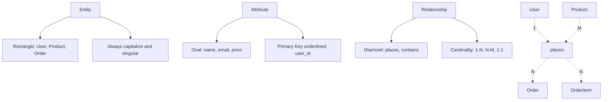

# Database Design Principles

**Level:** Intermediate  
**Time Estimate:** 50 minutes  
**Prerequisites:** Basic SQL, normalization concepts.

## TL;DR
Database design is the process of creating a blueprint for a database that organizes data efficiently and ensures data integrity. Good database design involves understanding requirements, modeling entities and relationships, normalizing data, and optimizing for performance.

## Learning Objectives
By the end of this lesson, you'll be able to:
- Apply fundamental principles of good database design
- Create entity-relationship models for database schemas
- Apply normalization principles effectively
- Design for common database patterns and use cases
- Balance normalization with performance considerations

## Motivation & Real-World Scenario
A startup launched an e-commerce platform, but as they grew, their database suffered from slow queries, data inconsistencies, and difficulties adding new features. Good database design from the start would have prevented these scaling issues, making the system faster, more reliable, and easier to maintain.

## Theory: Database Design Process

### 1. Requirements Analysis
The first step in database design is to understand what data needs to be stored and how it will be used.

**Key Questions to Ask:**
- What data needs to be stored?
- How will the data be accessed?
- What operations will be performed (CRUD)?
- What are the performance requirements?
- Who will access the data and what are their permissions?

### 2. Conceptual Design (Entity-Relationship Model)
This phase focuses on identifying entities and their relationships without worrying about database implementation details.

**Visual Representation of ERD Components:**


### 3. Logical Design (Normalization)
Convert the conceptual model to logical database tables following normalization rules.

**Design Patterns:**
```
One-to-Many Relationship:
┌─────────────┐    ┌──────────────┐
│   Users     │    │   Orders     │
│─────────────│    │──────────────│
│ user_id (PK)│───→│ user_id (FK) │
│ name        │    │ order_id (PK)│
│ email       │    │ order_date   │
└─────────────┘    └──────────────┘

Many-to-Many Relationship:
┌──────────┐    ┌──────────────────┐    ┌──────────┐
│ Products │    │ Product_Orders   │    │  Orders  │
│──────────│    │──────────────────│    │──────────│
│ prod_id  │←───│ prod_id (FK)     │────│ order_id │
│ name     │    │ order_id (FK)    │    │ date     │
│ price    │    │ quantity         │    └──────────┘
└──────────┘    └──────────────────┘
```

### 4. Physical Design (Implementation)
Optimize the database for performance based on how it will actually be used.

## Worked Examples

### Example 1: E-commerce Database Design

**Step 1: Requirements Analysis**
- Users can create accounts and place orders
- Products have categories, descriptions, and inventory
- Orders contain multiple products (shopping cart)
- Need reporting on sales and inventory

**Step 2: Entity-Relationship Model**
- **Entities**: Users, Products, Categories, Orders, OrderItems
- **Relationships**: Users place Orders, Orders contain Products, Products belong to Category

**Step 3: Logical Design (Normalized Schema)**
```sql
CREATE TABLE users (
    user_id SERIAL PRIMARY KEY,
    username VARCHAR(50) UNIQUE NOT NULL,
    email VARCHAR(100) UNIQUE NOT NULL,
    password_hash VARCHAR(255) NOT NULL,
    created_at TIMESTAMP DEFAULT CURRENT_TIMESTAMP
);

CREATE TABLE categories (
    category_id SERIAL PRIMARY KEY,
    name VARCHAR(100) NOT NULL,
    description TEXT
);

CREATE TABLE products (
    product_id SERIAL PRIMARY KEY,
    name VARCHAR(200) NOT NULL,
    description TEXT,
    price DECIMAL(10,2) NOT NULL,
    category_id INT,
    inventory_count INT DEFAULT 0,
    created_at TIMESTAMP DEFAULT CURRENT_TIMESTAMP,
    FOREIGN KEY (category_id) REFERENCES categories(category_id)
);

CREATE TABLE orders (
    order_id SERIAL PRIMARY KEY,
    user_id INT NOT NULL,
    order_date TIMESTAMP DEFAULT CURRENT_TIMESTAMP,
    status VARCHAR(20) DEFAULT 'pending',
    total_amount DECIMAL(10,2) NOT NULL,
    FOREIGN KEY (user_id) REFERENCES users(user_id)
);

CREATE TABLE order_items (
    item_id SERIAL PRIMARY KEY,
    order_id INT NOT NULL,
    product_id INT NOT NULL,
    quantity INT NOT NULL,
    unit_price DECIMAL(10,2) NOT NULL,
    FOREIGN KEY (order_id) REFERENCES orders(order_id),
    FOREIGN KEY (product_id) REFERENCES products(product_id)
);
```

### Example 2: Addressing Performance Considerations
After normalization, identify performance bottlenecks and optimize:

```sql
-- Add indexes for frequently queried columns
CREATE INDEX idx_orders_user_id ON orders(user_id);
CREATE INDEX idx_orders_date ON orders(order_date);
CREATE INDEX idx_products_category ON products(category_id);
CREATE INDEX idx_order_items_order_id ON order_items(order_id);

-- Composite index for common multi-column queries
CREATE INDEX idx_orders_status_date ON orders(status, order_date);
```

## Database Design Principles

### 1. Choose Appropriate Data Types
- Use the most specific data type that fits your data
- Consider storage size and performance implications
- Use appropriate precision for numeric data

```sql
-- Good: Specific and efficient
CREATE TABLE users (
    user_id SERIAL,
    birth_date DATE,
    account_balance DECIMAL(10,2),
    is_active BOOLEAN
);

-- Avoid: Overly generous or inappropriate types
CREATE TABLE users_bad (
    user_id VARCHAR(50),  -- Should be integer
    birth_date VARCHAR(20), -- Should be DATE
    account_balance VARCHAR(50), -- Should be DECIMAL
    is_active VARCHAR(5) -- Should be BOOLEAN
);
```

### 2. Implement Proper Keys and Constraints
- Primary keys for unique identification
- Foreign keys for referential integrity
- Unique constraints to prevent duplicates
- Check constraints for data validation

```sql
CREATE TABLE products (
    product_id SERIAL PRIMARY KEY,
    name VARCHAR(200) NOT NULL,
    price DECIMAL(10,2) NOT NULL CHECK (price > 0),
    category_id INT NOT NULL,
    inventory_count INT NOT NULL DEFAULT 0 CHECK (inventory_count >= 0),
    created_at TIMESTAMP DEFAULT CURRENT_TIMESTAMP,
    UNIQUE(name),  -- Product names must be unique
    FOREIGN KEY (category_id) REFERENCES categories(category_id)
);
```

### 3. Plan for Growth and Scalability
- Use serial/auto-incrementing IDs instead of meaningful business data
- Consider partitioning strategies for large tables
- Design for potential future requirements

### 4. Document Your Design
- Use clear, descriptive names
- Add comments to explain complex relationships
- Create ERD diagrams
- Document business rules and assumptions

## Common Design Patterns

### 1. Type/Category Pattern
For representing categories, statuses, or types:
```sql
CREATE TABLE status_types (
    type_id SERIAL PRIMARY KEY,
    type_name VARCHAR(50) NOT NULL,
    description TEXT
);

CREATE TABLE orders (
    order_id SERIAL PRIMARY KEY,
    status_type_id INT REFERENCES status_types(type_id),
    -- other columns
);
```

### 2. Audit Trail Pattern
To track changes and maintain history:
```sql
CREATE TABLE audit_logs (
    log_id SERIAL PRIMARY KEY,
    table_name VARCHAR(50) NOT NULL,
    record_id INT NOT NULL,
    operation_type VARCHAR(10) NOT NULL, -- INSERT, UPDATE, DELETE
    old_values JSONB,
    new_values JSONB,
    changed_by INT,
    changed_at TIMESTAMP DEFAULT CURRENT_TIMESTAMP
);
```

### 3. Flexible Attributes Pattern
For entities with variable attributes:
```sql
-- Instead of adding many nullable columns to main table
CREATE TABLE products (
    product_id SERIAL PRIMARY KEY,
    name VARCHAR(200) NOT NULL,
    base_price DECIMAL(10,2) NOT NULL
);

CREATE TABLE product_attributes (
    attribute_id SERIAL PRIMARY KEY,
    product_id INT NOT NULL,
    attribute_name VARCHAR(100) NOT NULL,
    attribute_value TEXT NOT NULL,
    FOREIGN KEY (product_id) REFERENCES products(product_id)
);
```

## Design Anti-Patterns to Avoid

### 1. Generic Key-Anti-Pattern
```sql
-- Bad: Generic relationship table
CREATE TABLE generic_relations (
    id SERIAL PRIMARY KEY,
    ref_table VARCHAR(50),  -- Points to any table
    ref_id INT,             -- ID in that table
    relation_type VARCHAR(50), -- What kind of relation
    related_to_table VARCHAR(50),
    related_to_id INT
);
```

### 2. Entity-Attribute-Value (EAV) Without Justification
```sql
-- Bad: When better alternatives exist
CREATE TABLE eav_table (
    id SERIAL PRIMARY KEY,
    entity_id INT,
    attribute_name VARCHAR(100),
    attribute_value TEXT
);
```

### 3. Using Generic Column Names
```sql
-- Bad: Not descriptive
CREATE TABLE data (
    id1 INT,
    id2 INT,
    value1 VARCHAR(50),
    value2 VARCHAR(50)
);

-- Good: Clear and descriptive
CREATE TABLE user_profiles (
    user_id INT,
    profile_id INT,
    first_name VARCHAR(50),
    last_name VARCHAR(50)
);
```

## Quick Checklist / Cheatsheet

- **Entities first**: Identify major entities before relationships
- **Normalization**: Apply 1NF, 2NF, 3NF (but denormalize where needed for performance)
- **Keys**: Always have a primary key, use foreign keys for relationships
- **Constraints**: Apply constraints to ensure data integrity
- **Indexes**: Add indexes for frequently queried columns
- **Documentation**: Name tables and columns descriptively

## Exercises

1. **Easy**: Design a simple blog database with posts, authors, and comments.
2. **Medium**: Design a university database with students, courses, and enrollments.
3. **Hard**: Design a social media database including users, posts, likes, and comments with privacy settings.

## Notes: Performance vs. Normalization

- Consider query patterns when designing
- Apply适度denormalization for read-heavy systems
- Normalization for write-heavy systems
- Always profile actual usage patterns
- Consider using materialized views for complex queries

## Next Steps

- Learn about database indexing strategies
- Study different database architectures (OLTP vs OLAP)
- Practice designing databases for different domains
- Learn about database performance optimization