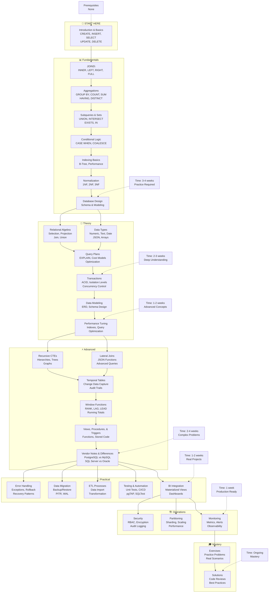
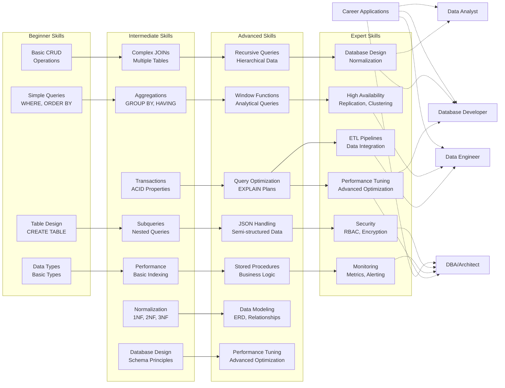

# SQL Learning Path - Master Index

This document provides a structured path through the SQL learning content. The course is organized into several parts, from core fundamentals to expert-level operations.

---

**SQL Learning Roadmap:**

**Skill Development Matrix:**

---

## Part 1: Fundamentals
*The essential building blocks of SQL. Start here if you are new to databases.*

1.  **[Introduction and Basics](fundamentals/1-introduction-and-basics.md)**: What is a database? Basic `CREATE`, `INSERT`, `SELECT`, `UPDATE`, `DELETE`.
2.  **[JOINs](fundamentals/2-joins.md)**: Combining data from multiple tables.
3.  **[Aggregations and Grouping](fundamentals/3-aggregations-and-grouping.md)**: Summarizing data with `GROUP BY`, `COUNT`, `SUM`, etc.
4.  **[Subqueries and Set Operations](fundamentals/4-subqueries-and-sets.md)**: Nested queries and combining results with `UNION`.
5.  **[Conditional Logic](fundamentals/5-conditional-logic.md)**: Using the `CASE` statement.
6.  **[Indexing Basics](fundamentals/6-indexing-basics.md)**: A brief introduction to performance.
7.  **[Database Normalization](fundamentals/7-normalization.md)**: Reducing redundancy with 1NF, 2NF, and 3NF.
8.  **[Database Design Principles](fundamentals/8-database-design.md)**: Schema design and modeling best practices.

---

## Part 2: Core Theory
*A deeper dive into the concepts that power a relational database.*

1.  **[Relational Algebra](theory/1-relational-algebra.md)**: The mathematical foundation of SQL.
2.  **[Data Types](theory/2-data-types.md)**: A detailed look at data types.
3.  **[Query Plans & Cost Models](theory/3-query-plans-and-cost-models.md)**: How the database executes your queries.
4.  **[Transactions, Isolation & Concurrency](theory/4-transactions-isolation-and-concurrency.md)**: The principles of ACID and safe data handling.
5.  **[Data Modeling Techniques](theory/5-data-modeling.md)**: Creating effective ERDs and schemas.
6.  **[Performance Tuning](theory/6-performance-tuning.md)**: Optimizing queries and database configurations.

---

## Part 3: Advanced Techniques
*Powerful SQL features for complex problems.*

1.  **[Recursive CTEs & Hierarchies](advanced/1-recursive-ctes-and-hierarchies.md)**: Querying tree-like structures.
2.  **[Lateral Joins & JSON Functions](advanced/2-lateral-joins-and-json-functions.md)**: Advanced joins and handling `JSON` data.
3.  **[Temporal Tables & Change Data Capture](advanced/3-temporal-tables-and-change-data-capture.md)**: Tracking data history.
4.  **[Vendor Notes & Differences](advanced/4-vendor-notes.md)**: How syntax differs between PostgreSQL, MySQL, etc.
5.  **[Window Functions](advanced/5-window-functions.md)**: Powerful analytical functions like `RANK()` and `LAG()`.
6.  **[Views, Procedures, & Triggers](advanced/6-views-procedures-triggers.md)**: Reusing code and automating tasks.

---

## Part 4: Practical Guides & Operations
*Hands-on guides for common, real-world database tasks.*

- **Error Handling**: [Error Handling & Exceptions](practical/1-error-handling-and-exceptions.md)
- **Data Management**: [Data Migration, Backup & Restore](practical/2-data-migration-backup-restore.md)
- **ETL**: [Data Import & ETL](practical/3-data-import-and-etl.md)
- **Testing**: [SQL Testing & Automation](practical/4-sql-testing-and-automation.md)
- **BI**: [Visualization & BI Integration](practical/5-visualization-and-BI-integration.md)
- **Security**: [Advanced Security](ops/1-advanced-security.md)
- **Scaling**: [Partitioning & Sharding](ops/2-partitioning-and-sharding.md)
- **Monitoring**: [Monitoring & Observability](ops/3-monitoring-and-observability.md)

---

## Part 5: Exercises
*Practice your skills.*

- **[Exercises README](exercises/README.md)**: Introduction to the exercises.
- **[Solutions](exercises/solutions/)**: Solutions to the exercises.

---

## Part 6: Non-Relational Databases (NoSQL)
*Alternative database models for specific use cases.*

### Fundamentals
1.  **[NoSQL vs SQL Comparison](nosql/fundamentals/0-nosql-vs-sql-comparison.md)**: When to choose each approach
2.  **[CAP Theorem and Trade-offs](nosql/fundamentals/1-cap-theorem-and-tradeoffs.md)**: Distributed systems fundamentals
3.  **[Document Databases](nosql/fundamentals/2-document-databases.md)**: Flexible schema, JSON-like documents
4.  **[Key-Value Stores](nosql/fundamentals/3-key-value-stores.md)**: Fast key-based access, caching
5.  **[Column-Family Stores](nosql/fundamentals/4-column-family-stores.md)**: Wide-column storage, analytics
6.  **[Graph Databases](nosql/fundamentals/5-graph-databases.md)**: Relationship-focused data models

### Theory
1.  **[ACID vs BASE Consistency](nosql/theory/1.5-acid-vs-base-consistency.md)**: Consistency models explained
2.  **[NoSQL Data Modeling](nosql/theory/1.7-nosql-data-modeling.md)**: Schema design patterns
3.  **[NoSQL Data Modeling Patterns](nosql/theory/2-nosql-data-modeling-patterns.md)**: Advanced modeling approaches

### Practical Applications
- **Performance**: [NoSQL Performance and Optimization](nosql/practical/1-nosql-performance-optimization.md)
- **Operations**: [NoSQL Operations Best Practices](nosql/practical/2-nosql-operations-best-practices.md)

### Operations
- **Security**: Data security in NoSQL systems
- **Monitoring**: Monitoring and observability for NoSQL
- **Backup/Recovery**: Data protection strategies