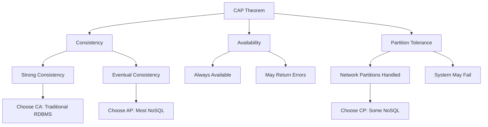

# CAP Theorem and Database Trade-offs

## Introduction

The CAP theorem is a fundamental concept in distributed systems that explains the trade-offs between consistency, availability, and partition tolerance. Understanding CAP is crucial for choosing the right database for your application.

## The CAP Theorem

**CAP Theorem**: In a distributed system, you can only guarantee **two out of three** properties simultaneously:

- **Consistency (C)**: Every read receives the most recent write or an error
- **Availability (A)**: Every request receives a response (not guaranteed to be the most recent)
- **Partition Tolerance (P)**: System continues to operate despite network partitions

## Database Categories by CAP Choice

### CA (Consistency + Availability)
- **Traditional RDBMS**: PostgreSQL, MySQL, Oracle
- **Trade-off**: No partition tolerance - single points of failure
- **Use case**: Financial systems, inventory management

### AP (Availability + Partition Tolerance)
- **Most NoSQL databases**: MongoDB, Cassandra, DynamoDB
- **Trade-off**: Eventual consistency
- **Use case**: Social media, e-commerce, real-time analytics

### CP (Consistency + Partition Tolerance)
- **Some NoSQL**: Redis, ZooKeeper, etcd
- **Trade-off**: May become unavailable during partitions
- **Use case**: Configuration management, leader election

## Practical Implications

### Eventual Consistency
- Writes may not be immediately visible to all reads
- Conflicts may need resolution
- Examples: DNS propagation, email delivery

### Strong Consistency
- All nodes see the same data at the same time
- Slower performance, higher latency
- Examples: Bank transactions, inventory systems

### Real-World Examples

**Banking Application**:
- Needs: Strong consistency, ACID transactions
- Choice: CA (Relational database)
- Trade-off: Limited scalability

**Social Media Feed**:
- Needs: High availability, global scale
- Choice: AP (NoSQL like Cassandra)
- Trade-off: Eventual consistency acceptable

**Configuration Service**:
- Needs: Consistent configuration across services
- Choice: CP (etcd, ZooKeeper)
- Trade-off: May be unavailable during network issues

## Choosing the Right Database

Consider these factors:

1. **Data Structure**: Structured vs. semi-structured vs. unstructured
2. **Query Patterns**: Complex joins vs. simple lookups vs. graph traversals
3. **Scalability Needs**: Read-heavy vs. write-heavy vs. both
4. **Consistency Requirements**: Strong vs. eventual consistency
5. **Operational Complexity**: Willingness to manage distributed systems

## Next Steps

- Learn about specific NoSQL databases
- Understand different data models
- Practice with local installations
- Study real-world use cases