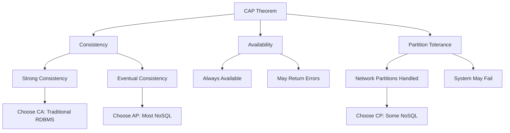

# CAP Theorem and Database Trade-offs

**Level:** Intermediate  
**Time Estimate:** 30 minutes  
**Prerequisites:** Basic understanding of databases and distributed systems.

## TL;DR
The CAP theorem explains fundamental trade-offs in distributed systems between consistency, availability, and partition tolerance. It helps you choose the right database for your application's needs.

## Learning Objectives
By the end of this lesson, you'll be able to:
- Understand the three properties of the CAP theorem
- Explain the trade-offs between CA, AP, and CP systems
- Choose appropriate databases based on CAP requirements
- Apply CAP theorem concepts to real-world scenarios

## Motivation & Real-World Scenario
When building a global e-commerce platform, you need to decide whether to prioritize immediate consistency (all users see the same inventory) or high availability (the site stays up even during network issues). The CAP theorem guides these critical architectural decisions.

## Theory: The CAP Theorem

### What is the CAP Theorem?
The CAP theorem, proposed by Eric Brewer in 2000, states that in a distributed system, you can only guarantee **two out of three** properties simultaneously:

- **Consistency (C)**: Every read receives the most recent write or an error
- **Availability (A)**: Every request receives a response (not guaranteed to be the most recent)
- **Partition Tolerance (P)**: System continues to operate despite network partitions



### Understanding the Properties

**Consistency (C):**
- All nodes see the same data simultaneously
- Read operations return the most recent write
- Strong consistency requires coordination between nodes

**Availability (A):**
- Every request receives a response
- System remains operational under all conditions
- May return stale data during partitions

**Partition Tolerance (P):**
- System continues functioning during network partitions
- Nodes can operate independently
- Communication between nodes may be unreliable

## Database Categories by CAP Choice

### CA (Consistency + Availability)
**Trade-off:** No partition tolerance - single points of failure

**Databases:**
- Traditional RDBMS: PostgreSQL, MySQL, Oracle
- **Use cases:** Financial systems, inventory management, banking
- **Example:** Stock trading platform where data accuracy is critical

**Visual Representation:**
```
CA System
├── Node 1: Data Version A
├── Node 2: Data Version A
└── Node 3: Data Version A
    (All nodes have identical data)
```

### AP (Availability + Partition Tolerance)
**Trade-off:** Eventual consistency - data may be temporarily inconsistent

**Databases:**
- Most NoSQL: MongoDB, Cassandra, DynamoDB, Riak
- **Use cases:** Social media, e-commerce, real-time analytics
- **Example:** Facebook feed where slight delays in updates are acceptable

**Visual Representation:**
```
AP System During Partition
├── Node 1: Data Version A
├── Node 2: Data Version B (temporarily different)
└── Node 3: Data Version A
    (Will eventually converge)
```

### CP (Consistency + Partition Tolerance)
**Trade-off:** May become unavailable during partitions

**Databases:**
- Some NoSQL: Redis, ZooKeeper, etcd, HBase
- **Use cases:** Configuration management, leader election, distributed locks
- **Example:** Kubernetes control plane where consistency is critical

**Visual Representation:**
```
CP System During Partition
├── Node 1: UNAVAILABLE
├── Node 2: UNAVAILABLE
└── Node 3: UNAVAILABLE
    (System sacrifices availability for consistency)
```

## Practical Implications

### Eventual Consistency
- **Definition:** Data becomes consistent over time, not immediately
- **Examples:** DNS propagation, email delivery, social media timelines
- **Challenges:** Conflict resolution, stale reads
- **Benefits:** High availability and performance

### Strong Consistency
- **Definition:** All reads return the most recent write
- **Examples:** Bank balances, inventory counts, financial transactions
- **Challenges:** Performance overhead, potential unavailability
- **Benefits:** Predictable behavior, data accuracy

### Real-World Decision Framework

**Choose CA when:**
- Data accuracy is more important than system uptime
- You have a single data center or reliable network
- Examples: Banking, healthcare, government systems

**Choose AP when:**
- System must remain available despite failures
- Temporary inconsistencies are acceptable
- Examples: Social networks, e-commerce, mobile apps

**Choose CP when:**
- Consistency is critical and you can tolerate downtime
- Examples: Configuration systems, distributed locks, consensus algorithms

## Database Selection Examples

### E-commerce Platform
- **Requirements:** High availability, global scale, acceptable temporary inconsistencies
- **Choice:** AP (Cassandra or DynamoDB)
- **Reasoning:** Customers can browse and shop even during network issues

### Banking Application
- **Requirements:** Strong consistency, ACID transactions
- **Choice:** CA (PostgreSQL or Oracle)
- **Reasoning:** Account balances must always be accurate

### Microservices Configuration
- **Requirements:** Consistent configuration across all services
- **Choice:** CP (etcd or ZooKeeper)
- **Reasoning:** All services must have identical configuration

## Quick Checklist / Cheatsheet

- **CA Systems**: Choose for data accuracy over availability
- **AP Systems**: Choose for availability over immediate consistency
- **CP Systems**: Choose for consistency over availability
- **Real applications**: Usually choose AP with eventual consistency
- **Hybrid approaches**: Use different CAP choices for different data types

## Exercises

1. **Easy**: Explain why you can't have all three CAP properties simultaneously.

2. **Medium**: For a social media application, would you choose CA, AP, or CP? Explain your reasoning.

3. **Hard**: Design a hybrid system that uses different CAP choices for different components (e.g., user profiles vs. financial transactions). Draw a simple architecture diagram.

## Practical Implications

### Eventual Consistency
- Writes may not be immediately visible to all reads
- Conflicts may need resolution
- Examples: DNS propagation, email delivery

### Strong Consistency
- All nodes see the same data at the same time
- Slower performance, higher latency
- Examples: Bank transactions, inventory systems

### Real-World Examples

**Banking Application**:
- Needs: Strong consistency, ACID transactions
- Choice: CA (Relational database)
- Trade-off: Limited scalability

**Social Media Feed**:
- Needs: High availability, global scale
- Choice: AP (NoSQL like Cassandra)
- Trade-off: Eventual consistency acceptable

**Configuration Service**:
- Needs: Consistent configuration across services
- Choice: CP (etcd, ZooKeeper)
- Trade-off: May be unavailable during network issues

## Choosing the Right Database

Consider these factors:

1. **Data Structure**: Structured vs. semi-structured vs. unstructured
2. **Query Patterns**: Complex joins vs. simple lookups vs. graph traversals
3. **Scalability Needs**: Read-heavy vs. write-heavy vs. both
4. **Consistency Requirements**: Strong vs. eventual consistency
5. **Operational Complexity**: Willingness to manage distributed systems

## Next Steps

- Learn about specific NoSQL databases
- Understand different data models
- Practice with local installations
- Study real-world use cases