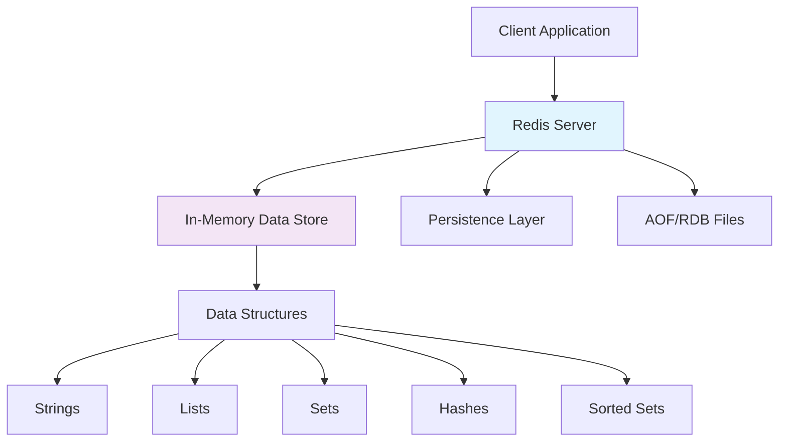

# Redis - Key-Value Store Fundamentals

**Level:** Beginner to Intermediate  
**Time Estimate:** 45 minutes  
**Prerequisites:** Basic programming concepts, understanding of caching.

## TL;DR
Redis is an open-source, in-memory data structure store used as a database, cache, and message broker. It supports various data types and provides high performance through memory-based storage with optional persistence.

## 📋 **Learning Objectives**
By the end of this module, you'll be able to:
- Understand Redis data types and their use cases
- Perform basic CRUD operations using redis-cli
- Configure Redis for different scenarios
- Implement basic caching patterns
- Choose appropriate data structures for common problems

## 🏗️ **Redis Architecture**



## 📊 **Redis Data Types**

### **1. Strings** - The most basic data type
```bash
# Set and get string values
SET user:name "John Doe"
GET user:name
# Output: "John Doe"

# Increment counters
SET counter 1
INCR counter
GET counter
# Output: 2

# Set expiration (TTL)
SET session:12345 "active" EX 3600
TTL session:12345
# Output: 3599 (seconds remaining)
```

**Use Cases:**
- Caching HTML fragments
- Storing user sessions
- Counters and statistics
- Configuration values

### **2. Lists** - Ordered collections of strings
```bash
# Push elements to list
LPUSH recent:users "alice"
LPUSH recent:users "bob"
LPUSH recent:users "charlie"

# Get list length
LLEN recent:users
# Output: 3

# Get range of elements
LRANGE recent:users 0 -1
# Output: ["charlie", "bob", "alice"]

# Pop elements
RPOP recent:users
# Output: "alice"
```

**Use Cases:**
- Message queues
- Recent items lists
- Timeline feeds
- Job queues

### **3. Sets** - Unordered collections of unique strings
```bash
# Add members to set
SADD user:1000:followers 2000
SADD user:1000:followers 3000
SADD user:1000:followers 4000

# Check membership
SISMEMBER user:1000:followers 2000
# Output: 1 (true)

# Get set members
SMEMBERS user:1000:followers
# Output: ["2000", "3000", "4000"]

# Set operations
SADD user:1000:following 2000
SADD user:1000:following 5000
SINTER user:1000:followers user:1000:following
# Output: ["2000"] (mutual follows)
```

**Use Cases:**
- Social network relationships
- Unique visitor tracking
- Tag systems
- Real-time analytics

### **4. Hashes** - Maps between string fields and values
```bash
# Set multiple fields
HSET user:1000 name "Alice" email "alice@example.com" age "30"

# Get single field
HGET user:1000 name
# Output: "Alice"

# Get all fields
HGETALL user:1000
# Output: ["name", "Alice", "email", "alice@example.com", "age", "30"]

# Increment numeric field
HINCRBY user:1000 login_count 1
HGET user:1000 login_count
# Output: 1
```

**Use Cases:**
- User profiles
- Object storage
- Configuration objects
- Counters with metadata

### **5. Sorted Sets** - Sets with score-based ordering
```bash
# Add members with scores
ZADD leaderboard 1500 "alice"
ZADD leaderboard 1200 "bob"
ZADD leaderboard 1800 "charlie"

# Get ranking
ZRANK leaderboard "alice"
# Output: 1 (0-based index)

# Get top players
ZREVRANGE leaderboard 0 2 WITHSCORES
# Output: ["charlie", "1800", "alice", "1500", "bob", "1200"]

# Get score range
ZRANGEBYSCORE leaderboard 1300 1700
# Output: ["bob", "alice"]
```

**Use Cases:**
- Leaderboards and rankings
- Priority queues
- Rate limiting
- Time-based data

## 🔧 **Basic Redis Operations**

### **Connecting to Redis**
```bash
# Connect to local Redis instance
redis-cli

# Connect to remote Redis
redis-cli -h redis.example.com -p 6379

# Test connection
PING
# Output: PONG
```

### **Key Management**
```bash
# Check if key exists
EXISTS user:1000
# Output: 1 (exists) or 0 (doesn't exist)

# Delete keys
DEL user:1000 session:12345

# Set key expiration
EXPIRE user:session:12345 3600

# Get key type
TYPE user:1000
# Output: hash, list, set, etc.

# Find keys by pattern
KEYS user:*
# Output: ["user:1000", "user:1001", ...]
```

### **Database Management**
```bash
# Select database (Redis has 16 databases by default, 0-15)
SELECT 1

# Get database size
DBSIZE

# Flush current database
FLUSHDB

# Flush all databases
FLUSHALL
```

## ⚙️ **Configuration Basics**

### **Memory Management**
```redis.conf
# Maximum memory usage
maxmemory 256mb

# Memory eviction policy
maxmemory-policy allkeys-lru

# Enable AOF persistence
appendonly yes

# AOF rewrite settings
auto-aof-rewrite-percentage 100
auto-aof-rewrite-min-size 64mb
```

### **Security Settings**
```redis.conf
# Require password
requirepass yourpassword

# Bind to specific interface
bind 127.0.0.1

# Disable dangerous commands
rename-command FLUSHDB ""
rename-command FLUSHALL ""
```

## 💡 **Common Patterns**

### **Cache-Aside Pattern with Redis CLI**
```bash
# Check cache first
127.0.0.1:6379> GET user:123
(nil)

# Cache miss - would fetch from database here
# Simulate storing user data in cache for 1 hour
127.0.0.1:6379> SET user:123 "{\"name\":\"Alice\",\"email\":\"alice@example.com\",\"age\":30}" EX 3600
OK

# Next request hits cache
127.0.0.1:6379> GET user:123
"{\"name\":\"Alice\",\"email\":\"alice@example.com\",\"age\":30}"

# Cache expiration
127.0.0.1:6379> TTL user:123
(integer) 3595
```

### **Rate Limiting with Redis CLI**
```bash
# Check rate limit for user
127.0.0.1:6379> INCR rate_limit:user123
(integer) 1
127.0.0.1:6379> EXPIRE rate_limit:user123 60
(integer) 1

# Check current count
127.0.0.1:6379> GET rate_limit:user123
"1"

# Another request
127.0.0.1:6379> INCR rate_limit:user123
(integer) 2

# If count exceeds limit (e.g., 10), block request
127.0.0.1:6379> GET rate_limit:user123
"2"
```

## 🧪 **Exercises**

### **Easy Level**
1. **Basic String Operations**
   - Create a user profile with name, email, and age
   - Implement a simple counter for page views
   - Set a session key with 5-minute expiration

2. **List Operations**
   - Create a shopping cart as a list
   - Add/remove items from the cart
   - Get the last 5 items added

### **Medium Level**
3. **Set Operations**
   - Implement user following/followers
   - Find mutual friends between two users
   - Track unique visitors to a website

4. **Hash Operations**
   - Store product information (name, price, category, stock)
   - Update product stock levels
   - Calculate total inventory value

### **Hard Level**
5. **Sorted Set Applications**
   - Build a leaderboard for a game
   - Implement a priority job queue
   - Track user activity scores over time

6. **Complex Data Structure**
   - Design a social media timeline using multiple data types
   - Implement a shopping cart with product details and quantities
   - Create a user recommendation system

## 🔍 **Key Takeaways**
- **Strings**: Simple key-value storage, perfect for caching and counters
- **Lists**: Ordered collections, ideal for queues and recent items
- **Sets**: Unique collections, great for relationships and uniqueness
- **Hashes**: Object storage, efficient for structured data
- **Sorted Sets**: Ordered collections with scores, perfect for rankings

## 📚 **Additional Resources**
- [Redis Official Documentation](https://redis.io/documentation)
- [Redis Data Types Tutorial](https://redis.io/topics/data-types)
- [Redis Persistence](https://redis.io/topics/persistence)
- [Redis Configuration](https://redis.io/topics/config)

## 🎯 **Next Steps**
Ready to dive deeper? Check out the next module on **Redis Advanced Concepts** to learn about Pub/Sub, clustering, and performance optimization!