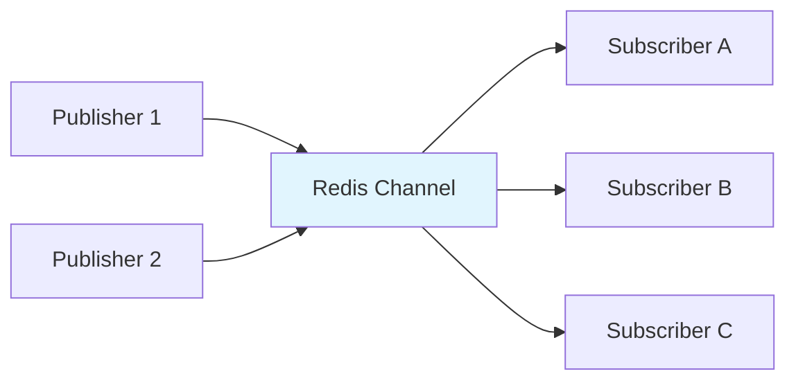
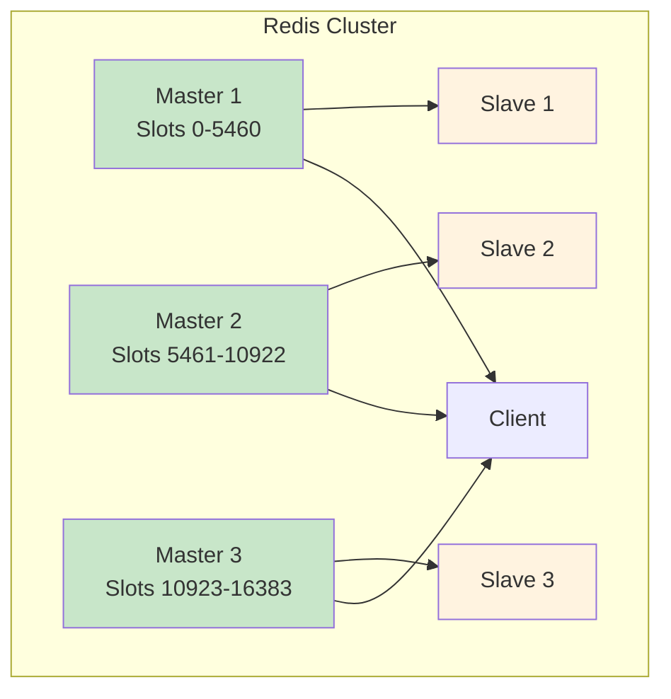

# 4. Redis Advanced Concepts

## 🎯 **TL;DR**
Master Redis advanced features including Pub/Sub messaging, clustering, persistence strategies, and performance optimization techniques for production deployments.

## 📋 **Learning Objectives**
By the end of this module, you'll be able to:
- Implement publish/subscribe messaging patterns
- Configure Redis Cluster for high availability
- Choose appropriate persistence strategies
- Optimize Redis performance and memory usage
- Implement advanced caching patterns

## 📡 **Publish/Subscribe (Pub/Sub) Messaging**

Redis Pub/Sub enables real-time messaging between publishers and subscribers without direct connections.



### **Basic Pub/Sub Operations**
```bash
# Subscribe to channels
SUBSCRIBE notifications user:123

# In another terminal, publish messages
PUBLISH notifications "System maintenance in 5 minutes"
PUBLISH user:123 "Your order has been shipped"

# Pattern subscription (wildcard)
PSUBSCRIBE user:*

# Unsubscribe
UNSUBSCRIBE notifications
PUNSUBSCRIBE user:*
```

### **Pub/Sub Use Cases**
- **Real-time notifications**: User alerts, system updates
- **Live chat systems**: Message broadcasting
- **Event-driven architectures**: Microservice communication
- **Live dashboards**: Real-time data updates

### **Pub/Sub Best Practices**
```python
import redis
import threading

class NotificationService:
    def __init__(self):
        self.redis = redis.Redis()

    def publish_notification(self, user_id, message):
        """Publish notification to specific user"""
        channel = f"user:{user_id}:notifications"
        self.redis.publish(channel, message)

    def subscribe_to_notifications(self, user_id, callback):
        """Subscribe to user notifications"""
        pubsub = self.redis.pubsub()
        pubsub.subscribe(f"user:{user_id}:notifications")

        def listener():
            for message in pubsub.listen():
                if message['type'] == 'message':
                    callback(message['data'].decode('utf-8'))

        thread = threading.Thread(target=listener, daemon=True)
        thread.start()
        return pubsub
```

## 🏗️ **Redis Cluster Architecture**

Redis Cluster provides automatic sharding and high availability across multiple nodes.



### **Cluster Setup**
```bash
# Create cluster configuration files
echo "port 7001
cluster-enabled yes
cluster-config-file nodes.conf
cluster-node-timeout 5000
appendonly yes" > redis-7001.conf

# Start Redis instances
redis-server redis-7001.conf
redis-server redis-7002.conf
redis-server redis-7003.conf

# Create cluster
redis-cli --cluster create 127.0.0.1:7001 127.0.0.1:7002 127.0.0.1:7003 \
  --cluster-replicas 0
```

### **Cluster Operations**
```bash
# Connect to cluster
redis-cli -c -p 7001

# Check cluster info
CLUSTER INFO
CLUSTER NODES

# Add new node
redis-cli --cluster add-node 127.0.0.1:7004 127.0.0.1:7001

# Reshard slots
redis-cli --cluster reshard 127.0.0.1:7001
```

## 💾 **Persistence Strategies**

Redis offers two main persistence mechanisms: RDB and AOF.

### **RDB (Redis Database) Snapshots**
- **Point-in-time snapshots** of your dataset
- **Compact single file** representation
- **Configurable save intervals**
- **Fast restarts** but potential data loss

```redis.conf
# Save every 15 minutes if at least 1 key changed
save 900 1

# Save every 5 minutes if at least 10 keys changed
save 300 10

# Save every 1 minute if at least 10000 keys changed
save 60 10000

# RDB file location
dbfilename dump.rdb
dir /var/lib/redis
```

### **AOF (Append Only File)**
- **Logs every write operation** to disk
- **Near real-time persistence** with fsync options
- **Better durability** but larger files
- **Slower restarts** but minimal data loss

```redis.conf
# Enable AOF
appendonly yes

# AOF file location
appendfilename "appendonly.aof"

# Fsync policy
appendfsync everysec    # every second (balance)
# appendfsync always    # every command (slowest)
# appendfsync no        # OS decides (fastest)
```

### **Hybrid Approach**
```redis.conf
# Use both RDB and AOF
save 900 1
appendonly yes
appendfsync everysec
```

## ⚡ **Performance Optimization**

### **Memory Management**
```bash
# Monitor memory usage
INFO memory

# Set memory limits
CONFIG SET maxmemory 256mb
CONFIG SET maxmemory-policy allkeys-lru

# Monitor keyspace
INFO keyspace
```

### **Connection Pooling**
```python
import redis
from redis.connection import ConnectionPool

# Create connection pool
pool = ConnectionPool(host='localhost', port=6379, db=0, max_connections=20)
redis_client = redis.Redis(connection_pool=pool)

# Reuse connections efficiently
def get_user_data(user_id):
    with redis_client.pipeline() as pipe:
        pipe.get(f"user:{user_id}")
        pipe.get(f"user:{user_id}:profile")
        return pipe.execute()
```

### **Pipeline Operations**
```python
# Batch multiple commands
def update_user_stats(user_id, stats):
    with redis.pipeline() as pipe:
        pipe.hset(f"user:{user_id}:stats", mapping=stats)
        pipe.expire(f"user:{user_id}:stats", 86400)  # 24 hours
        pipe.publish(f"user:{user_id}:updates", "stats_updated")
        pipe.execute()
```

## 🔐 **Security & Access Control**

### **Authentication**
```redis.conf
# Require password
requirepass your_secure_password

# Connect with password
redis-cli -a your_secure_password
```

### **Command Renaming**
```redis.conf
# Disable dangerous commands
rename-command FLUSHDB ""
rename-command FLUSHALL ""
rename-command SHUTDOWN SHUTDOWN_REDIS
```

### **Network Security**
```redis.conf
# Bind to specific interface
bind 127.0.0.1

# Disable protected mode in production
protected-mode no

# Enable TLS
tls-port 6380
tls-cert-file /path/to/redis.crt
tls-key-file /path/to/redis.key
```

## 📊 **Monitoring & Observability**

### **Built-in Monitoring**
```bash
# Server information
INFO

# Specific sections
INFO server
INFO clients
INFO memory
INFO stats

# Real-time monitoring
redis-cli --stat
redis-cli --latency
```

### **Key Metrics to Monitor**
- **Memory usage**: `used_memory`, `used_memory_peak`
- **Connections**: `connected_clients`, `blocked_clients`
- **Operations**: `total_commands_processed`, `instantaneous_ops_per_sec`
- **Hits/Misses**: `keyspace_hits`, `keyspace_misses`
- **Persistence**: `rdb_last_save_time`, `aof_last_rewrite_time`

### **Health Checks**
```bash
# Ping test
redis-cli ping

# Memory usage alert
redis-cli INFO memory | grep used_memory_human

# Connection count
redis-cli INFO clients | grep connected_clients
```

## 🏃‍♂️ **Advanced Caching Patterns**

### **Cache-Aside Pattern**
```python
class CacheManager:
    def __init__(self):
        self.redis = redis.Redis()
        self.db = DatabaseConnection()

    def get_data(self, key, ttl=3600):
        # Try cache first
        cached = self.redis.get(key)
        if cached:
            return json.loads(cached)

        # Cache miss - fetch from DB
        data = self.db.fetch(key)
        if data:
            self.redis.setex(key, ttl, json.dumps(data))
        return data

    def invalidate_cache(self, key):
        self.redis.delete(key)
```

### **Write-Through Cache**
```python
def update_user(self, user_id, data):
    # Update database first
    self.db.update_user(user_id, data)

    # Then update cache
    cache_key = f"user:{user_id}"
    self.redis.setex(cache_key, 3600, json.dumps(data))

    # Publish update event
    self.redis.publish(f"user:{user_id}:updates", "profile_updated")
```

### **Cache Invalidation Strategies**
```python
class SmartCache:
    def __init__(self):
        self.redis = redis.Redis()

    def set_with_tags(self, key, value, tags, ttl=3600):
        """Set cache with tags for selective invalidation"""
        self.redis.setex(key, ttl, json.dumps(value))

        # Store key in tag sets
        for tag in tags:
            self.redis.sadd(f"tag:{tag}", key)
            self.redis.expire(f"tag:{tag}", ttl)

    def invalidate_by_tag(self, tag):
        """Invalidate all keys with a specific tag"""
        keys = self.redis.smembers(f"tag:{tag}")
        if keys:
            self.redis.delete(*keys)
        self.redis.delete(f"tag:{tag}")
```

## 🧪 **Exercises**

### **Medium Level**
1. **Pub/Sub Implementation**
   - Build a simple chat room using Redis Pub/Sub
   - Implement user presence notifications
   - Create a real-time dashboard for system metrics

2. **Cluster Configuration**
   - Set up a 3-node Redis cluster locally
   - Test failover by stopping master nodes
   - Implement resharding operations

3. **Persistence Tuning**
   - Configure RDB snapshots for different data types
   - Set up AOF with different fsync policies
   - Compare backup sizes and recovery times

### **Hard Level**
4. **Advanced Caching**
   - Implement a multi-level cache (L1: memory, L2: Redis)
   - Build a cache with automatic refresh capabilities
   - Create a distributed cache invalidation system

5. **Performance Monitoring**
   - Set up automated monitoring for Redis metrics
   - Implement alerting for memory usage and connection limits
   - Create a dashboard for Redis performance visualization

6. **Production Setup**
   - Configure Redis with TLS encryption
   - Implement connection pooling for high-traffic applications
   - Set up automated backups and disaster recovery

## 🔍 **Key Takeaways**
- **Pub/Sub**: Real-time messaging without direct connections
- **Clustering**: Automatic sharding and high availability
- **Persistence**: Choose RDB for snapshots, AOF for durability
- **Performance**: Monitor memory, connections, and operations
- **Security**: Authentication, command renaming, and TLS

## 📚 **Additional Resources**
- [Redis Cluster Tutorial](https://redis.io/topics/cluster-tutorial)
- [Redis Persistence](https://redis.io/topics/persistence)
- [Redis Security](https://redis.io/topics/security)
- [Redis Monitoring](https://redis.io/topics/admin)

## 🎯 **Next Steps**
Ready for practical applications? Check out the next module on **Redis Practical Applications** to see real-world implementations and use cases!