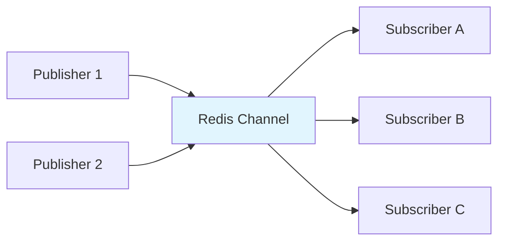

# Redis Advanced Concepts

**Level:** Intermediate  
**Time Estimate:** 20 minutes  
**Prerequisites:** Redis fundamentals, basic understanding of distributed systems.

## TL;DR
Redis advanced features include Pub/Sub messaging, clustering concepts, and persistence strategies. Focus on understanding patterns, not configuration.

## Learning Objectives
By the end of this lesson, you'll be able to:
- Understand Pub/Sub messaging patterns
- Know when to use clustering vs single instance
- Choose appropriate persistence strategies
- Apply advanced caching patterns

## Theory: Advanced Redis Patterns

### **Publish/Subscribe (Pub/Sub) Messaging**

Redis Pub/Sub enables real-time messaging between publishers and subscribers without direct connections.

**Visual Pattern:**


**Key Concepts:**
- **Channels**: Named message streams
- **Publishers**: Send messages to channels
- **Subscribers**: Listen to channels
- **Pattern Matching**: Subscribe to multiple channels with wildcards

### **Basic Operations**
```bash
# Subscribe to channels
SUBSCRIBE notifications user:123

# In another terminal, publish messages
PUBLISH notifications "System maintenance in 5 minutes"
PUBLISH user:123 "Your order has been shipped"

# Pattern subscription (wildcard)
PSUBSCRIBE user:*

# Unsubscribe
UNSUBSCRIBE notifications
PUNSUBSCRIBE user:*
```

### **Pub/Sub Use Cases**
- **Real-time notifications**: User alerts, system updates
- **Live chat systems**: Message broadcasting
- **Event-driven architectures**: Microservice communication
- **Live dashboards**: Real-time data updates

### **Pub/Sub with Redis CLI**
```bash
# Terminal 1: Subscribe to channel
127.0.0.1:6379> SUBSCRIBE user:123:notifications
Reading messages... (press Ctrl-C to quit)
1) "subscribe"
2) "user:123:notifications"
3) (integer) 1

# Terminal 2: Publish message
127.0.0.1:6379> PUBLISH user:123:notifications "You have a new message!"
(integer) 1

# Terminal 1 will receive:
1) "message"
2) "user:123:notifications"
3) "You have a new message!"

# Pattern subscription
127.0.0.1:6379> PSUBSCRIBE user:*:notifications
1) "psubscribe"
2) "user:*:notifications"
3) (integer) 1

# Publish to pattern-matched channels
127.0.0.1:6379> PUBLISH user:456:notifications "Alert for user 456"
(integer) 1
```

## 🏗️ **Redis Cluster Architecture**

Redis Cluster provides automatic sharding and high availability across multiple nodes.

```mermaid
graph TB
    subgraph "Redis Cluster"
        A[Master 1<br/>Slots 0-5460] --> B[Slave 1]
        C[Master 2<br/>Slots 5461-10922] --> D[Slave 2]


## Quick Checklist / Cheatsheet
- **Pub/Sub**: Real-time messaging with channels
- **Clustering**: Horizontal scaling for high availability  
- **Persistence**: RDB snapshots vs AOF logging
- **Caching**: Advanced patterns for performance

## Notes: When to Use Advanced Features
- **Pub/Sub**: Real-time notifications, chat systems
- **Clustering**: High availability, large datasets
- **Persistence**: Data durability requirements
- **Advanced Caching**: Complex invalidation patterns

## Further Reading
- [Redis Pub/Sub Documentation](https://redis.io/docs/manual/pubsub/)
- [Redis Clustering Guide](https://redis.io/docs/manual/scaling/)
- [Redis Persistence](https://redis.io/docs/manual/persistence/)

