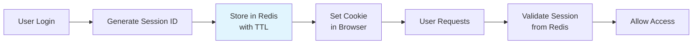
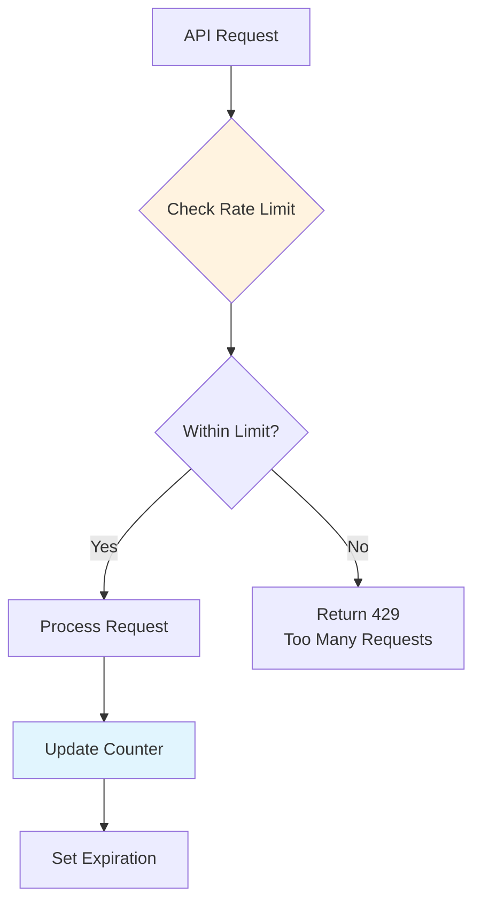
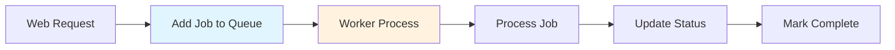
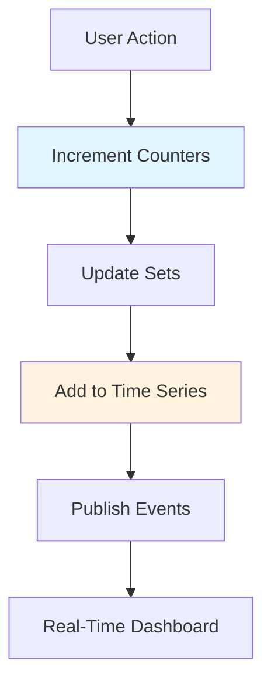

# 5. Redis Practical Applications

## 🎯 **TL;DR**
Discover real-world Redis implementations including session management, rate limiting, job queues, real-time analytics, and integration patterns for modern applications.

## 📋 **Learning Objectives**
By the end of this module, you'll be able to:
- Implement user session management with Redis
- Build rate limiting systems for API protection
- Create job queues for background processing
- Set up real-time analytics dashboards
- Integrate Redis with web applications

## 🔐 **Session Management**

Redis is perfect for storing user sessions due to its speed and built-in expiration.



### **Session Store Implementation**
```python
import redis
import json
import uuid
from datetime import datetime, timedelta

class RedisSessionStore:
    def __init__(self, redis_client, ttl_minutes=30):
        self.redis = redis_client
        self.ttl = ttl_minutes * 60  # Convert to seconds

    def create_session(self, user_data):
        """Create new session for user"""
        session_id = str(uuid.uuid4())
        session_key = f"session:{session_id}"

        session_data = {
            'user_id': user_data['id'],
            'username': user_data['username'],
            'created_at': datetime.now().isoformat(),
            'last_access': datetime.now().isoformat()
        }

        self.redis.setex(session_key, self.ttl, json.dumps(session_data))
        return session_id

    def get_session(self, session_id):
        """Retrieve session data"""
        session_key = f"session:{session_id}"
        session_data = self.redis.get(session_key)

        if session_data:
            # Update last access time
            data = json.loads(session_data)
            data['last_access'] = datetime.now().isoformat()
            self.redis.setex(session_key, self.ttl, json.dumps(data))
            return data

        return None

    def destroy_session(self, session_id):
        """Remove session"""
        session_key = f"session:{session_id}"
        self.redis.delete(session_key)

    def extend_session(self, session_id, additional_minutes=15):
        """Extend session TTL"""
        session_key = f"session:{session_id}"
        if self.redis.exists(session_key):
            self.redis.expire(session_key, additional_minutes * 60)
            return True
        return False
```

### **Express.js Integration**
```javascript
const express = require('express');
const session = require('express-session');
const RedisStore = require('connect-redis')(session);
const redis = require('redis');

const app = express();
const redisClient = redis.createClient();

// Configure session store
app.use(session({
  store: new RedisStore({ client: redisClient }),
  secret: 'your-secret-key',
  resave: false,
  saveUninitialized: false,
  cookie: {
    secure: false, // Set to true in production with HTTPS
    maxAge: 30 * 60 * 1000 // 30 minutes
  }
}));

// Protected route
app.get('/dashboard', (req, res) => {
  if (!req.session.userId) {
    return res.status(401).json({ error: 'Not authenticated' });
  }

  res.json({
    userId: req.session.userId,
    username: req.session.username,
    lastAccess: req.session.lastAccess
  });
});
```

## 🛡️ **Rate Limiting**

Protect your APIs from abuse with Redis-based rate limiting.



### **Sliding Window Rate Limiter**
```python
import time
import redis

class RateLimiter:
    def __init__(self, redis_client, max_requests=100, window_seconds=60):
        self.redis = redis_client
        self.max_requests = max_requests
        self.window = window_seconds

    def is_allowed(self, user_id, action="api_call"):
        """Check if request is within rate limit"""
        key = f"rate_limit:{user_id}:{action}"
        now = time.time()

        # Remove old requests outside the window
        self.redis.zremrangebyscore(key, 0, now - self.window)

        # Count current requests in window
        current_count = self.redis.zcard(key)

        if current_count >= self.max_requests:
            return False

        # Add current request
        self.redis.zadd(key, {now: now})
        self.redis.expire(key, self.window)

        return True

    def get_remaining_requests(self, user_id, action="api_call"):
        """Get remaining requests in current window"""
        key = f"rate_limit:{user_id}:{action}"
        now = time.time()

        # Clean old entries
        self.redis.zremrangebyscore(key, 0, now - self.window)

        current_count = self.redis.zcard(key)
        return max(0, self.max_requests - current_count)

    def get_reset_time(self, user_id, action="api_call"):
        """Get time when rate limit resets"""
        key = f"rate_limit:{user_id}:{action}"
        oldest_request = self.redis.zrange(key, 0, 0, withscores=True)

        if oldest_request:
            return oldest_request[0][1] + self.window

        return time.time() + self.window
```

### **API Middleware**
```javascript
const rateLimiter = new RateLimiter(redisClient, 100, 60); // 100 requests per minute

app.use('/api/', async (req, res, next) => {
  const userId = req.user?.id || req.ip;
  const action = req.path.split('/')[2] || 'general';

  if (!rateLimiter.isAllowed(userId, action)) {
    const resetTime = rateLimiter.getResetTime(userId, action);
    const remaining = rateLimiter.getRemainingRequests(userId, action);

    res.set({
      'X-RateLimit-Limit': 100,
      'X-RateLimit-Remaining': remaining,
      'X-RateLimit-Reset': Math.ceil(resetTime),
      'Retry-After': Math.ceil((resetTime - Date.now() / 1000))
    });

    return res.status(429).json({
      error: 'Too many requests',
      retryAfter: Math.ceil((resetTime - Date.now() / 1000))
    });
  }

  next();
});
```

## ⚙️ **Job Queues & Background Processing**

Use Redis lists for simple job queues or Redis streams for advanced message processing.



### **Simple Job Queue with Lists**
```python
class JobQueue:
    def __init__(self, redis_client, queue_name="jobs"):
        self.redis = redis_client
        self.queue_name = queue_name
        self.processing_queue = f"{queue_name}:processing"

    def enqueue_job(self, job_data, priority=0):
        """Add job to queue"""
        job_id = str(uuid.uuid4())
        job = {
            'id': job_id,
            'data': job_data,
            'created_at': datetime.now().isoformat(),
            'priority': priority
        }

        if priority > 0:
            # Use sorted set for priority
            self.redis.zadd(f"{self.queue_name}:priority",
                          {json.dumps(job): priority})
        else:
            self.redis.lpush(self.queue_name, json.dumps(job))

        return job_id

    def dequeue_job(self, timeout=30):
        """Get next job from queue"""
        # Try priority queue first
        priority_jobs = self.redis.zrevrange(
            f"{self.queue_name}:priority", 0, 0
        )

        if priority_jobs:
            job_data = self.redis.zremrangebyrank(
                f"{self.queue_name}:priority", -1, -1
            )[0]
            job = json.loads(job_data)
            self.redis.setex(f"job:{job['id']}:status", 3600, "processing")
            return job

        # Fall back to regular queue
        job_data = self.redis.brpoplpush(
            self.queue_name, self.processing_queue, timeout
        )

        if job_data:
            job = json.loads(job_data)
            self.redis.setex(f"job:{job['id']}:status", 3600, "processing")
            return job

        return None

    def complete_job(self, job_id, result=None):
        """Mark job as completed"""
        self.redis.lrem(self.processing_queue, 0, f'{{"id":"{job_id}"')
        self.redis.setex(f"job:{job_id}:result", 86400, json.dumps(result))
        self.redis.setex(f"job:{job_id}:status", 3600, "completed")
```

### **Worker Process**
```python
import signal
import sys

class JobWorker:
    def __init__(self, queue):
        self.queue = queue
        self.running = True

        signal.signal(signal.SIGTERM, self.stop)
        signal.signal(signal.SIGINT, self.stop)

    def stop(self, signum, frame):
        print("Shutting down worker...")
        self.running = False

    def process_email_job(self, job_data):
        """Example job processor"""
        # Simulate email sending
        time.sleep(2)
        print(f"Sent email to {job_data['email']} with subject {job_data['subject']}")
        return {'status': 'sent', 'timestamp': datetime.now().isoformat()}

    def run(self):
        print("Worker started, waiting for jobs...")

        while self.running:
            job = self.queue.dequeue_job(timeout=5)

            if job:
                try:
                    if job['data']['type'] == 'email':
                        result = self.process_email_job(job['data'])
                        self.queue.complete_job(job['id'], result)
                        print(f"Completed job {job['id']}")
                except Exception as e:
                    print(f"Job {job['id']} failed: {e}")
                    # Could implement retry logic here
            else:
                print("No jobs available, waiting...")

if __name__ == "__main__":
    redis_client = redis.Redis()
    queue = JobQueue(redis_client, "email_jobs")
    worker = JobWorker(queue)
    worker.run()
```

## 📊 **Real-Time Analytics**

Track and analyze user behavior in real-time using Redis data structures.



### **Analytics Tracker**
```python
class AnalyticsTracker:
    def __init__(self, redis_client):
        self.redis = redis_client

    def track_page_view(self, user_id, page, referrer=None):
        """Track page views with metadata"""
        timestamp = int(time.time())

        # Increment global counters
        self.redis.incr(f"page:{page}:views")
        self.redis.incr("total:page_views")

        # Track unique visitors (hyperloglog)
        self.redis.pfadd(f"page:{page}:unique_visitors", user_id)

        # Add to time series
        self.redis.zadd(f"page:{page}:timeline",
                       {f"{user_id}:{timestamp}": timestamp})

        # Track user journey
        if referrer:
            self.redis.lpush(f"user:{user_id}:journey",
                           f"{page}<-{referrer}@{timestamp}")

        # Publish real-time event
        event = {
            'type': 'page_view',
            'user_id': user_id,
            'page': page,
            'timestamp': timestamp
        }
        self.redis.publish('analytics:events', json.dumps(event))

    def track_conversion(self, user_id, conversion_type, value=0):
        """Track conversions and revenue"""
        self.redis.incr(f"conversion:{conversion_type}")
        self.redis.incr("total:conversions")

        if value > 0:
            self.redis.incrbyfloat(f"revenue:{conversion_type}", value)
            self.redis.incrbyfloat("total:revenue", value)

        # Add to user conversion history
        self.redis.sadd(f"user:{user_id}:conversions", conversion_type)

    def get_realtime_stats(self):
        """Get current statistics"""
        stats = {}

        # Page views
        stats['total_views'] = self.redis.get('total:page_views') or 0
        stats['total_conversions'] = self.redis.get('total:conversions') or 0
        stats['total_revenue'] = self.redis.get('total:revenue') or 0

        # Top pages
        top_pages = self.redis.zrevrangebyscore(
            'page:views:ranking', '+inf', '-inf', 0, 10, withscores=True
        )
        stats['top_pages'] = [{'page': p.decode(), 'views': int(s)}
                            for p, s in top_pages]

        return stats
```

### **Real-Time Dashboard**
```javascript
const express = require('express');
const app = express();
const redis = require('redis');
const redisClient = redis.createClient();

// Subscribe to analytics events
const subscriber = redis.createClient();
subscriber.subscribe('analytics:events');

subscriber.on('message', (channel, message) => {
  const event = JSON.parse(message);
  // Broadcast to connected WebSocket clients
  io.emit('analytics_event', event);
});

// Analytics API
app.get('/api/analytics/stats', async (req, res) => {
  const tracker = new AnalyticsTracker(redisClient);
  const stats = await tracker.getRealtimeStats();
  res.json(stats);
});

app.get('/api/analytics/page/:page', async (req, res) => {
  const page = req.params.page;
  const views = await redisClient.get(`page:${page}:views`) || 0;
  const uniqueVisitors = await redisClient.pfcount(`page:${page}:unique_visitors`);

  res.json({
    page,
    views: parseInt(views),
    uniqueVisitors
  });
});
```

## 🏪 **E-commerce Integration**

Complete e-commerce caching and session management with Redis.

```python
class EcommerceRedis:
    def __init__(self, redis_client):
        self.redis = redis_client
        self.session_store = RedisSessionStore(redis_client)
        self.rate_limiter = RateLimiter(redis_client, 1000, 3600)  # 1000/hour

    def add_to_cart(self, session_id, product_id, quantity=1):
        """Add item to shopping cart"""
        cart_key = f"cart:{session_id}"

        # Check product availability (simplified)
        available = self.redis.get(f"product:{product_id}:stock")
        if not available or int(available) < quantity:
            raise ValueError("Insufficient stock")

        # Add to cart hash
        self.redis.hincrby(cart_key, product_id, quantity)
        self.redis.expire(cart_key, 86400)  # 24 hours

        # Update cart total
        self._update_cart_total(session_id)

    def get_cart(self, session_id):
        """Get cart contents with product details"""
        cart_key = f"cart:{session_id}"
        cart_items = self.redis.hgetall(cart_key)

        if not cart_items:
            return {'items': [], 'total': 0}

        cart = {'items': [], 'total': 0}

        for product_id, quantity in cart_items.items():
            product_key = f"product:{product_id}"
            product_data = self.redis.hgetall(product_key)

            if product_data:
                cart['items'].append({
                    'id': product_id.decode(),
                    'name': product_data[b'name'].decode(),
                    'price': float(product_data[b'price'].decode()),
                    'quantity': int(quantity)
                })

        cart['total'] = float(self.redis.get(f"cart:{session_id}:total") or 0)
        return cart

    def _update_cart_total(self, session_id):
        """Recalculate cart total"""
        cart_key = f"cart:{session_id}"
        cart_items = self.redis.hgetall(cart_key)
        total = 0

        for product_id, quantity in cart_items.items():
            price = self.redis.hget(f"product:{product_id}", "price")
            if price:
                total += float(price) * int(quantity)

        self.redis.set(f"cart:{session_id}:total", total)
```

## 🧪 **Exercises**

### **Medium Level**
1. **Session Management System**
   - Build a complete session store with login/logout
   - Implement session hijacking protection
   - Add multi-device session management

2. **API Rate Limiting**
   - Implement different rate limits for different endpoints
   - Add burst allowance for occasional high usage
   - Create admin dashboard for rate limit monitoring

3. **Job Queue System**
   - Build a priority job queue with retry logic
   - Implement job status tracking and progress updates
   - Add dead letter queue for failed jobs

### **Hard Level**
4. **Real-Time Analytics Platform**
   - Create a complete analytics system with multiple metrics
   - Implement real-time dashboards with WebSocket updates
   - Add A/B testing capabilities with Redis

5. **E-commerce Platform**
   - Build a full shopping cart system with inventory management
   - Implement product recommendations based on user behavior
   - Add order processing with Redis-backed workflows

6. **Microservices Integration**
   - Design inter-service communication using Redis Pub/Sub
   - Implement distributed caching across multiple services
   - Create a service registry with Redis

## 🔍 **Key Takeaways**
- **Sessions**: Fast, scalable session storage with automatic expiration
- **Rate Limiting**: Protect APIs with sliding window algorithms
- **Job Queues**: Background processing with priority and status tracking
- **Analytics**: Real-time metrics collection and dashboard updates
- **Integration**: Redis as the "glue" between different application components

## 📚 **Additional Resources**
- [Redis in Production](https://redis.io/topics/admin)
- [Redis Use Cases](https://redis.io/topics/introduction)
- [Real-World Redis Examples](https://redis.io/commands)
- [Redis Best Practices](https://redis.io/topics/memory-optimization)

## 🎯 **Next Steps**
Redis module complete! Ready to explore other databases? Check out **Cassandra Column-Family Database** for distributed big data storage, or dive into **Graph Databases** with Neo4j!