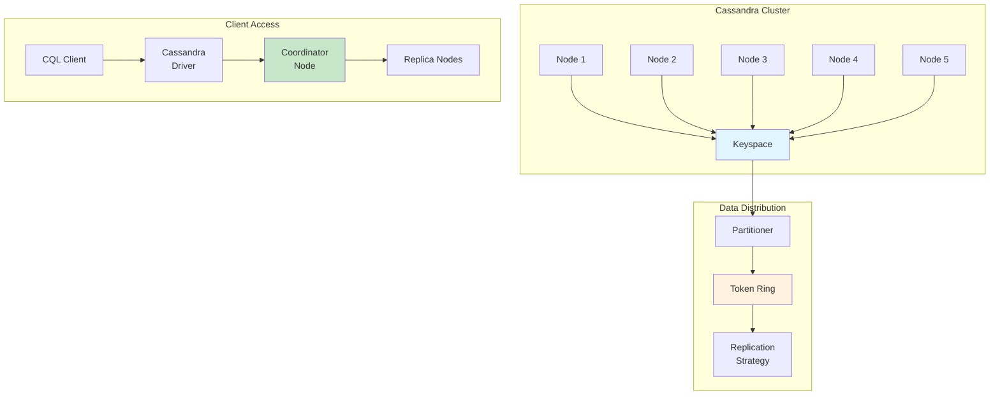

# 6. Cassandra - Column-Family Database

## 🎯 **TL;DR**
Apache Cassandra is a highly scalable, distributed NoSQL database designed for handling large amounts of data across multiple commodity servers with high availability and no single point of failure.

## 📋 **Learning Objectives**
By the end of this module, you'll be able to:
- Understand Cassandra's distributed architecture and data model
- Design and implement column-family data structures
- Use CQL (Cassandra Query Language) for data operations
- Configure replication and consistency levels
- Optimize Cassandra for different workloads

## 🏗️ **Cassandra Architecture**

Cassandra's architecture is designed for high availability, scalability, and fault tolerance.



### **Key Architectural Components**

#### **1. Nodes and Clusters**
- **Node**: Single Cassandra instance running on a server
- **Cluster**: Collection of nodes working together
- **Datacenter**: Logical grouping of nodes in the same physical location
- **Rack**: Physical grouping within a datacenter

#### **2. Data Distribution**
- **Partitioner**: Determines which node stores data (Murmur3Partitioner by default)
- **Token**: 64-bit integer representing data ownership
- **Vnodes**: Virtual nodes for better load distribution
- **Replication Factor**: Number of data copies across the cluster

#### **3. Consistency and Replication**
- **Replication Strategy**: How data is replicated across nodes
  - `SimpleStrategy`: Single datacenter
  - `NetworkTopologyStrategy`: Multiple datacenters
- **Consistency Level**: Read/write consistency requirements
- **Hinted Handoff**: Temporary storage for unavailable replicas

## 📊 **Cassandra Data Model**

Unlike relational databases, Cassandra uses a column-family data model optimized for distributed storage.

### **Key Concepts**

#### **1. Keyspace**
Top-level namespace containing column families (tables).

```sql
-- Create keyspace
CREATE KEYSPACE ecommerce
WITH REPLICATION = {
  'class': 'SimpleStrategy',
  'replication_factor': 3
};

-- Use keyspace
USE ecommerce;
```

#### **2. Column Family (Table)**
Contains rows and defines the structure.

```sql
-- Create table
CREATE TABLE products (
  product_id UUID PRIMARY KEY,
  name TEXT,
  price DECIMAL,
  category TEXT,
  tags SET<TEXT>,
  specifications MAP<TEXT, TEXT>,
  reviews LIST<FROZEN<review_udt>>
);

-- Create user-defined type
CREATE TYPE review_udt (
  user_id UUID,
  rating INT,
  comment TEXT,
  created_at TIMESTAMP
);
```

#### **3. Primary Key Structure**
Determines data distribution and uniqueness.

```sql
-- Simple primary key
CREATE TABLE users (
  user_id UUID PRIMARY KEY,
  username TEXT,
  email TEXT
);

-- Composite primary key
CREATE TABLE user_posts (
  user_id UUID,
  post_id UUID,
  content TEXT,
  created_at TIMESTAMP,
  PRIMARY KEY (user_id, post_id)
);

-- Compound primary key with clustering
CREATE TABLE sensor_data (
  sensor_id UUID,
  timestamp TIMESTAMP,
  value DOUBLE,
  unit TEXT,
  PRIMARY KEY (sensor_id, timestamp)
) WITH CLUSTERING ORDER BY (timestamp DESC);
```

### **Data Types**

Cassandra supports various data types for different use cases:

```sql
-- Basic types
CREATE TABLE example_types (
  id UUID PRIMARY KEY,
  text_field TEXT,
  int_field INT,
  bigint_field BIGINT,
  float_field FLOAT,
  double_field DOUBLE,
  decimal_field DECIMAL,
  boolean_field BOOLEAN,
  timestamp_field TIMESTAMP,
  date_field DATE,
  time_field TIME,
  blob_field BLOB,
  ascii_field ASCII
);

-- Collection types
CREATE TABLE collections_example (
  id UUID PRIMARY KEY,
  tags SET<TEXT>,
  properties MAP<TEXT, TEXT>,
  recent_actions LIST<TEXT>,
  scores MAP<TEXT, INT>
);

-- User-defined types
CREATE TYPE address (
  street TEXT,
  city TEXT,
  state TEXT,
  zip_code TEXT,
  country TEXT
);

CREATE TABLE user_profiles (
  user_id UUID PRIMARY KEY,
  name TEXT,
  address FROZEN<address>,
  phone_numbers SET<TEXT>
);
```

## 🔧 **CQL (Cassandra Query Language)**

CQL is Cassandra's SQL-like query language for data operations.

### **Data Manipulation**

#### **INSERT Operations**
```sql
-- Basic insert
INSERT INTO products (product_id, name, price, category)
VALUES (uuid(), 'Wireless Headphones', 199.99, 'Electronics');

-- Insert with TTL (Time To Live)
INSERT INTO user_sessions (session_id, user_id, created_at)
VALUES (uuid(), uuid(), toTimestamp(now()))
USING TTL 3600;  -- Expires in 1 hour

-- Insert with collections
INSERT INTO products (product_id, name, tags, specifications)
VALUES (
  uuid(),
  'Gaming Laptop',
  {'gaming', 'high-performance', 'portable'},
  {'cpu': 'Intel i7', 'ram': '16GB', 'storage': '512GB SSD'}
);
```

#### **SELECT Operations**
```sql
-- Basic select
SELECT * FROM products WHERE product_id = ?;

-- Select specific columns
SELECT name, price, category FROM products
WHERE product_id = ?;

-- Range queries on clustering columns
SELECT * FROM sensor_data
WHERE sensor_id = ?
  AND timestamp >= '2024-01-01 00:00:00'
  AND timestamp <= '2024-01-31 23:59:59';

-- Aggregation queries
SELECT category, COUNT(*) as product_count, AVG(price) as avg_price
FROM products
GROUP BY category;

-- Collection queries
SELECT name, tags FROM products WHERE product_id = ?;
SELECT name, specifications['cpu'] as cpu FROM products WHERE product_id = ?;
```

#### **UPDATE Operations**
```sql
-- Basic update
UPDATE products
SET price = 179.99, category = 'Audio'
WHERE product_id = ?;

-- Update collections
UPDATE products
SET tags = tags + {'wireless', 'bluetooth'}
WHERE product_id = ?;

UPDATE products
SET specifications = specifications + {'battery': '20 hours'}
WHERE product_id = ?;

-- Conditional updates
UPDATE products
SET price = 159.99
WHERE product_id = ?
IF price = 179.99;
```

#### **DELETE Operations**
```sql
-- Delete entire row
DELETE FROM products WHERE product_id = ?;

-- Delete specific columns
DELETE price, category FROM products WHERE product_id = ?;

-- Delete from collections
DELETE tags['gaming'] FROM products WHERE product_id = ?;
UPDATE products SET tags = tags - {'old_tag'} WHERE product_id = ?;

-- Delete with conditions
DELETE FROM user_sessions
WHERE user_id = ?
  AND session_id = ?
IF EXISTS;
```

### **Advanced Queries**

#### **Batch Operations**
```sql
-- Logged batch (atomic)
BEGIN BATCH
  INSERT INTO orders (order_id, user_id, total) VALUES (?, ?, ?);
  UPDATE inventory SET quantity = quantity - ? WHERE product_id = ?;
  INSERT INTO order_items (order_id, product_id, quantity, price)
    VALUES (?, ?, ?, ?);
APPLY BATCH;

-- Unlogged batch (non-atomic, better performance)
BEGIN UNLOGGED BATCH
  INSERT INTO metrics (timestamp, metric_name, value) VALUES (?, ?, ?);
  INSERT INTO metrics (timestamp, metric_name, value) VALUES (?, ?, ?);
APPLY BATCH;
```

#### **Lightweight Transactions**
```sql
-- Conditional inserts
INSERT INTO users (user_id, username, email)
VALUES (?, ?, ?)
IF NOT EXISTS;

-- Conditional updates
UPDATE products
SET quantity = ?
WHERE product_id = ?
IF quantity > ?;
```

## ⚙️ **Replication & Consistency**

### **Replication Strategies**

#### **SimpleStrategy**
```sql
CREATE KEYSPACE simple_keyspace
WITH REPLICATION = {
  'class': 'SimpleStrategy',
  'replication_factor': 3
};
```

#### **NetworkTopologyStrategy**
```sql
CREATE KEYSPACE multi_dc_keyspace
WITH REPLICATION = {
  'class': 'NetworkTopologyStrategy',
  'datacenter1': 3,
  'datacenter2': 2
};
```

### **Consistency Levels**

| Level | Description | Use Case |
|-------|-------------|----------|
| `ANY` | Write to any replica | High availability |
| `ONE` | Read/write from 1 replica | Fast, low consistency |
| `QUORUM` | Read/write from majority | Balanced consistency |
| `LOCAL_QUORUM` | Read/write from local DC majority | Multi-DC deployments |
| `EACH_QUORUM` | Read/write from all DC majorities | Strong consistency |
| `ALL` | Read/write from all replicas | Maximum consistency |

```sql
-- Set consistency level
CONSISTENCY QUORUM;

-- Query with specific consistency
SELECT * FROM products WHERE product_id = ?;
INSERT INTO products (product_id, name) VALUES (?, ?) USING CONSISTENCY LOCAL_QUORUM;
```

## 📈 **Data Modeling Patterns**

### **Time Series Data**
```sql
-- Weather sensor data
CREATE TABLE weather_data (
  sensor_id UUID,
  date DATE,
  timestamp TIMESTAMP,
  temperature DOUBLE,
  humidity DOUBLE,
  pressure DOUBLE,
  PRIMARY KEY ((sensor_id, date), timestamp)
) WITH CLUSTERING ORDER BY (timestamp DESC);

-- Query patterns
SELECT * FROM weather_data
WHERE sensor_id = ?
  AND date = '2024-01-15'
  AND timestamp >= '2024-01-15 10:00:00'
  AND timestamp <= '2024-01-15 12:00:00';
```

### **User Activity Feed**
```sql
-- User activities
CREATE TABLE user_activities (
  user_id UUID,
  activity_id TIMEUUID,
  activity_type TEXT,
  details TEXT,
  created_at TIMESTAMP,
  PRIMARY KEY (user_id, activity_id)
) WITH CLUSTERING ORDER BY (activity_id DESC);

-- Insert activity
INSERT INTO user_activities (user_id, activity_id, activity_type, details, created_at)
VALUES (?, now(), 'login', '{"ip": "192.168.1.1"}', toTimestamp(now()));
```

### **Product Catalog**
```sql
-- Product catalog with variants
CREATE TABLE products (
  category TEXT,
  product_id UUID,
  name TEXT,
  description TEXT,
  base_price DECIMAL,
  variants MAP<TEXT, TEXT>,  -- color -> sku
  PRIMARY KEY (category, product_id)
);

-- Product variants
CREATE TABLE product_variants (
  sku TEXT PRIMARY KEY,
  product_id UUID,
  color TEXT,
  size TEXT,
  price DECIMAL,
  stock_quantity INT
);

-- Query by category
SELECT * FROM products WHERE category = 'electronics';
```

## 🧪 **Exercises**

### **Easy Level**
1. **Basic Keyspace and Table Creation**
   - Create a keyspace for a blog application
   - Design tables for users, posts, and comments
   - Insert sample data and perform basic queries

2. **Data Types Exploration**
   - Create a table using all available data types
   - Experiment with collection types (set, list, map)
   - Create and use user-defined types

3. **Simple CRUD Operations**
   - Implement create, read, update, delete operations
   - Use different consistency levels
   - Experiment with TTL and timestamps

### **Medium Level**
4. **Time Series Data Modeling**
   - Design a sensor data collection system
   - Implement efficient querying for time ranges
   - Add data aggregation capabilities

5. **E-commerce Data Model**
   - Design product catalog with variants
   - Implement shopping cart functionality
   - Create order management system

6. **Social Media Feed**
   - Design user posts and follower relationships
   - Implement timeline generation
   - Add like and comment functionality

### **Hard Level**
7. **Multi-Datacenter Setup**
   - Configure replication across multiple datacenters
   - Implement cross-DC consistency patterns
   - Design failover and disaster recovery

8. **High-Volume Analytics**
   - Design system for collecting user behavior data
   - Implement real-time analytics queries
   - Optimize for high write throughput

9. **Complex Data Relationships**
   - Model hierarchical product categories
   - Implement recommendation system
   - Design efficient search and filtering

## 🔍 **Key Takeaways**
- **Distributed**: Designed for horizontal scaling across multiple nodes
- **Column-Family**: Optimized for wide, sparse data structures
- **Tunable Consistency**: Choose consistency vs availability trade-offs
- **No Joins**: Denormalization required for complex queries
- **Time Series**: Excellent for timestamped, append-only data

## 📚 **Additional Resources**
- [Cassandra Documentation](https://cassandra.apache.org/doc/latest/)
- [CQL Reference](https://cassandra.apache.org/doc/latest/cql/)
- [Data Modeling Guide](https://cassandra.apache.org/doc/latest/data_modeling/)
- [Architecture Overview](https://cassandra.apache.org/doc/latest/architecture/)

## 🎯 **Next Steps**
Ready to dive deeper into Cassandra operations? Check out the next module on **Cassandra Operations** to learn about cluster management, maintenance, and performance tuning!