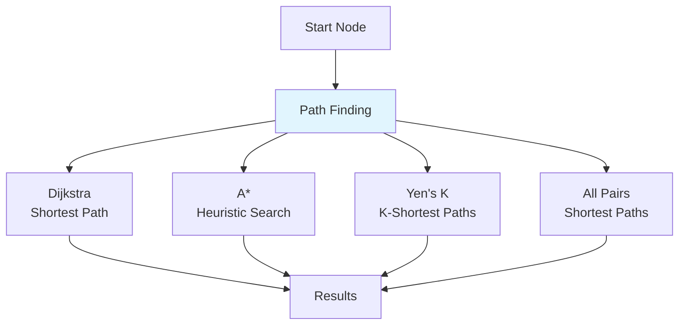
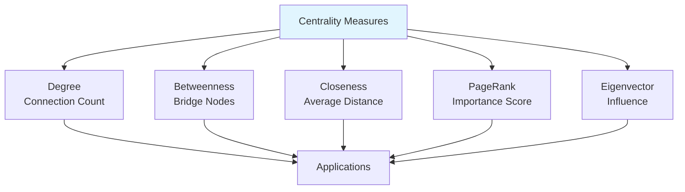
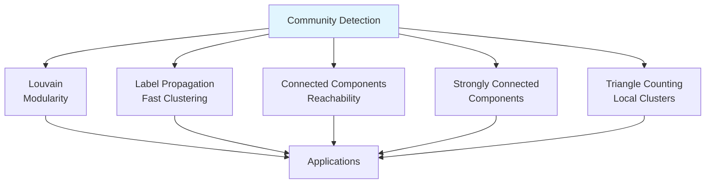
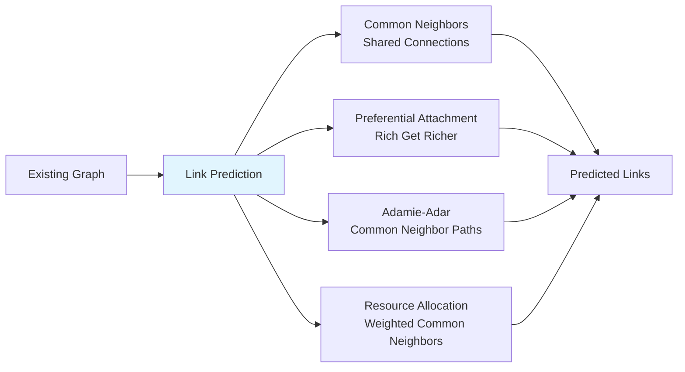

# 10. Neo4j Graph Algorithms

## 🎯 **TL;DR**
Master graph algorithms in Neo4j including path finding, centrality measures, community detection, and link prediction. Learn to analyze graph structures and extract meaningful insights from connected data.

## 📋 **Learning Objectives**
By the end of this module, you'll be able to:
- Implement path finding algorithms (Dijkstra, A*)
- Calculate centrality measures (PageRank, betweenness)
- Detect communities and clusters in graphs
- Apply link prediction algorithms
- Use Neo4j's Graph Data Science library
- Analyze real-world graph datasets

## 🛣️ **Path Finding Algorithms**

Path finding algorithms discover routes between nodes in a graph, considering various constraints and optimization criteria.



### **Shortest Path (Dijkstra)**
Finds the path with minimum total weight between two nodes.

```cypher
// Create a weighted graph (road network)
CREATE (a:Location {name: "A", lat: 40.7128, lon: -74.0060})
CREATE (b:Location {name: "B", lat: 34.0522, lon: -118.2437})
CREATE (c:Location {name: "C", lat: 41.8781, lon: -87.6298})
CREATE (d:Location {name: "D", lat: 37.7749, lon: -122.4194})

CREATE (a)-[:ROAD {distance: 100, time: 2}]->(b)
CREATE (a)-[:ROAD {distance: 200, time: 3}]->(c)
CREATE (b)-[:ROAD {distance: 150, time: 2.5}]->(d)
CREATE (c)-[:ROAD {distance: 180, time: 3}]->(d)

// Find shortest path by distance
MATCH (start:Location {name: "A"}), (end:Location {name: "D"})
CALL algo.shortestPath.stream(start, end, "distance")
YIELD nodeId, cost
RETURN algo.getNodeById(nodeId).name as location, cost

// Find shortest path by time
MATCH (start:Location {name: "A"}), (end:Location {name: "D"})
CALL algo.shortestPath.stream(start, end, "time")
YIELD nodeId, cost
RETURN algo.getNodeById(nodeId).name as location, cost
```

### **A* Algorithm**
Uses heuristics to find optimal paths more efficiently than Dijkstra.

```cypher
// A* with heuristic (straight-line distance)
MATCH (start:Location {name: "A"}), (end:Location {name: "D"})
CALL algo.shortestPath.astar.stream(start, end, "distance", "lat", "lon")
YIELD nodeId, cost
RETURN algo.getNodeById(nodeId).name as location, cost

// Custom heuristic function
MATCH (start:Location {name: "A"}), (end:Location {name: "D"})
CALL algo.shortestPath.astar.stream(start, end, "distance",
  "lat", "lon", { heuristicFunction: "euclidean" })
YIELD nodeId, cost
RETURN algo.getNodeById(nodeId).name as location, cost
```

### **K-Shortest Paths (Yen's Algorithm)**
Finds multiple alternative paths between nodes.

```cypher
// Find 3 shortest paths
MATCH (start:Location {name: "A"}), (end:Location {name: "D"})
CALL algo.kShortestPaths.stream(start, end, 3, "distance")
YIELD index, nodeIds, costs
RETURN index,
       [nodeId IN nodeIds | algo.getNodeById(nodeId).name] as path,
       costs
```

### **All Pairs Shortest Paths**
Calculates shortest paths between all node pairs.

```cypher
// Floyd-Warshall algorithm for dense graphs
CALL algo.allPairsShortestPath.stream("distance")
YIELD sourceNodeId, targetNodeId, distance
WHERE distance < 1000  // Filter long distances
RETURN algo.getNodeById(sourceNodeId).name as source,
       algo.getNodeById(targetNodeId).name as target,
       distance
ORDER BY distance DESC
LIMIT 10
```

## 📊 **Centrality Algorithms**

Centrality measures identify the most important or influential nodes in a graph.



### **Degree Centrality**
Measures node importance by connection count.

```cypher
// Undirected degree centrality
CALL algo.degree.stream("Person", "FRIENDS_WITH")
YIELD nodeId, score
RETURN algo.getNodeById(nodeId).name as person, score as connections
ORDER BY score DESC

// Directed degree centrality (in-degree)
CALL algo.degree.stream("Person", "FOLLOWS", {direction: "INCOMING"})
YIELD nodeId, score
RETURN algo.getNodeById(nodeId).name as person, score as followers
ORDER BY score DESC

// Weighted degree centrality
CALL algo.degree.stream("Person", "INTERACTED_WITH", {
  weightProperty: "weight",
  defaultValue: 1.0
})
YIELD nodeId, score
RETURN algo.getNodeById(nodeId).name as person, score as weighted_connections
ORDER BY score DESC
```

### **Betweenness Centrality**
Measures how often a node lies on shortest paths between other nodes.

```cypher
// Standard betweenness centrality
CALL algo.betweenness.stream("Person", "FRIENDS_WITH")
YIELD nodeId, centrality
RETURN algo.getNodeById(nodeId).name as person, centrality
ORDER BY centrality DESC

// Approximate betweenness (for large graphs)
CALL algo.betweenness.sample.stream("Person", "FRIENDS_WITH", {
  samplingSize: 100,
  samplingSeed: 42
})
YIELD nodeId, centrality
RETURN algo.getNodeById(nodeId).name as person, centrality
ORDER BY centrality DESC
```

### **Closeness Centrality**
Measures how close a node is to all other nodes (inverse of average distance).

```cypher
// Closeness centrality
CALL algo.closeness.stream("Person", "FRIENDS_WITH")
YIELD nodeId, centrality
RETURN algo.getNodeById(nodeId).name as person, centrality
ORDER BY centrality DESC

// Harmonic closeness centrality (handles disconnected graphs)
CALL algo.closeness.harmonic.stream("Person", "FRIENDS_WITH")
YIELD nodeId, centrality
RETURN algo.getNodeById(nodeId).name as person, centrality
ORDER BY centrality DESC
```

### **PageRank**
Measures node importance based on incoming relationships (Google's algorithm).

```cypher
// Standard PageRank
CALL algo.pageRank.stream("Person", "FRIENDS_WITH", {
  iterations: 20,
  dampingFactor: 0.85
})
YIELD nodeId, score
RETURN algo.getNodeById(nodeId).name as person, score
ORDER BY score DESC

// Personalized PageRank (biased towards specific nodes)
MATCH (source:Person {name: "Alice"})
CALL algo.pageRank.stream("Person", "FRIENDS_WITH", {
  iterations: 20,
  dampingFactor: 0.85,
  sourceNodes: [id(source)]
})
YIELD nodeId, score
RETURN algo.getNodeById(nodeId).name as person, score
ORDER BY score DESC
```

### **Eigenvector Centrality**
Measures node importance based on connections to other important nodes.

```cypher
// Eigenvector centrality
CALL algo.eigenvector.stream("Person", "FRIENDS_WITH", {
  maxIterations: 20,
  tolerance: 0.0001
})
YIELD nodeId, score
RETURN algo.getNodeById(nodeId).name as person, score
ORDER BY score DESC
```

## 🏘️ **Community Detection**

Community detection algorithms identify clusters or groups of densely connected nodes.



### **Louvain Modularity**
Hierarchical community detection algorithm that optimizes modularity.

```cypher
// Louvain community detection
CALL algo.louvain.stream("Person", "FRIENDS_WITH")
YIELD nodeId, community
RETURN community, count(*) as size,
       collect(algo.getNodeById(nodeId).name) as members
ORDER BY size DESC

// Multi-level Louvain
CALL algo.louvain.stream("Person", "FRIENDS_WITH", {
  includeIntermediateCommunities: true,
  intermediateCommunityProperty: "louvain_layer"
})
YIELD nodeId, community, communities
RETURN algo.getNodeById(nodeId).name as person,
       community,
       communities
```

### **Label Propagation**
Fast algorithm that propagates labels through the network.

```cypher
// Label propagation
CALL algo.labelPropagation.stream("Person", "FRIENDS_WITH", {
  iterations: 10,
  partitionProperty: "partition"
})
YIELD nodeId, label
RETURN label, count(*) as size,
       collect(algo.getNodeById(nodeId).name) as members
ORDER BY size DESC

// Weighted label propagation
CALL algo.labelPropagation.stream("Person", "FRIENDS_WITH", {
  iterations: 10,
  weightProperty: "weight",
  partitionProperty: "weighted_partition"
})
YIELD nodeId, label
RETURN label, count(*) as size,
       collect(algo.getNodeById(nodeId).name) as members
ORDER BY size DESC
```

### **Connected Components**
Finds isolated groups of connected nodes.

```cypher
// Weakly connected components
CALL algo.unionFind.stream("Person", "FRIENDS_WITH")
YIELD nodeId, setId
RETURN setId, count(*) as size,
       collect(algo.getNodeById(nodeId).name) as members
ORDER BY size DESC

// Strongly connected components (for directed graphs)
CALL algo.scc.stream("Person", "FOLLOWS", {
  writeProperty: "scc"
})
YIELD nodeId, componentId
RETURN componentId, count(*) as size,
       collect(algo.getNodeById(nodeId).name) as members
ORDER BY size DESC
```

### **Triangle Counting**
Counts triangles (3-node cycles) to identify tightly connected communities.

```cypher
// Triangle count for each node
CALL algo.triangleCount.stream("Person", "FRIENDS_WITH")
YIELD nodeId, triangles
RETURN algo.getNodeById(nodeId).name as person, triangles
ORDER BY triangles DESC

// Global triangle count
CALL algo.triangleCount.stream("Person", "FRIENDS_WITH", {
  clusteringCoefficientProperty: "clustering"
})
YIELD globalTriangles, nodeCount
RETURN globalTriangles, nodeCount,
       toFloat(globalTriangles) / (nodeCount * (nodeCount - 1) / 2) as clustering_coefficient
```

## 🔗 **Link Prediction**

Link prediction algorithms suggest potential new relationships in a graph.



### **Common Neighbors**
Predicts links based on shared connections.

```cypher
// Common neighbors link prediction
MATCH (p1:Person), (p2:Person)
WHERE id(p1) < id(p2) AND NOT (p1)-[:FRIENDS_WITH]-(p2)
WITH p1, p2,
     algo.linkprediction.commonNeighbors(p1, p2, {
       relationshipQuery: "FRIENDS_WITH"
     }) AS score
WHERE score > 0
RETURN p1.name, p2.name, score
ORDER BY score DESC
LIMIT 10
```

### **Adamie-Adar Index**
Considers paths of length 2 between nodes.

```cypher
// Adamic-Adar link prediction
MATCH (p1:Person), (p2:Person)
WHERE id(p1) < id(p2) AND NOT (p1)-[:FRIENDS_WITH]-(p2)
WITH p1, p2,
     algo.linkprediction.adamicAdar(p1, p2, {
       relationshipQuery: "FRIENDS_WITH"
     }) AS score
WHERE score > 0
RETURN p1.name, p2.name, score
ORDER BY score DESC
LIMIT 10
```

### **Preferential Attachment**
Predicts links based on node degrees ("rich get richer").

```cypher
// Preferential attachment
MATCH (p1:Person), (p2:Person)
WHERE id(p1) < id(p2) AND NOT (p1)-[:FRIENDS_WITH]-(p2)
WITH p1, p2,
     algo.linkprediction.preferentialAttachment(p1, p2, {
       relationshipQuery: "FRIENDS_WITH"
     }) AS score
RETURN p1.name, p2.name, score
ORDER BY score DESC
LIMIT 10
```

### **Resource Allocation**
Weighted version of common neighbors.

```cypher
// Resource allocation index
MATCH (p1:Person), (p2:Person)
WHERE id(p1) < id(p2) AND NOT (p1)-[:FRIENDS_WITH]-(p2)
WITH p1, p2,
     algo.linkprediction.resourceAllocation(p1, p2, {
       relationshipQuery: "FRIENDS_WITH"
     }) AS score
WHERE score > 0
RETURN p1.name, p2.name, score
ORDER BY score DESC
LIMIT 10
```

## 📈 **Similarity Algorithms**

Similarity algorithms measure how alike nodes are based on their connections.

### **Jaccard Similarity**
Measures overlap in neighbor sets.

```cypher
// Jaccard similarity
MATCH (p1:Person), (p2:Person)
WHERE id(p1) < id(p2)
WITH p1, p2,
     algo.similarity.jaccard([labels IN [(p1)-[:FRIENDS_WITH]->(friend) | id(friend)] | labels],
                           [labels IN [(p2)-[:FRIENDS_WITH]->(friend) | id(friend)] | labels]) AS similarity
WHERE similarity > 0
RETURN p1.name, p2.name, similarity
ORDER BY similarity DESC
LIMIT 10
```

### **Cosine Similarity**
Measures angle between node vectors.

```cypher
// Cosine similarity
MATCH (p1:Person), (p2:Person)
WHERE id(p1) < id(p2)
WITH p1, p2,
     algo.similarity.cosine([labels IN [(p1)-[:FRIENDS_WITH]->(friend) | id(friend)] | labels],
                           [labels IN [(p2)-[:FRIENDS_WITH]->(friend) | id(friend)] | labels]) AS similarity
WHERE similarity > 0
RETURN p1.name, p2.name, similarity
ORDER BY similarity DESC
LIMIT 10
```

### **Pearson Similarity**
Measures linear correlation between node connections.

```cypher
// Pearson correlation similarity
MATCH (p1:Person), (p2:Person)
WHERE id(p1) < id(p2)
WITH p1, p2,
     algo.similarity.pearson([labels IN [(p1)-[:FRIENDS_WITH]->(friend) | id(friend)] | labels],
                            [labels IN [(p2)-[:FRIENDS_WITH]->(friend) | id(friend)] | labels]) AS similarity
WHERE similarity > 0
RETURN p1.name, p2.name, similarity
ORDER BY similarity DESC
LIMIT 10
```

## 🧪 **Practical Applications**

### **Social Network Analysis**
```cypher
// Find influencers (high PageRank)
CALL algo.pageRank.stream("User", "FOLLOWS", {iterations: 20})
YIELD nodeId, score
WHERE score > 0.1
RETURN algo.getNodeById(nodeId).name as influencer, score
ORDER BY score DESC

// Detect communities
CALL algo.louvain.stream("User", "FOLLOWS")
YIELD nodeId, community
RETURN community, count(*) as size,
       collect(algo.getNodeById(nodeId).name) as members
ORDER BY size DESC

// Find potential friends (link prediction)
MATCH (u1:User), (u2:User)
WHERE id(u1) < id(u2) AND NOT (u1)-[:FOLLOWS]-(u2)
WITH u1, u2,
     algo.linkprediction.commonNeighbors(u1, u2, {relationshipQuery: "FOLLOWS"}) AS score
WHERE score >= 3
RETURN u1.name, u2.name, score as common_friends
ORDER BY score DESC
```

### **Recommendation Engine**
```cypher
// Product recommendations based on purchase history
MATCH (u1:User)-[:PURCHASED]->(p1:Product)<-[:PURCHASED]-(u2:User)-[:PURCHASED]->(p2:Product)
WHERE u1 <> u2 AND NOT (u1)-[:PURCHASED]->(p2)
WITH u1, p2, count(*) as frequency
WHERE frequency >= 2
RETURN u1.name, p2.name, frequency
ORDER BY frequency DESC

// Content-based recommendations using similarity
MATCH (u:User)-[:RATED]->(m1:Movie)
WITH u, collect(id(m1)) as userMovies
MATCH (m2:Movie)
WHERE not(m2.id in userMovies)
WITH u, userMovies, m2,
     algo.similarity.jaccard(userMovies, [m2.id]) as similarity
WHERE similarity > 0.1
RETURN u.name, m2.title, similarity
ORDER BY similarity DESC
```

### **Fraud Detection**
```cypher
// Find suspicious patterns (triangles in financial transactions)
CALL algo.triangleCount.stream("Account", "TRANSFERRED_TO")
YIELD nodeId, triangles
WHERE triangles > 10
RETURN algo.getNodeById(nodeId).account_id as suspicious_account, triangles

// Community detection for fraud rings
CALL algo.louvain.stream("Account", "TRANSFERRED_TO")
YIELD nodeId, community
WITH community, collect(algo.getNodeById(nodeId)) as accounts
WHERE size(accounts) > 5
RETURN community, size(accounts) as ring_size, accounts
ORDER BY ring_size DESC
```

## 🧪 **Exercises**

### **Medium Level**
1. **Path Finding**
   - Implement route planning with different cost functions (distance, time, cost)
   - Find multiple alternative routes between locations
   - Compare Dijkstra vs A* performance on different graph types

2. **Centrality Analysis**
   - Analyze social network influencers using multiple centrality measures
   - Compare PageRank results with degree centrality
   - Identify bridge nodes in organizational networks

3. **Community Detection**
   - Apply different community detection algorithms to the same dataset
   - Compare Louvain vs Label Propagation results
   - Analyze community characteristics and evolution

### **Hard Level**
4. **Link Prediction Pipeline**
   - Build a complete link prediction system for social networks
   - Evaluate different algorithms on the same dataset
   - Implement model validation and accuracy metrics

5. **Recommendation System**
   - Create a hybrid recommendation engine using collaborative and content-based filtering
   - Implement A/B testing for different recommendation algorithms
   - Optimize recommendation performance for real-time serving

6. **Graph Analytics Dashboard**
   - Build a comprehensive analytics dashboard for graph data
   - Implement real-time graph metrics and visualizations
   - Create alerting system for graph structure changes

## 🔍 **Key Takeaways**
- **Path Finding**: Choose algorithm based on graph size and constraints
- **Centrality**: Different measures reveal different types of importance
- **Community Detection**: Multiple algorithms for different use cases
- **Link Prediction**: Suggest new connections based on existing patterns
- **Similarity**: Measure node likeness for recommendations and clustering

## 📚 **Additional Resources**
- [Neo4j Graph Algorithms Documentation](https://neo4j.com/docs/graph-algorithms/)
- [Graph Data Science Library](https://neo4j.com/docs/graph-data-science/)
- [Algorithm Performance Guide](https://neo4j.com/docs/graph-algorithms/current/algorithms/)
- [Real-World Use Cases](https://neo4j.com/use-cases/)

## 🎯 **Next Steps**
Graph algorithms mastered! Ready for practical applications? Check out the next module on **Neo4j Use Cases** to see real-world implementations and industry applications!