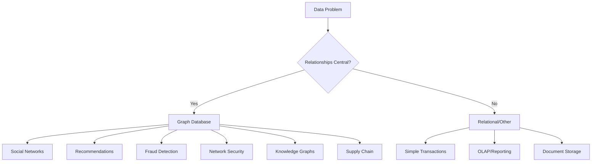

# 11. Neo4j - Graph Database Applications and Use Cases

**Level:** Advanced  
**Time Estimate:** 45 minutes  
**Prerequisites:** Graph algorithms, Cypher query language, advanced graph concepts.

## TL;DR
Graph databases excel in use cases involving complex relationships and connected data. Key applications include social networks, recommendation engines, fraud detection, knowledge graphs, network security, and master data management.

## Learning Objectives
By the end of this lesson, you'll be able to:
- Identify business problems suitable for graph database solutions
- Design graph schemas for specific use cases
- Implement queries and algorithms for domain-specific applications
- Evaluate the benefits and trade-offs of graph vs relational approaches
- Build solutions for common graph database applications

## Motivation & Real-World Scenario
A logistics company struggles with route optimization, shipment tracking across multiple carriers, and identifying bottlenecks in their supply chain. Traditional relational databases require complex joins and multi-level queries that perform poorly. A graph database models the network of locations, routes, and shipments, enabling efficient pathfinding, real-time tracking, and network optimization.

## Theory: Graph Database Use Cases

### When to Use Graph Databases

**Good for:**
- Complex relationships (many-to-many with properties)
- Traversals and pathfinding
- Community/cluster detection
- Recommendation systems
- Network analysis

**Not ideal for:**
- Simple CRUD operations on unrelated entities
- Data warehousing and reporting
- Simple transaction processing
- When relationships are not the primary concern

**Visual Representation:**


## Detailed Use Cases

### 1. Social Networks and Relationship Analysis

**Schema:**
```cypher
// Social network model
CREATE (user1:User {id: 1, name: "Alice", location: "New York", joined_date: date("2024-01-15")})
CREATE (user2:User {id: 2, name: "Bob", location: "San Francisco", joined_date: date("2024-01-20")})
CREATE (user3:User {id: 3, name: "Charlie", location: "Chicago", joined_date: date("2024-01-10")})

CREATE (post1:Post {id: 101, content: "Hello from NYC!", timestamp: datetime("2024-02-01T10:00:00")})
CREATE (post2:Post {id: 102, content: "Great weather today", timestamp: datetime("2024-02-02T14:30:00")})

CREATE (hashtag1:Hashtag {name: "#nyc"})
CREATE (hashtag2:Hashtag {name: "#weather"})

// Relationships
CREATE (user1)-[:FRIENDS_WITH {since: date("2023-05-15"), strength: 0.8}]->(user2)
CREATE (user2)-[:FRIENDS_WITH {since: date("2023-06-20"), strength: 0.9}]->(user3)
CREATE (user1)-[:FRIENDS_WITH {since: date("2023-11-10"), strength: 0.7}]->(user3)

CREATE (user1)-[:POSTED]->(post1)
CREATE (user2)-[:POSTED]->(post2)

CREATE (post1)-[:TAGGED]->(hashtag1)
CREATE (post2)-[:TAGGED]->(hashtag2)

CREATE (user2)-[:LIKES {timestamp: datetime("2024-02-01T10:30:00")}]->(post1)
CREATE (user3)-[:LIKES {timestamp: datetime("2024-02-02T15:00:00")}]->(post2)
```

**Queries:**
```cypher
// Find mutual friends
MATCH (u1:User {name: "Alice"})-[:FRIENDS_WITH]-(mutual:User)-[:FRIENDS_WITH]-(u2:User {name: "Bob"})
WHERE u1 <> u2
RETURN mutual.name

// Find friends of friends (2nd degree connections)
MATCH (me:User {name: "Alice"})-[:FRIENDS_WITH*2..2]-(fof:User)
WHERE NOT (me)-[:FRIENDS_WITH]-(fof) AND me <> fof
RETURN fof.name, count(*) AS connection_paths
ORDER BY connection_paths DESC

// Recommended friends based on shared connections
MATCH (me:User {name: "Alice"})-[:FRIENDS_WITH]-(friend:User)-[:FRIENDS_WITH]-(suggestion:User)
WHERE NOT (me)-[:FRIENDS_WITH]-(suggestion) AND me <> suggestion
RETURN suggestion.name, count(friend) AS common_friends
ORDER BY common_friends DESC
LIMIT 5
```

### 2. Recommendation Engines

**E-commerce Product Recommendations:**
```cypher
// Product and user model for recommendations
CREATE (u1:User {id: 1, name: "John", age: 30})
CREATE (u2:User {id: 2, name: "Sarah", age: 28})
CREATE (u3:User {id: 3, name: "Mike", age: 35})

CREATE (p1:Product {id: 101, name: "Laptop", category: "Electronics"})
CREATE (p2:Product {id: 102, name: "Mouse", category: "Electronics"})
CREATE (p3:Product {id: 103, name: "Keyboard", category: "Electronics"})
CREATE (p4:Product {id: 104, name: "Book", category: "Education"})

// Purchase and interaction patterns
CREATE (u1)-[:PURCHASED {timestamp: date("2024-01-15"), rating: 5}]->(p1)
CREATE (u1)-[:PURCHASED {timestamp: date("2024-01-20"), rating: 4}]->(p2)
CREATE (u2)-[:PURCHASED {timestamp: date("2024-01-18"), rating: 5}]->(p1)
CREATE (u2)-[:PURCHASED {timestamp: date("2024-01-22"), rating: 3}]->(p3)
CREATE (u3)-[:PURCHASED {timestamp: date("2024-01-10"), rating: 4}]->(p1)
CREATE (u3)-[:PURCHASED {timestamp: date("2024-01-25"), rating: 5}]->(p2)

// Product similarity based on co-purchasing
CREATE (p1)-[:SIMILAR_TO {score: 0.8}]->(p2)
CREATE (p1)-[:SIMILAR_TO {score: 0.6}]->(p3)
```

**Recommendation Queries:**
```cypher
// Collaborative filtering: People who bought X also bought Y
MATCH (target:User {name: "John"})-[:PURCHASED]->(purchased:Product)<-[:PURCHASED]-(similarUser:User)-[:PURCHASED]->(recommendation:Product)
WHERE NOT (target)-[:PURCHASED]->(recommendation) AND target <> similarUser
WITH recommendation, count(similarUser) AS frequency
ORDER BY frequency DESC
LIMIT 5
RETURN recommendation.name, frequency

// Content-based filtering using product categories
MATCH (target:User {name: "John"})-[:PURCHASED]->(:Product)-[:SIMILAR_TO]->(similar:Product)
WHERE NOT (target)-[:PURCHASED]->(similar)
RETURN similar.name, similar.category
ORDER BY similar.category

// Hybrid recommendation combining multiple signals
MATCH (target:User {name: "John"})-[:PURCHASED]->(prod1:Product)
OPTIONAL MATCH (prod1)-[:SIMILAR_TO]->(similar:Product)
OPTIONAL MATCH (target)-[:PURCHASED]->(prod2:Product)<-[:PURCHASED]-(otherUser:User)-[:PURCHASED]->(collabReco:Product)
WHERE similar <> collabReco
WITH collect(DISTINCT similar) + collect(DISTINCT collabReco) AS all_recos
UNWIND all_recos AS recommendation
WHERE recommendation IS NOT NULL
RETURN recommendation.name, recommendation.category
ORDER BY recommendation.category
LIMIT 5
```

### 3. Fraud Detection

**Schema for Fraud Detection:**
```cypher
// Account and transaction model for fraud detection
CREATE (a1:Account {account_id: "ACC001", user_id: "U001", type: "checking", risk_score: 0.2})
CREATE (a2:Account {account_id: "ACC002", user_id: "U002", type: "savings", risk_score: 0.1})
CREATE (a3:Account {account_id: "ACC003", user_id: "U001", type: "credit", risk_score: 0.3})

CREATE (d1:Device {device_id: "DEV001", type: "mobile", os: "iOS", ip: "192.168.1.10"})
CREATE (d2:Device {device_id: "DEV002", type: "desktop", os: "Windows", ip: "192.168.1.20"})
CREATE (d3:Device {device_id: "DEV003", type: "mobile", os: "Android", ip: "192.168.1.30"})

CREATE (loc1:Location {city: "New York", country: "US", ip_range: "192.168.1.0/24"})
CREATE (loc2:Location {city: "London", country: "UK", ip_range: "10.0.0.0/24"})

// Relationships
CREATE (a1)-[:USED_ON]->(d1)
CREATE (a2)-[:USED_ON]->(d2)
CREATE (a3)-[:USED_ON]->(d1)
CREATE (a1)-[:USED_AT]->(loc1)
CREATE (a2)-[:USED_AT]->(loc1)
CREATE (a3)-[:USED_AT]->(loc2)
```

**Fraud Detection Queries:**
```cypher
// Find accounts potentially involved in fraud
MATCH (a1:Account)-[:USED_ON]->(d:Device)<-[:USED_ON]-(a2:Account)
WHERE a1 <> a2 AND a1.user_id <> a2.user_id
RETURN a1.account_id, a2.account_id, d.device_id

// Location anomalies (sudden location changes)
MATCH (a:Account)-[:USED_AT]->(loc:Location)
WHERE a.last_transaction_location <> loc.city
WITH a, collect(loc.city) AS locations
WHERE size(locations) > 1
RETURN a.account_id, locations

// Unusual patterns: multiple accounts from same device in short time
MATCH (a:Account)-[:USED_ON]->(d:Device)<-[:USED_ON]-(other:Account)
WHERE a <> other
WITH d, collect(a.account_id) AS accounts, count(a) AS account_count
WHERE account_count > 2
RETURN d.device_id, accounts, account_count

// Ring detection: groups of accounts with shared properties
MATCH (a1:Account)-[:USED_ON]->(d1:Device)<-[:USED_ON]-(a2:Account)
WHERE a1 <> a2
WITH a1, a2, collect(d1.device_id) AS shared_devices
WHERE size(shared_devices) >= 1
MATCH (a1)-[:USED_AT]->(l1:Location)<-[:USED_AT]-(a2)
WITH a1, a2, shared_devices, collect(l1.city) AS shared_locations
WHERE size(shared_locations) >= 1
RETURN a1.account_id, a2.account_id, shared_devices, shared_locations
```

### 4. Knowledge Graphs

**Schema for Knowledge Graph:**
```cypher
// Example knowledge graph about movies, people, and genres
CREATE (actor1:Person {name: "Leonardo DiCaprio", birth_year: 1974, nationality: "American"})
CREATE (actor2:Person {name: "Meryl Streep", birth_year: 1949, nationality: "American"})
CREATE (director:Person {name: "Christopher Nolan", birth_year: 1970, nationality: "British"})

CREATE (movie1:Movie {title: "Inception", release_year: 2010, duration: 148})
CREATE (movie2:Movie {title: "The Revenant", release_year: 2015, duration: 156})
CREATE (movie3:Movie {title: "The Devil Wears Prada", release_year: 2006, duration: 109})

CREATE (genre1:Genre {name: "Sci-Fi"})
CREATE (genre2:Genre {name: "Drama"})
CREATE (genre3:Genre {name: "Thriller"})

// Relationships in knowledge graph
CREATE (actor1)-[:ACTED_IN {role: "Dom Cobb"}]->(movie1)
CREATE (actor1)-[:ACTED_IN {role: "Hugh Glass"}]->(movie2)
CREATE (actor2)-[:ACTED_IN {role: "Miranda Priestly"}]->(movie3)
CREATE (director)-[:DIRECTED]->(movie1)

CREATE (movie1)-[:BELONGS_TO]->(genre1)
CREATE (movie1)-[:BELONGS_TO]->(genre2)
CREATE (movie2)-[:BELONGS_TO]->(genre2)
CREATE (movie3)-[:BELONGS_TO]->(genre2)
CREATE (movie3)-[:BELONGS_TO]->(genre3)

// Knowledge graph connections
CREATE (actor1)-[:INFLUENCED_BY]->(actor2)
CREATE (director)-[:INFLUENCED_BY]->(:Person {name: "Stanley Kubrick"})
```

**Knowledge Graph Queries:**
```cypher
// Find movies with actors who worked together
MATCH (actor1:Person)-[:ACTED_IN]->(movie:Movie)<-[:ACTED_IN]-(actor2:Person)
WHERE actor1 <> actor2
WITH movie, collect(actor1.name) AS actors
WHERE size(actors) > 1
RETURN movie.title, actors

// Find actor's career path through genres
MATCH path = (actor:Person {name: "Leonardo DiCaprio"})-[:ACTED_IN]->(m:Movie)-[:BELONGS_TO]->(g:Genre)
RETURN m.title, g.name, m.release_year
ORDER BY m.release_year

// Find influential connections in the industry
MATCH (person:Person)-[:INFLUENCED_BY]->(influence:Person)
OPTIONAL MATCH (person)-[:ACTED_IN]->(p_movies:Movie)
OPTIONAL MATCH (influence)-[:ACTED_IN]->(i_movies:Movie)
RETURN person.name, influence.name, 
       count(DISTINCT p_movies) AS person_movies, 
       count(DISTINCT i_movies) AS influence_movies

// Complex knowledge graph traversal
MATCH (actor:Person {name: "Leonardo DiCaprio"})-[:ACTED_IN]->(movie:Movie)-[:BELONGS_TO]->(genre:Genre)<-[:BELONGS_TO]-(similar_movie:Movie)<-[:ACTED_IN]-(co_star:Person)
WHERE actor <> co_star AND movie <> similar_movie
RETURN DISTINCT co_star.name, genre.name, similar_movie.title
LIMIT 10
```

### 5. Network and IT Security

**Schema for Network Security:**
```cypher
// Network security model
CREATE (server1:Server {hostname: "web01", ip: "10.0.1.10", os: "Linux", role: "web"})
CREATE (server2:Server {hostname: "db01", ip: "10.0.1.20", os: "Linux", role: "database"})
CREATE (server3:Server {hostname: "app01", ip: "10.0.1.30", os: "Linux", role: "application"})

CREATE (user1:User {username: "admin", role: "administrator", department: "IT"})
CREATE (user2:User {username: "jdoe", role: "developer", department: "Engineering"})
CREATE (user3:User {username: "sso", role: "service", department: "System"})

CREATE (service1:Service {name: "nginx", port: 80, protocol: "http"})
CREATE (service2:Service {name: "postgresql", port: 5432, protocol: "tcp"})
CREATE (service3:Service {name: "ssh", port: 22, protocol: "tcp"})

CREATE (app1:Application {name: "Customer Portal", criticality: 5})
CREATE (app2:Application {name: "Reporting Tool", criticality: 3})

// Network relationships
CREATE (server1)-[:RUNS]->(service1)
CREATE (server2)-[:RUNS]->(service2)
CREATE (server1)-[:RUNS]->(service3)
CREATE (server2)-[:RUNS]->(service3)

CREATE (server1)-[:USED_BY]->(app1)
CREATE (server2)-[:USED_BY]->(app1)
CREATE (server3)-[:USED_BY]->(app2)

CREATE (user1)-[:HAS_ACCESS]->(server1)
CREATE (user1)-[:HAS_ACCESS]->(server2)
CREATE (user2)-[:HAS_ACCESS]->(server3)
```

**Security Queries:**
```cypher
// Find potential attack paths
MATCH path = (start:Server {hostname: "web01"})-[:RUNS]->(s:Service)-[:CONNECTED_TO*]-(target:Server)
WHERE target.role = "database"
RETURN path

// Identify high-privilege users with access to critical systems
MATCH (user:User)-[:HAS_ACCESS]->(server:Server)-[:RUNS]->(service:Service)
WHERE user.role = "administrator" AND service.port IN [22, 3389, 5432]
RETURN user.username, server.hostname, service.name

// Find servers that connect to multiple network segments
MATCH (server:Server)-[:CONNECTED_TO]->(other:Server)
WITH server, count(other) AS connection_count
WHERE connection_count > 2
RETURN server.hostname, connection_count

// Identify critical application dependencies
MATCH (app:Application {name: "Customer Portal"})<-[:USED_BY]-(server:Server)
OPTIONAL MATCH (server)-[:RUNS]->(service:Service)
RETURN app.name, server.hostname, collect(service.name) AS services
```

## Performance Optimization for Different Use Cases

### Indexing Strategies
```cypher
// Indexes for social network queries
CREATE INDEX FOR (u:User) ON (u.name)
CREATE INDEX FOR (u:User) ON (u.location)
CREATE INDEX FOR (p:Post) ON (p.timestamp)

// Indexes for recommendation engines
CREATE INDEX FOR (u:User) ON (u.age)
CREATE INDEX FOR (p:Product) ON (p.category)
CREATE INDEX FOR ()-[r:PURCHASED]-() ON (r.timestamp)

// Indexes for fraud detection
CREATE INDEX FOR (a:Account) ON (a.user_id)
CREATE INDEX FOR (d:Device) ON (d.device_id)
CREATE INDEX FOR (l:Location) ON (l.ip_range)
```

### Query Optimization
```cypher
// Use direction when relationships are directional
MATCH (user:User)-[:FRIENDS_WITH]->(friend:User)  // Directed friendship

// Limit results early when possible
MATCH (user:User)-[:FRIENDS_WITH]-(friend:User)
WHERE user.id = 123
WITH user, friend
LIMIT 10
MATCH (friend)-[:FRIENDS_WITH]-(fof:User)
WHERE NOT (user)-[:FRIENDS_WITH]-(fof)
RETURN fof.name
LIMIT 5

// Use path variables appropriately
MATCH path = (a:User)-[:FRIENDS_WITH*1..3]-(b:User)
WHERE length(path) <= 3
RETURN path
```

## Trade-offs and Considerations

### Graph vs Relational for Different Use Cases

| Use Case | Graph Approach | Relational Approach | Recommendation |
|----------|----------------|---------------------|----------------|
| Social Network | Excellent - natural modeling of connections | Complex queries with multiple JOINs | Graph |
| Simple CRUD | Overhead for simple operations | Excellent performance | Relational |
| Reporting Analytics | Good for network metrics | Excellent for aggregations | Relational |
| Recommendation Engine | Excellent - path finding | Complex with many tables | Graph |
| Master Data Management | Excellent - entity relationships | Good but complex | Graph |
| Time Series Data | Not ideal | Excellent | Relational |

## Quick Checklist / Cheatsheet

- **Graph When**: Relationships are central to the problem
- **Relational When**: Simple data operations, heavy aggregations
- **Index Properties**: That are frequently queried
- **Limit Traversals**: Use depth limits in path queries
- **Consider Data Size**: Graph algorithms can be expensive
- **Model for Queries**: Design schema based on access patterns

## Exercises

1. **Easy**: Build a simple recommendation engine for a movie database.
2. **Medium**: Create a fraud detection model for a financial application.
3. **Hard**: Design a comprehensive knowledge graph for a domain of your choice.

## Notes: Advanced Considerations

- Consider graph partitioning for very large datasets
- Implement proper backup and recovery procedures
- Monitor memory usage for large graph traversals
- Plan for schema evolution in graph databases
- Consider using Graph Data Science library for advanced analytics

## Next Steps

- Explore graph neural networks and machine learning
- Learn about graph visualization tools
- Study performance optimization strategies
- Practice with real-world graph datasets