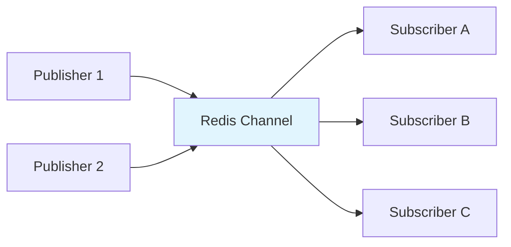
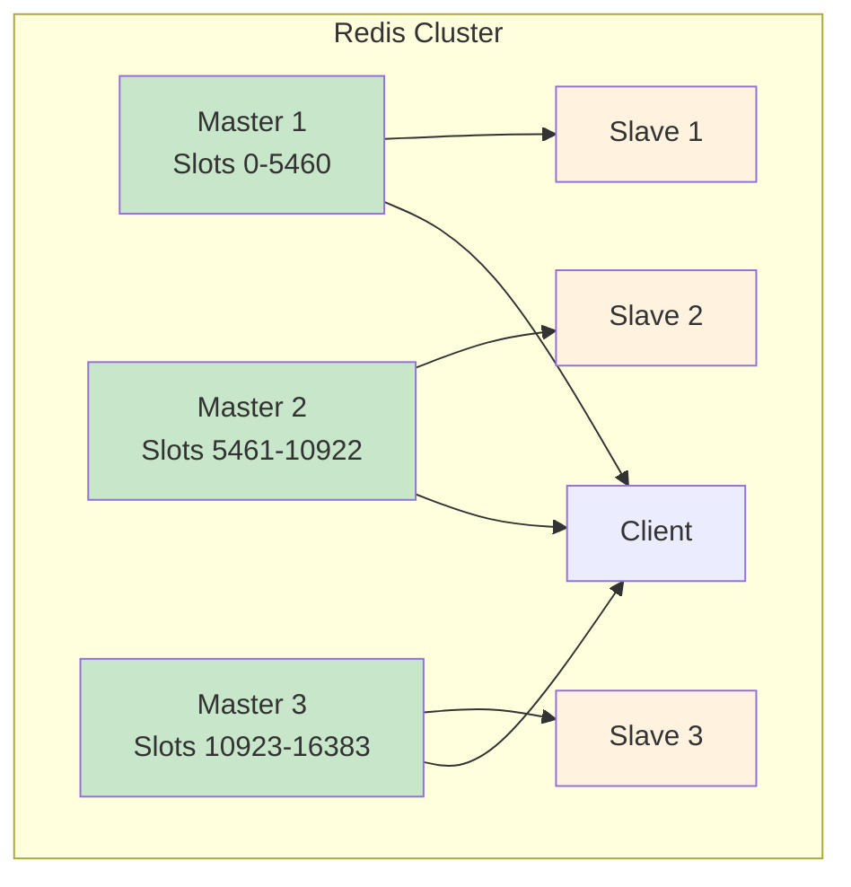

# 4. Redis Advanced Concepts

## 🎯 **TL;DR**
Master Redis advanced features including Pub/Sub messaging, clustering, persistence strategies, and performance optimization techniques for production deployments.

## 📋 **Learning Objectives**
By the end of this module, you'll be able to:
- Implement publish/subscribe messaging patterns
- Configure Redis Cluster for high availability
- Choose appropriate persistence strategies
- Optimize Redis performance and memory usage
- Implement advanced caching patterns

## 📡 **Publish/Subscribe (Pub/Sub) Messaging**

Redis Pub/Sub enables real-time messaging between publishers and subscribers without direct connections.



### **Basic Pub/Sub Operations**
```bash
# Subscribe to channels
SUBSCRIBE notifications user:123

# In another terminal, publish messages
PUBLISH notifications "System maintenance in 5 minutes"
PUBLISH user:123 "Your order has been shipped"

# Pattern subscription (wildcard)
PSUBSCRIBE user:*

# Unsubscribe
UNSUBSCRIBE notifications
PUNSUBSCRIBE user:*
```

### **Pub/Sub Use Cases**
- **Real-time notifications**: User alerts, system updates
- **Live chat systems**: Message broadcasting
- **Event-driven architectures**: Microservice communication
- **Live dashboards**: Real-time data updates

### **Pub/Sub with Redis CLI**
```bash
# Terminal 1: Subscribe to channel
127.0.0.1:6379> SUBSCRIBE user:123:notifications
Reading messages... (press Ctrl-C to quit)
1) "subscribe"
2) "user:123:notifications"
3) (integer) 1

# Terminal 2: Publish message
127.0.0.1:6379> PUBLISH user:123:notifications "You have a new message!"
(integer) 1

# Terminal 1 will receive:
1) "message"
2) "user:123:notifications"
3) "You have a new message!"

# Pattern subscription
127.0.0.1:6379> PSUBSCRIBE user:*:notifications
1) "psubscribe"
2) "user:*:notifications"
3) (integer) 1

# Publish to pattern-matched channels
127.0.0.1:6379> PUBLISH user:456:notifications "Alert for user 456"
(integer) 1
```

## 🏗️ **Redis Cluster Architecture**

Redis Cluster provides automatic sharding and high availability across multiple nodes.



### **Cluster Setup**
```bash
# Create cluster configuration files
echo "port 7001
cluster-enabled yes
cluster-config-file nodes.conf
cluster-node-timeout 5000
appendonly yes" > redis-7001.conf

# Start Redis instances
redis-server redis-7001.conf
redis-server redis-7002.conf
redis-server redis-7003.conf

# Create cluster
redis-cli --cluster create 127.0.0.1:7001 127.0.0.1:7002 127.0.0.1:7003 \
  --cluster-replicas 0
```

### **Cluster Operations**
```bash
# Connect to cluster
redis-cli -c -p 7001

# Check cluster info
CLUSTER INFO
CLUSTER NODES

# Add new node
redis-cli --cluster add-node 127.0.0.1:7004 127.0.0.1:7001

# Reshard slots
redis-cli --cluster reshard 127.0.0.1:7001
```

## 💾 **Persistence Strategies**

Redis offers two main persistence mechanisms: RDB and AOF.

### **RDB (Redis Database) Snapshots**
- **Point-in-time snapshots** of your dataset
- **Compact single file** representation
- **Configurable save intervals**
- **Fast restarts** but potential data loss

```redis.conf
# Save every 15 minutes if at least 1 key changed
save 900 1

# Save every 5 minutes if at least 10 keys changed
save 300 10

# Save every 1 minute if at least 10000 keys changed
save 60 10000

# RDB file location
dbfilename dump.rdb
dir /var/lib/redis
```

### **AOF (Append Only File)**
- **Logs every write operation** to disk
- **Near real-time persistence** with fsync options
- **Better durability** but larger files
- **Slower restarts** but minimal data loss

```redis.conf
# Enable AOF
appendonly yes

# AOF file location
appendfilename "appendonly.aof"

# Fsync policy
appendfsync everysec    # every second (balance)
# appendfsync always    # every command (slowest)
# appendfsync no        # OS decides (fastest)
```

### **Hybrid Approach**
```redis.conf
# Use both RDB and AOF
save 900 1
appendonly yes
appendfsync everysec
```

## ⚡ **Performance Optimization**

### **Memory Management**
```bash
# Monitor memory usage
INFO memory

# Set memory limits
CONFIG SET maxmemory 256mb
CONFIG SET maxmemory-policy allkeys-lru

# Monitor keyspace
INFO keyspace
```

### **Connection Pooling with Redis CLI**
```bash
# Redis CLI handles connection pooling automatically
# Multiple clients can connect simultaneously
127.0.0.1:6379> CLIENT LIST
# Shows all connected clients

# Set connection timeout
127.0.0.1:6379> CONFIG SET timeout 300
OK

# Monitor connection stats
127.0.0.1:6379> INFO clients
# connected_clients:5
# client_recent_max_input_buffer:0
# client_recent_max_output_buffer:0
```

### **Pipeline Operations with Redis CLI**
```bash
# Start pipeline mode
127.0.0.1:6379> MULTI
OK

# Queue multiple commands
127.0.0.1:6379> HSET user:123:stats login_count 5
QUEUED
127.0.0.1:6379> HSET user:123:stats last_login "2024-01-15"
QUEUED
127.0.0.1:6379> EXPIRE user:123:stats 86400
QUEUED
127.0.0.1:6379> PUBLISH user:123:updates "stats_updated"
QUEUED

# Execute all commands atomically
127.0.0.1:6379> EXEC
1) (integer) 0
2) (integer) 0
3) (integer) 1
4) (integer) 0

# Check results
127.0.0.1:6379> HGETALL user:123:stats
1) "login_count"
2) "5"
3) "last_login"
4) "2024-01-15"
```

## 🔐 **Security & Access Control**

### **Authentication**
```redis.conf
# Require password
requirepass your_secure_password

# Connect with password
redis-cli -a your_secure_password
```

### **Command Renaming**
```redis.conf
# Disable dangerous commands
rename-command FLUSHDB ""
rename-command FLUSHALL ""
rename-command SHUTDOWN SHUTDOWN_REDIS
```

### **Network Security**
```redis.conf
# Bind to specific interface
bind 127.0.0.1

# Disable protected mode in production
protected-mode no

# Enable TLS
tls-port 6380
tls-cert-file /path/to/redis.crt
tls-key-file /path/to/redis.key
```

## 📊 **Monitoring & Observability**

### **Built-in Monitoring**
```bash
# Server information
INFO

# Specific sections
INFO server
INFO clients
INFO memory
INFO stats

# Real-time monitoring
redis-cli --stat
redis-cli --latency
```

### **Key Metrics to Monitor**
- **Memory usage**: `used_memory`, `used_memory_peak`
- **Connections**: `connected_clients`, `blocked_clients`
- **Operations**: `total_commands_processed`, `instantaneous_ops_per_sec`
- **Hits/Misses**: `keyspace_hits`, `keyspace_misses`
- **Persistence**: `rdb_last_save_time`, `aof_last_rewrite_time`

### **Health Checks**
```bash
# Ping test
redis-cli ping

# Memory usage alert
redis-cli INFO memory | grep used_memory_human

# Connection count
redis-cli INFO clients | grep connected_clients
```

## 🏃‍♂️ **Advanced Caching Patterns**

### **Cache-Aside Pattern with Redis CLI**
```bash
# Check cache first
127.0.0.1:6379> GET user:profile:123
(nil)

# Cache miss - would fetch from database
# Store in cache with TTL
127.0.0.1:6379> SET user:profile:123 "{\"name\":\"Alice\",\"email\":\"alice@example.com\"}" EX 3600
OK

# Next request hits cache
127.0.0.1:6379> GET user:profile:123
"{\"name\":\"Alice\",\"email\":\"alice@example.com\"}"

# Invalidate cache when data changes
127.0.0.1:6379> DEL user:profile:123
(integer) 1

# Cache warm-up after invalidation
127.0.0.1:6379> SET user:profile:123 "{\"name\":\"Alice\",\"email\":\"alice@example.com\",\"updated\":true}" EX 3600
OK
```

### **Write-Through Cache with Redis CLI**
```bash
# Update database first (simulated)
# Then update cache immediately
127.0.0.1:6379> SET user:123 "{\"name\":\"Alice\",\"email\":\"alice_updated@example.com\"}" EX 3600
OK

# Publish update event
127.0.0.1:6379> PUBLISH user:123:updates "profile_updated"
(integer) 0

# Verify cache is updated
127.0.0.1:6379> GET user:123
"{\"name\":\"Alice\",\"email\":\"alice_updated@example.com\"}"
```

### **Cache Invalidation Strategies with Redis CLI**
```bash
# Set cache with tags (using sets to track related keys)
127.0.0.1:6379> SET user:profile:123 "profile_data" EX 3600
OK
127.0.0.1:6379> SADD tag:user_profiles user:profile:123
(integer) 1
127.0.0.1:6379> EXPIRE tag:user_profiles 3600
(integer) 1

# Add more keys to the same tag
127.0.0.1:6379> SET user:profile:456 "profile_data_2" EX 3600
OK
127.0.0.1:6379> SADD tag:user_profiles user:profile:456
(integer) 1

# Invalidate by tag (delete all keys with this tag)
127.0.0.1:6379> SMEMBERS tag:user_profiles
1) "user:profile:123"
2) "user:profile:456"
127.0.0.1:6379> DEL user:profile:123 user:profile:456 tag:user_profiles
(integer) 3

# Verify invalidation
127.0.0.1:6379> EXISTS user:profile:123
(integer) 0
```

## 🧪 **Exercises**

### **Medium Level**
1. **Pub/Sub Implementation**
   - Build a simple chat room using Redis Pub/Sub
   - Implement user presence notifications
   - Create a real-time dashboard for system metrics

2. **Cluster Configuration**
   - Set up a 3-node Redis cluster locally
   - Test failover by stopping master nodes
   - Implement resharding operations

3. **Persistence Tuning**
   - Configure RDB snapshots for different data types
   - Set up AOF with different fsync policies
   - Compare backup sizes and recovery times

### **Hard Level**
4. **Advanced Caching**
   - Implement a multi-level cache (L1: memory, L2: Redis)
   - Build a cache with automatic refresh capabilities
   - Create a distributed cache invalidation system

5. **Performance Monitoring**
   - Set up automated monitoring for Redis metrics
   - Implement alerting for memory usage and connection limits
   - Create a dashboard for Redis performance visualization

6. **Production Setup**
   - Configure Redis with TLS encryption
   - Implement connection pooling for high-traffic applications
   - Set up automated backups and disaster recovery

## 🔍 **Key Takeaways**
- **Pub/Sub**: Real-time messaging without direct connections
- **Clustering**: Automatic sharding and high availability
- **Persistence**: Choose RDB for snapshots, AOF for durability
- **Performance**: Monitor memory, connections, and operations
- **Security**: Authentication, command renaming, and TLS

## 📚 **Additional Resources**
- [Redis Cluster Tutorial](https://redis.io/topics/cluster-tutorial)
- [Redis Persistence](https://redis.io/topics/persistence)
- [Redis Security](https://redis.io/topics/security)
- [Redis Monitoring](https://redis.io/topics/admin)

## 🎯 **Next Steps**
Ready for practical applications? Check out the next module on **Redis Practical Applications** to see real-world implementations and use cases!