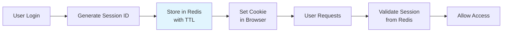
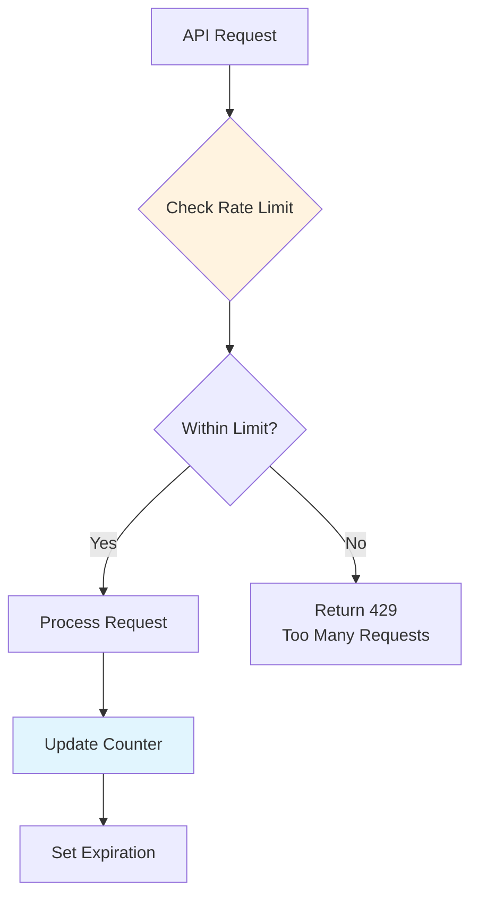
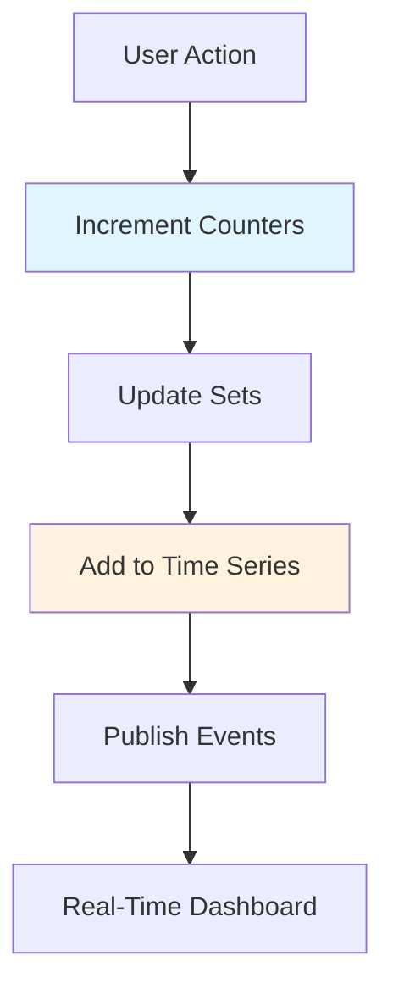

# 5. Redis Practical Applications

## 🎯 **TL;DR**
Discover real-world Redis implementations including session management, rate limiting, job queues, real-time analytics, and integration patterns for modern applications.

## 📋 **Learning Objectives**
By the end of this module, you'll be able to:
- Implement user session management with Redis
- Build rate limiting systems for API protection
- Create job queues for background processing
- Set up real-time analytics dashboards
- Integrate Redis with web applications

## 🔐 **Session Management**

Redis is perfect for storing user sessions due to its speed and built-in expiration.



### **Redis CLI Session Management**
```bash
# Start Redis server
redis-server

# In another terminal, connect to Redis
redis-cli

# Create a session with user data
127.0.0.1:6379> SET session:user123:userid "123"
OK
127.0.0.1:6379> SET session:user123:username "alice"
OK
127.0.0.1:6379> SET session:user123:created_at "2024-01-15T10:30:00Z"
OK
127.0.0.1:6379> SET session:user123:last_access "2024-01-15T10:30:00Z"
OK

# Set expiration for session (30 minutes = 1800 seconds)
127.0.0.1:6379> EXPIRE session:user123:userid 1800
(integer) 1
127.0.0.1:6379> EXPIRE session:user123:username 1800
(integer) 1
127.0.0.1:6379> EXPIRE session:user123:created_at 1800
(integer) 1
127.0.0.1:6379> EXPIRE session:user123:last_access 1800
(integer) 1

# Retrieve session data
127.0.0.1:6379> MGET session:user123:userid session:user123:username session:user123:last_access
1) "123"
2) "alice"
3) "2024-01-15T10:30:00Z"

# Update last access time
127.0.0.1:6379> SET session:user123:last_access "2024-01-15T10:45:00Z"
OK

# Extend session by 15 minutes
127.0.0.1:6379> EXPIRE session:user123:userid 2700
(integer) 1
127.0.0.1:6379> EXPIRE session:user123:username 2700
(integer) 1

# Check if session exists
127.0.0.1:6379> EXISTS session:user123:userid
(integer) 1

# Destroy session (logout)
127.0.0.1:6379> DEL session:user123:userid session:user123:username session:user123:created_at session:user123:last_access
(integer) 4

# Verify session is destroyed
127.0.0.1:6379> EXISTS session:user123:userid
(integer) 0
```
```bash
# Start Redis server
redis-server

# In another terminal, connect to Redis
redis-cli

# Set up session data
127.0.0.1:6379> SET session:user123:userid "123"
OK
127.0.0.1:6379> SET session:user123:username "alice"
OK
127.0.0.1:6379> SET session:user123:lastaccess "2024-01-15T10:30:00Z"
OK
127.0.0.1:6379> EXPIRE session:user123:* 1800
(integer) 3

# Check session exists
127.0.0.1:6379> EXISTS session:user123:userid
(integer) 1

# Get session data
127.0.0.1:6379> MGET session:user123:userid session:user123:username session:user123:lastaccess
1) "123"
2) "alice"
3) "2024-01-15T10:30:00Z"

# Clean up expired sessions (would be done by application)
127.0.0.1:6379> DEL session:user123:userid session:user123:username session:user123:lastaccess
(integer) 3
```

## 🛡️ **Rate Limiting**

Protect your APIs from abuse with Redis-based rate limiting.



### **Rate Limiting with Redis CLI**
```bash
# Simulate API rate limiting
127.0.0.1:6379> ZADD rate_limit:user123:api_call 1705315800 "req1"
(integer) 1
127.0.0.1:6379> ZADD rate_limit:user123:api_call 1705315810 "req2"
(integer) 1
127.0.0.1:6379> ZADD rate_limit:user123:api_call 1705315820 "req3"
(integer) 1

# Check current request count in last 60 seconds
127.0.0.1:6379> ZCOUNT rate_limit:user123:api_call 1705315260 1705315320
(integer) 3

# Remove old requests (outside 60-second window)
127.0.0.1:6379> ZREMRANGEBYSCORE rate_limit:user123:api_call -inf 1705315260
(integer) 0

# Check if under limit (assuming 5 requests per minute limit)
127.0.0.1:6379> ZCARD rate_limit:user123:api_call
(integer) 3

# Add new request if under limit
127.0.0.1:6379> ZADD rate_limit:user123:api_call 1705315830 "req4"
(integer) 1

# Set expiration on the rate limit key
127.0.0.1:6379> EXPIRE rate_limit:user123:api_call 3600
(integer) 1
```

## ⚙️ **Job Queues & Background Processing**

Use Redis lists for simple job queues or Redis streams for advanced message processing.


### **Job Queue with Redis CLI**
```bash
# Add jobs to queue (using Redis lists)
127.0.0.1:6379> LPUSH jobs '{"id":"job1","type":"email","email":"user@example.com","subject":"Welcome","priority":0}'
(integer) 1
127.0.0.1:6379> LPUSH jobs '{"id":"job2","type":"email","email":"admin@example.com","subject":"Alert","priority":1}'
(integer) 2

# Add high priority jobs to sorted set
127.0.0.1:6379> ZADD jobs:priority 1 '{"id":"job2","type":"email","email":"admin@example.com","subject":"Alert"}'
(integer) 1

# Process jobs (worker picks from priority queue first)
127.0.0.1:6379> ZREVRANGE jobs:priority 0 0
1) "{\"id\":\"job2\",\"type\":\"email\",\"email\":\"admin@example.com\",\"subject\":\"Alert\"}"

# Remove from priority queue and mark as processing
127.0.0.1:6379> ZREMRANGEBYRANK jobs:priority -1 -1
(integer) 1
127.0.0.1:6379> SET job:job2:status processing EX 3600
OK

# Mark job as completed
127.0.0.1:6379> SET job:job2:result '{"status":"sent","timestamp":"2024-01-15T11:00:00Z"}' EX 86400
OK
127.0.0.1:6379> SET job:job2:status completed EX 3600
OK

# Process regular jobs from list
127.0.0.1:6379> BRPOPLPUSH jobs jobs:processing 30
"{\"id\":\"job1\",\"type\":\"email\",\"email\":\"user@example.com\",\"subject\":\"Welcome\",\"priority\":0}"
127.0.0.1:6379> SET job:job1:status processing EX 3600
OK

# Check processing queue
127.0.0.1:6379> LRANGE jobs:processing 0 -1
1) "{\"id\":\"job1\",\"type\":\"email\",\"email\":\"user@example.com\",\"subject\":\"Welcome\",\"priority\":0}"

# Complete job and remove from processing queue
127.0.0.1:6379> LREM jobs:processing 0 "{\"id\":\"job1\",\"type\":\"email\",\"email\":\"user@example.com\",\"subject\":\"Welcome\",\"priority\":0}"
(integer) 1
127.0.0.1:6379> SET job:job1:status completed EX 3600
OK

# Check job status
127.0.0.1:6379> GET job:job1:status
"completed"
127.0.0.1:6379> GET job:job2:status
"completed"
```

## 📊 **Real-Time Analytics**

Track and analyze user behavior in real-time using Redis data structures.



## 🏪 **E-commerce Integration**
### **Real-Time Analytics with Redis CLI**
```bash
# Track page views
127.0.0.1:6379> INCR page:home:views
(integer) 1
127.0.0.1:6379> INCR total:page_views
(integer) 1

# Add to unique visitors (HyperLogLog)
127.0.0.1:6379> PFADD page:home:unique_visitors user123
(integer) 1
127.0.0.1:6379> PFADD page:home:unique_visitors user456
(integer) 1

# Get unique visitor count
127.0.0.1:6379> PFCOUNT page:home:unique_visitors
(integer) 2

# Track user journey (list)
127.0.0.1:6379> LPUSH user:123:journey "checkout<-cart<-home@1705315800"
(integer) 1

# Publish analytics event
127.0.0.1:6379> PUBLISH analytics:events "{\"type\":\"page_view\",\"user_id\":\"123\",\"page\":\"home\",\"timestamp\":1705315800}"
(integer) 0

# Track conversions
127.0.0.1:6379> INCR conversion:purchase
(integer) 1
127.0.0.1:6379> INCR total:conversions
(integer) 1

# Add revenue
127.0.0.1:6379> INCRBYFLOAT revenue:purchase 99.99
"99.99"
127.0.0.1:6379> INCRBYFLOAT total:revenue 99.99
"99.99"

# Get real-time stats
127.0.0.1:6379> MGET total:page_views total:conversions total:revenue
1) "1"
2) "1"
3) "99.99"

# Get page-specific stats
127.0.0.1:6379> GET page:home:views
"1"
127.0.0.1:6379> PFCOUNT page:home:unique_visitors
(integer) 2
```

## 🏪 **E-commerce Integration**

Complete e-commerce caching and session management with Redis.

### **E-commerce with Redis CLI**
```bash
# Set up product inventory
127.0.0.1:6379> HMSET product:123 name "Wireless Headphones" price "99.99" stock "50"
OK
127.0.0.1:6379> HMSET product:456 name "Bluetooth Speaker" price "49.99" stock "25"
OK

# Add items to shopping cart (using hashes)
127.0.0.1:6379> HINCRBY cart:session123 123 2
(integer) 2
127.0.0.1:6379> HINCRBY cart:session123 456 1
(integer) 1

# Set cart expiration (24 hours)
127.0.0.1:6379> EXPIRE cart:session123 86400
(integer) 1

# Check product availability before adding more
127.0.0.1:6379> HGET product:123 stock
"50"
127.0.0.1:6379> HGETALL cart:session123
1) "123"
2) "2"
3) "456"
4) "1"

# Calculate cart total
127.0.0.1:6379> HGET product:123 price
"99.99"
127.0.0.1:6379> HGET product:456 price
"49.99"
# Total = (2 * 99.99) + (1 * 49.99) = 249.97
127.0.0.1:6379> SET cart:session123:total 249.97
OK

# Get cart contents
127.0.0.1:6379> HGETALL cart:session123
1) "123"
2) "2"
3) "456"
4) "1"
127.0.0.1:6379> GET cart:session123:total
"249.97"

# Update inventory after purchase
127.0.0.1:6379> HINCRBY product:123 stock -2
(integer) 48
127.0.0.1:6379> HINCRBY product:456 stock -1
(integer) 24

# Clear cart after checkout
127.0.0.1:6379> DEL cart:session123 cart:session123:total
(integer) 2
```

## 🧪 **Exercises**

### **Medium Level**
1. **Session Management System**
   - Build a complete session store with login/logout
   - Implement session hijacking protection
   - Add multi-device session management

2. **API Rate Limiting**
   - Implement different rate limits for different endpoints
   - Add burst allowance for occasional high usage
   - Create admin dashboard for rate limit monitoring

3. **Job Queue System**
   - Build a priority job queue with retry logic
   - Implement job status tracking and progress updates
   - Add dead letter queue for failed jobs

### **Hard Level**
4. **Real-Time Analytics Platform**
   - Create a complete analytics system with multiple metrics
   - Implement real-time dashboards with WebSocket updates
   - Add A/B testing capabilities with Redis

5. **E-commerce Platform**
   - Build a full shopping cart system with inventory management
   - Implement product recommendations based on user behavior
   - Add order processing with Redis-backed workflows

6. **Microservices Integration**
   - Design inter-service communication using Redis Pub/Sub
   - Implement distributed caching across multiple services
   - Create a service registry with Redis

## 🔍 **Key Takeaways**
- **Sessions**: Fast, scalable session storage with automatic expiration
- **Rate Limiting**: Protect APIs with sliding window algorithms
- **Job Queues**: Background processing with priority and status tracking
- **Analytics**: Real-time metrics collection and dashboard updates
- **Integration**: Redis as the "glue" between different application components

## 📚 **Additional Resources**
- [Redis in Production](https://redis.io/topics/admin)
- [Redis Use Cases](https://redis.io/topics/introduction)
- [Real-World Redis Examples](https://redis.io/commands)
- [Redis Best Practices](https://redis.io/topics/memory-optimization)

## 🎯 **Next Steps**
Redis module complete! Ready to explore other databases? Check out **Cassandra Column-Family Database** for distributed big data storage, or dive into **Graph Databases** with Neo4j!