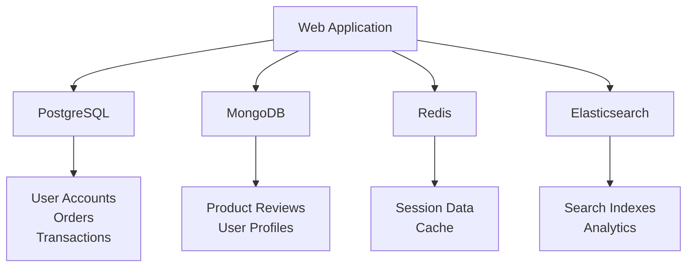

# NoSQL vs SQL: When to Choose What

**Level:** Intermediate  
**Time Estimate:** 25 minutes  
**Prerequisites:** Basic understanding of databases, CAP theorem.

## TL;DR
SQL databases excel at complex queries and transactions, while NoSQL databases prioritize scalability and flexibility. Choose based on your data patterns, consistency needs, and scaling requirements.

## Learning Objectives
By the end of this lesson, you'll be able to:
- Compare SQL and NoSQL databases objectively
- Choose the right database for specific use cases
- Understand trade-offs between consistency and scalability
- Design hybrid architectures when appropriate

## Motivation & Real-World Scenario
Building an e-commerce platform where you need to store user profiles (flexible schemas), product catalogs (complex relationships), and shopping cart data (high write throughput). You'll need both SQL and NoSQL databases working together.

## Theory: SQL vs NoSQL Comparison

### Core Differences

| **Aspect** | **SQL Databases** | **NoSQL Databases** |
|------------|-------------------|---------------------|
| **Data Model** | Tables with fixed schemas | Documents, key-value, graphs, etc. |
| **Schema** | Predefined, rigid | Dynamic, flexible |
| **Query Language** | SQL (standardized) | Varies by database type |
| **Transactions** | ACID compliance | BASE (varies by database) |
| **Scaling** | Vertical (bigger servers) | Horizontal (more servers) |
| **Joins** | Native support | Limited or application-level |
| **Consistency** | Strong consistency | Eventual consistency (usually) |

### When to Choose SQL

**✅ Best For:**
- **Complex Relationships**: Multi-table joins, foreign keys
- **Data Integrity**: ACID transactions required
- **Complex Queries**: Analytics, reporting, aggregations
- **Structured Data**: Fixed schemas, predictable patterns
- **Financial Systems**: Banking, accounting, inventory

**Real Examples:**
- E-commerce product catalogs with categories and suppliers
- Banking systems requiring transaction consistency
- ERP systems with complex business logic
- Analytics platforms with multi-dimensional reporting

### When to Choose NoSQL

**✅ Best For:**
- **High Volume**: Massive read/write operations
- **Flexible Schemas**: Evolving data structures
- **Horizontal Scaling**: Distributed across many servers
- **Simple Queries**: Key-based lookups
- **Big Data**: Unstructured or semi-structured data

**Real Examples:**
- Social media feeds and user profiles
- IoT sensor data streams
- Content management systems
- Real-time analytics dashboards

### Hybrid Approaches (Polyglot Persistence)

**Modern applications often use multiple database types:**



**Common Patterns:**
- **SQL + Document DB**: Structured data + flexible content
- **SQL + Key-Value**: Transactions + high-speed cache
- **SQL + Search Engine**: Data storage + full-text search
- **SQL + Time Series**: Business data + metrics/analytics

## Decision Framework

### Step 1: Analyze Your Data
```
Data Characteristics → Database Choice

├── Structured & Relational → SQL
├── Semi-structured & Flexible → Document DB (MongoDB)
├── Simple Key-Value → Key-Value Store (Redis)
├── Hierarchical/Networks → Graph DB (Neo4j)
├── Time-Based Metrics → Time Series DB (InfluxDB)
├── Full-Text Search → Search Engine (Elasticsearch)
└── Wide Columns → Column-Family (Cassandra)
```

### Step 2: Consider Requirements
```
Requirements → Database Choice

├── ACID Transactions → SQL
├── High Availability → AP NoSQL (Cassandra, DynamoDB)
├── Strong Consistency → CP NoSQL (Redis, etcd) or SQL
├── Massive Scale → NoSQL
├── Complex Analytics → SQL + NoSQL
└── Real-time Processing → NoSQL
```

### Step 3: Evaluate Trade-offs
```
SQL Trade-offs:
├── Vertical scaling limits
├── Schema changes are expensive
└── Complex for simple key-value operations

NoSQL Trade-offs:
├── Eventual consistency complexity
├── Limited transaction support
├── Application-level joins
└── Learning curve for new query languages
```

## Real-World Case Studies

### Netflix: SQL → NoSQL Migration
- **Before**: Oracle for all data
- **After**: Cassandra for user data, MySQL for transactions
- **Result**: 10x scalability improvement
- **Lesson**: Different data types need different databases

### Twitter: Multiple NoSQL Solutions
- **MySQL**: User accounts and relationships
- **Redis**: Timeline caching and sessions
- **Cassandra**: Tweet storage and analytics
- **Result**: Handles billions of tweets daily
- **Lesson**: Polyglot persistence enables massive scale

### Airbnb: SQL + NoSQL Hybrid
- **PostgreSQL**: Core business data
- **MongoDB**: Flexible listing data
- **Redis**: Search caching
- **Result**: Fast search + flexible content management
- **Lesson**: Best tool for each job

## Migration Strategies

### From SQL to NoSQL
1. **Identify Migration Candidates**: Simple tables, high-volume data
2. **Choose Target Database**: Based on data patterns
3. **Plan Data Transformation**: Schema changes, data type conversions
4. **Implement Dual Writes**: Write to both systems during transition
5. **Migrate Incrementally**: Move one table/feature at a time
6. **Update Application Code**: New queries and connection logic

### From NoSQL to SQL
1. **Schema Design**: Define tables and relationships
2. **Data Validation**: Ensure data fits SQL constraints
3. **ETL Processes**: Transform and load data
4. **Application Updates**: Add transaction logic
5. **Testing**: Validate data integrity and performance

## Quick Checklist / Cheatsheet

**Choose SQL when:**
- Data has complex relationships
- ACID transactions are required
- You need complex queries and joins
- Schema is stable and well-defined

**Choose NoSQL when:**
- You need massive scalability
- Data structure evolves frequently
- Simple queries dominate
- High write throughput is critical

**Consider Hybrid when:**
- Different data types have different requirements
- You want best tool for each job
- Application complexity is manageable

## Exercises

1. **Easy**: For a blog application storing articles and comments, would you choose SQL or NoSQL? Explain why.

2. **Medium**: Design a hybrid architecture for a social media platform. Specify which database type you'd use for: user profiles, posts, friendships, search, and analytics.

3. **Hard**: You're migrating a monolithic e-commerce application from a single SQL database to a microservices architecture with polyglot persistence. Plan the migration strategy, including which services get which databases and how you'll handle data consistency.