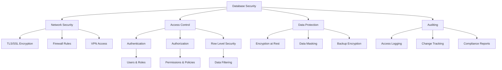
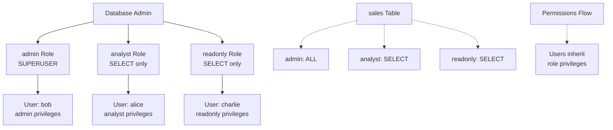
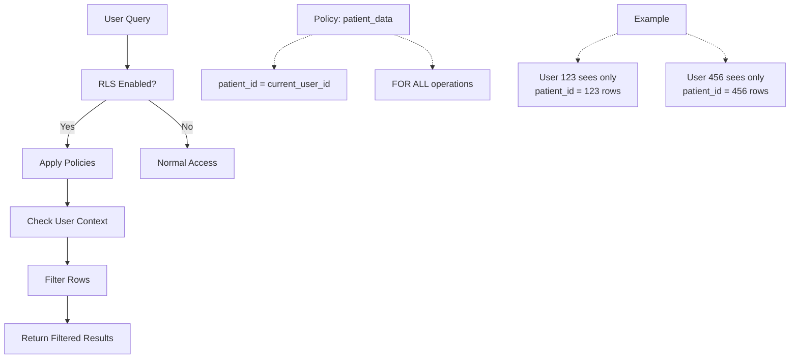

# Advanced Security

**Level:** Advanced  
**Time Estimate:** 40 minutes  
**Prerequisites:** Basic SQL, user management.

## TL;DR
Secure databases with access controls, encryption, and auditing. Implement least privilege, row-level security, and protect data at rest and in transit.

## Learning Objectives
By the end of this lesson, you'll be able to:
- Set up role-based access control (RBAC).
- Implement Row Level Security (RLS) in Postgres.
- Configure encryption and TLS.
- Enable auditing for compliance.

## Motivation & Real-World Scenario
A healthcare app must ensure patients see only their records. Without security, breaches expose sensitive data. Proper security prevents unauthorized access and logs suspicious activity.

## Theory: Security Layers

### Access Control
- **Roles:** Group permissions.
- **Privileges:** GRANT/REVOKE on objects.
- **RLS:** Filter rows based on user context.

### Encryption
- **At Rest:** Encrypt data on disk.
- **In Transit:** Use TLS for connections.

### Auditing
- Log access and changes for compliance (e.g., HIPAA, GDPR).

**Database Security Layers:**


## Worked Examples

### Role-Based Access (Postgres)
```sql
-- Create roles
CREATE ROLE analyst;
CREATE ROLE admin SUPERUSER;

-- Grant privileges
GRANT SELECT ON sales TO analyst;
GRANT ALL ON sales TO admin;

-- Create user
CREATE USER alice PASSWORD 'secret';
GRANT analyst TO alice;
```

**RBAC Hierarchy Example:**


### Row Level Security (Postgres)
```sql
CREATE TABLE patient_records (id serial, patient_id int, data text);
ALTER TABLE patient_records ENABLE ROW LEVEL SECURITY;

-- Policy: users see only their records
CREATE POLICY patient_data ON patient_records
  FOR ALL USING (patient_id = current_setting('app.current_user_id')::int);
```

**RLS Policy Flow:**


### Encryption at Rest (Postgres with pgcrypto)
```sql
-- Encrypt column
CREATE EXTENSION pgcrypto;
UPDATE users SET ssn = pgp_sym_encrypt(ssn, 'key');

-- Decrypt
SELECT pgp_sym_decrypt(ssn, 'key') FROM users;
```

### TLS Configuration
In `postgresql.conf`:
```
ssl = on
ssl_cert_file = 'server.crt'
ssl_key_file = 'server.key'
```

Client: `psql "sslmode=require host=..."`

### Auditing (Postgres)
```sql
-- Enable logging
ALTER SYSTEM SET log_statement = 'all';
ALTER SYSTEM SET log_line_prefix = '%t [%p]: [%l-1] user=%u,db=%d,app=%a,client=%h ';

-- Or use pgAudit extension
CREATE EXTENSION pgaudit;
ALTER SYSTEM SET pgaudit.log = 'read,write';
```

## Quick Checklist / Cheatsheet
- Use least privilege: grant only needed permissions.
- Enable RLS for multi-tenant apps.
- Encrypt sensitive data and use TLS.
- Regularly review audit logs.

## Exercises

1. **Easy:** Create a role for read-only access to a table.
2. **Medium:** Implement RLS on a `orders` table for user isolation.
3. **Hard:** Set up basic auditing and query logs.

## Solutions

1. `CREATE ROLE readonly; GRANT SELECT ON table TO readonly;`

2. `ALTER TABLE orders ENABLE ROW LEVEL SECURITY; CREATE POLICY user_orders FOR ALL USING (user_id = current_user_id);`

3. Enable `log_statement = 'all'` in config, reload, and check logs.

## Notes: Vendor Differences / Performance Tips
- Postgres: RLS with policies; MySQL: views or application-level.
- Encryption can impact performance; use for sensitive fields only.
- Audit logs grow fast; archive regularly.

## Next Lessons
- Monitoring & Observability (for security alerts).
- Partitioning & Sharding (for data isolation).

