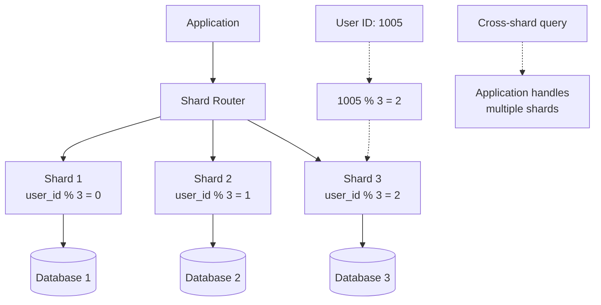

# Partitioning & Sharding

**Level:** Advanced  
**Time Estimate:** 40 minutes  
**Prerequisites:** Indexing, large datasets.

## TL;DR
Partition tables for better performance on large data. Shard across servers for horizontal scaling. Use partitioning for maintenance, sharding for distribution.

## Learning Objectives
By the end of this lesson, you'll be able to:
- Implement table partitioning.
- Understand sharding strategies.
- Maintain partitioned tables.
- Choose between partitioning and sharding.

## Motivation & Real-World Scenario
A table with billions of rows slows queries. Partitioning splits data logically, sharding distributes across nodes, improving speed and manageability.

## Theory: Partitioning vs Sharding

### Partitioning
- Split table into smaller pieces (same server).
- Types: Range, List, Hash.

### Sharding
- Distribute across multiple servers.
- Requires application logic or middleware.

**Visual Comparison:**
```
Partitioning (Same Server):
┌─────────────────────────────────────┐
│ Server                              │
├─────────────────────────────────────┤
│ Table: sales                        │
├─────────────────────────────────────┤
│ Partition 2023 │ Partition 2024 │ ... │
│ Jan-Mar        │ Apr-Jun       │     │
└─────────────────────────────────────┘

Sharding (Multiple Servers):
┌─────────────┐  ┌─────────────┐  ┌─────────────┐
│ Server 1    │  │ Server 2    │  │ Server 3    │
├─────────────┤  ├─────────────┤  ├─────────────┤
│ Shard A     │  │ Shard B     │  │ Shard C     │
│ user_id % 3 │  │ user_id % 3 │  │ user_id % 3 │
│ = 0         │  │ = 1         │  │ = 2         │
└─────────────┘  └─────────────┘  └─────────────┘
```

## Worked Examples

### Range Partitioning (Postgres)
```sql
CREATE TABLE sales (
  id bigserial,
  sale_date date,
  amount numeric
) PARTITION BY RANGE (sale_date);

-- Create partitions
CREATE TABLE sales_2023 PARTITION OF sales FOR VALUES FROM ('2023-01-01') TO ('2024-01-01');
CREATE TABLE sales_2024 PARTITION OF sales FOR VALUES FROM ('2024-01-01') TO ('2025-01-01');

-- Index on partition
CREATE INDEX idx_sales_2024_date ON sales_2024 (sale_date);
```

**Visual Range Partitioning:**
```
Sales Table (Range Partitioned by sale_date)
├── sales_2023: 2023-01-01 to 2023-12-31
│   ├── Q1: Jan-Mar
│   ├── Q2: Apr-Jun  
│   ├── Q3: Jul-Sep
│   └── Q4: Oct-Dec
├── sales_2024: 2024-01-01 to 2024-12-31
│   ├── Q1: Jan-Mar
│   ├── Q2: Apr-Jun
│   └── Q3: Jul-Sep
└── sales_2025: 2025-01-01 to 2025-12-31 (future)

Query: WHERE sale_date >= '2024-01-01'
Result: Only scans sales_2024+ partitions (partition pruning)
```

### List Partitioning
```sql
CREATE TABLE orders PARTITION BY LIST (region);

CREATE TABLE orders_us PARTITION OF orders FOR VALUES IN ('US');
CREATE TABLE orders_eu PARTITION OF orders FOR VALUES IN ('EU');
```

**Visual List Partitioning:**
```
Orders Table (List Partitioned by region)
├── orders_us: region IN ('US')
│   ├── Northeast
│   ├── Midwest  
│   ├── South
│   └── West
├── orders_eu: region IN ('EU')
│   ├── UK
│   ├── Germany
│   ├── France
│   └── Others
└── orders_asia: region IN ('ASIA')
    ├── China
    ├── Japan
    └── India

Query: WHERE region = 'US'
Result: Only scans orders_us partition
```

### Sharding Example (Conceptual)
Use a shard key (e.g., user_id % num_shards) to route queries. Tools: Citus (Postgres extension), Vitess (MySQL).

**Visual Sharding Architecture:**


## Quick Checklist / Cheatsheet
- Partition on query-heavy columns.
- Use hash for even distribution.
- Monitor partition sizes.
- For sharding, plan rebalancing.

## Exercises

1. **Easy:** Create a range-partitioned table for logs.
2. **Medium:** Add a new partition and migrate data.
3. **Hard:** Design a sharding scheme for users.

## Solutions

1. `CREATE TABLE logs PARTITION BY RANGE (created_at); CREATE TABLE logs_2025 PARTITION OF logs FOR VALUES FROM ('2025-01-01') TO ('2026-01-01');`

2. `CREATE TABLE new_part PARTITION OF table FOR VALUES ...; INSERT INTO new_part SELECT * FROM old_part WHERE ...; DROP TABLE old_part;`

3. Use modulo on user_id, route to shards, handle cross-shard queries with application logic.

## Notes: Vendor Differences / Performance Tips
- Postgres: Native partitioning.
- MySQL: Partitioning supported.
- SQL Server/Oracle: Advanced partitioning.
- Sharding often via third-party tools.

Partition pruning is key for performance.

## Next Lessons
- Indexing & Performance (for partitioned tables).
- Monitoring & Observability (for shard health).

