# Monitoring & Observability

**Level:** Intermediate  
**Time Estimate:** 35 minutes  
**Prerequisites:** Basic SQL, system admin.

## TL;DR
Monitor database health with metrics like query performance, connections, and locks. Use tools like pg_stat_statements and exporters for alerts.

## Learning Objectives
By the end of this lesson, you'll be able to:
- Query system views for metrics.
- Set up basic monitoring.
- Identify performance bottlenecks.
- Integrate with monitoring stacks.

## Motivation & Real-World Scenario
A database slows down under load. Monitoring reveals high lock waits, allowing quick fixes before outages.

## Theory: Key Metrics

### Performance
- Query latency, throughput.

### Health
- Connections, locks, replication lag.

### Resources
- CPU, memory, disk I/O.

**Database Monitoring Architecture:**


**Database Metrics Hierarchy:**


**Alert Flow & Escalation:**


**Observability Dashboard Layout:**

```mermaid
graph TB
    subgraph "Top Row - System Overview"
        A[Database Status ● Up/Down]
        B[Uptime 99.9%]
        C[Active Connections 45/100]
        D[Replication Lag 2.3s]
    end
    
    subgraph "Middle Row - Performance"
        E[Query Latency Chart over time]
        F[Throughput TPS Chart over time]
        G[Slow Query Count Top 10 list]
        H[Lock Waits Current count]
    end
    
    subgraph "Bottom Row - Resources"
        I[CPU Usage % Chart over time]
        J[Memory Usage % Chart over time]
        K[Disk I/O Read/Write MB/s]
        L[Network I/O Packets/s]
    end
    
    subgraph "Right Panel - Alerts & Logs"
        M[Active Alerts Critical: 0 Warning: 2]
        N[Recent Logs Error log entries]
        O[Top Queries By execution time]
    end
    
    P[Time Range Selector] -.-> E
    P -.-> F
    P -.-> I
    P -.-> J
    P -.-> K
    P -.-> L
    
    Q[Refresh Interval 30s] -.-> A
    Q -.-> B
    Q -.-> C
    Q -.-> D
```


## Worked Examples

### Slow Queries (Postgres)
```sql
SELECT query, calls, total_time / calls AS avg_time
FROM pg_stat_statements
ORDER BY total_time DESC
LIMIT 10;
```

### Active Connections
```sql
SELECT count(*) FROM pg_stat_activity;
```

### Lock Waits
```sql
SELECT * FROM pg_locks WHERE granted = false;
```

### Replication Lag
```sql
SELECT client_addr, pg_wal_lsn_diff(pg_current_wal_lsn(), replay_lsn) AS lag_bytes
FROM pg_stat_replication;
```

### Prometheus Exporter
Install `postgres_exporter`, configure scrape in Prometheus.

## Quick Checklist / Cheatsheet
- Enable pg_stat_statements.
- Monitor pg_stat_activity regularly.
- Set alerts for high connection counts.
- Use EXPLAIN ANALYZE for query tuning.

## Exercises

1. **Easy:** Find the top 5 slowest queries.
2. **Medium:** Check for blocked queries.
3. **Hard:** Set up a simple alert for replication lag.

## Solutions

1. `SELECT query, total_time FROM pg_stat_statements ORDER BY total_time DESC LIMIT 5;`

2. `SELECT * FROM pg_stat_activity WHERE wait_event_type = 'Lock';`

3. Use a cron job to query lag and email if > threshold.

## Notes: Vendor Differences / Performance Tips
- MySQL: Use `performance_schema`.
- SQL Server: DMVs like `sys.dm_exec_requests`.
- Monitor trends, not just snapshots.

## Next Lessons
- Query Plans & Cost Models (for query analysis).
- Advanced Security (for audit logs).

