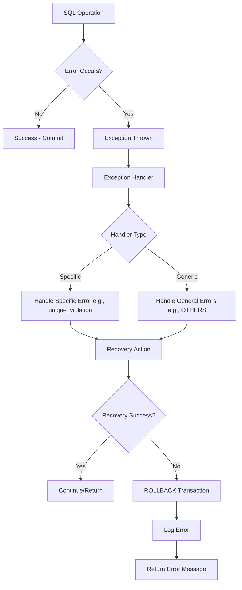
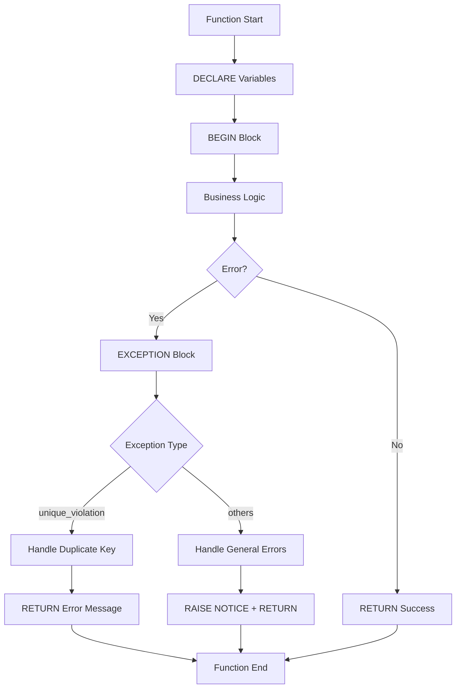

# Error Handling and Exceptions

**Level:** Intermediate  
**Time Estimate:** 30 minutes  
**Prerequisites:** Basic SQL, transactions.

## TL;DR
Handle errors in SQL procedures to ensure data integrity and provide user-friendly feedback. Use exception blocks to catch and respond to failures like constraint violations or deadlocks.

## Learning Objectives
By the end of this lesson, you'll be able to:
- Implement error handling in stored procedures.
- Use `ROLLBACK` to undo failed transactions.
- Differentiate between vendor-specific syntax (Postgres vs MySQL).
- Design idempotent operations for safe retries.

## Motivation & Real-World Scenario
In a banking app, a transfer might fail due to insufficient funds. Without error handling, the app crashes or leaves data inconsistent. Proper handling rolls back changes and logs the issue.

## Theory: Exception Handling Basics

### Why Handle Errors?
- Prevent partial updates.
- Log issues for debugging.
- Provide graceful degradation.

### Key Concepts
- **Exception Blocks:** Catch errors and execute recovery code.
- **Idempotency:** Operations that can be repeated safely.
- **Rollback:** Undo transaction changes on error.

**Error Handling Flow:**


## Worked Examples

### Postgres (PL/pgSQL)
```sql
CREATE OR REPLACE FUNCTION safe_transfer(from_id INT, to_id INT, amt NUMERIC) RETURNS TEXT AS $$
DECLARE
  from_balance NUMERIC;
BEGIN
  -- Check balance
  SELECT balance INTO from_balance FROM accounts WHERE id = from_id;
  IF from_balance < amt THEN
    RAISE EXCEPTION 'Insufficient funds';
  END IF;

  -- Perform transfer
  UPDATE accounts SET balance = balance - amt WHERE id = from_id;
  UPDATE accounts SET balance = balance + amt WHERE id = to_id;

  RETURN 'Transfer successful';
EXCEPTION
  WHEN unique_violation THEN
    RETURN 'Duplicate key error';
  WHEN others THEN
    RAISE NOTICE 'Error: %', SQLERRM;
    RETURN 'Transfer failed';
END;
$$ LANGUAGE plpgsql;
```

**Postgres Exception Handling Structure:**


### MySQL
```sql
DELIMITER //
CREATE PROCEDURE safe_transfer(IN from_id INT, IN to_id INT, IN amt DECIMAL(10,2))
BEGIN
  DECLARE from_balance DECIMAL(10,2);
  DECLARE EXIT HANDLER FOR SQLEXCEPTION
  BEGIN
    ROLLBACK;
    SIGNAL SQLSTATE '45000' SET MESSAGE_TEXT = 'Transfer failed';
  END;

  START TRANSACTION;

  SELECT balance INTO from_balance FROM accounts WHERE id = from_id;
  IF from_balance < amt THEN
    SIGNAL SQLSTATE '45000' SET MESSAGE_TEXT = 'Insufficient funds';
  END IF;

  UPDATE accounts SET balance = balance - amt WHERE id = from_id;
  UPDATE accounts SET balance = balance + amt WHERE id = to_id;

  COMMIT;
END //
DELIMITER ;
```

### Idempotent Retries
Use unique constraints or keys to prevent duplicates:
```sql
-- Idempotent insert
INSERT INTO transfers (id, from_id, to_id, amt) VALUES (gen_random_uuid(), 1, 2, 100)
ON CONFLICT (id) DO NOTHING;
```

**Idempotency vs Non-Idempotency:**
```
Non-Idempotent Operation:
POST /transfer (debit $100)
├── First call: Success - $100 debited
└── Second call: Error - Insufficient funds (state changed)

Idempotent Operation:
POST /transfer?request_id=123 (debit $100)
├── First call: Success - $100 debited, request_id recorded
└── Second call: Success - No action (duplicate request_id detected)

Idempotent Design Patterns:
├── Use unique constraints on request IDs
├── Check for existing records before insertion
├── Use UPSERT operations (INSERT ... ON CONFLICT)
├── Make operations naturally idempotent (e.g., set-based updates)
```

## Quick Checklist / Cheatsheet
- Always wrap multi-step operations in transactions.
- Use specific exception types when possible (e.g., `unique_violation`).
- Log errors with `RAISE NOTICE` or equivalent.
- Test error paths manually.

## Exercises

1. **Easy:** Modify the Postgres function to check for negative amounts.
2. **Medium:** Add deadlock handling (retry logic) to the MySQL procedure.
3. **Hard:** Implement a retry mechanism for serialization failures in Postgres.

## Solutions

1. Add `IF amt <= 0 THEN RAISE EXCEPTION 'Invalid amount'; END IF;` before checks.

2. Wrap in a loop with `DECLARE retry_count INT DEFAULT 0;` and increment on deadlock, sleep, retry up to 3 times.

3. Use a loop: `WHILE retry_count < 3 LOOP BEGIN ... EXCEPTION WHEN serialization_failure THEN retry_count := retry_count + 1; END; END LOOP;`

## Notes: Vendor Differences / Performance Tips
- Postgres: `EXCEPTION WHEN ... THEN` blocks.
- MySQL: `DECLARE EXIT HANDLER FOR ...`
- SQL Server: `TRY ... CATCH`
- Avoid over-catching; let critical errors bubble up.

## Next Lessons
- Transactions & Isolation (for error context).
- Data Migration & Backup (for recovery strategies).

