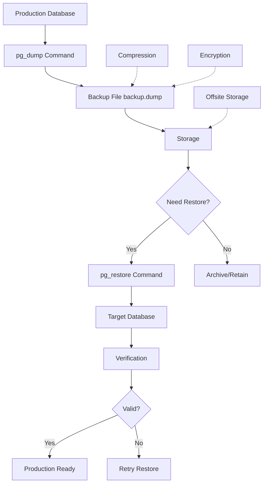

# Migration, Backup & Restore

**Level:** Intermediate  
**Time Estimate:** 35 minutes  
**Prerequisites:** Basic SQL, database setup.

## TL;DR
Back up your data regularly to prevent loss. Use logical dumps for portability and physical backups for point-in-time recovery. Test restores to ensure reliability.

## Learning Objectives
By the end of this lesson, you'll be able to:
- Perform logical and physical backups in Postgres.
- Restore from backups.
- Plan migration strategies for schema changes.
- Implement point-in-time recovery (PITR).

## Motivation & Real-World Scenario
A production database crashes, losing recent data. Without backups, the business suffers downtime and data loss. Regular backups and tested restores minimize impact.

## Theory: Backup Types

### Logical Backups
- Export data as SQL statements.
- Portable across versions/DBs.
- Slower for large datasets.

### Physical Backups
- Copy database files.
- Faster, supports PITR.
- Tied to specific version/hardware.

### Migration
- Schema changes: Use version control and migration scripts.
- Data migration: ETL tools or custom scripts.

**Backup Types Comparison:**
```
Logical Backups (pg_dump):
├── Format: SQL statements
├── Portability: High (works across versions/DBs)
├── Speed: Slower for large datasets
├── Use Cases: Schema migration, small databases
└── Recovery: Full or selective restore

Physical Backups (pg_basebackup):
├── Format: Database files + WAL
├── Portability: Low (version/hardware specific)
├── Speed: Fast for large datasets
├── Use Cases: Disaster recovery, PITR
└── Recovery: Complete database restore

Migration Strategies:
├── Schema Migration: DDL changes via scripts
├── Data Migration: ETL pipelines or bulk operations
├── Zero-downtime: Rolling updates with replication
└── Rollback Plan: Always have reversal strategy
```

## Worked Examples

### Logical Backup/Restore (Postgres)
```bash
# Backup
pg_dump -h localhost -U sqluser -d sqldb -F c -f backup.dump

# Restore
pg_restore -h localhost -U sqluser -d newdb -v backup.dump
```

**Backup & Restore Workflow:**


### Schema-Only Migration
```bash
# Export schema
pg_dump -h localhost -U sqluser -d sqldb --schema-only -f schema.sql

# Apply to new DB
psql -h localhost -U sqluser -d newdb -f schema.sql
```

### Physical Backup with pg_basebackup
```bash
# Backup
pg_basebackup -h localhost -U sqluser -D /backup -Ft -z

# For PITR, enable WAL archiving in postgresql.conf
archive_mode = on
archive_command = 'cp %p /archive/%f'
```

### PITR Restore
1. Stop Postgres.
2. Restore base backup.
3. Replay WAL logs up to target time.
4. Start Postgres.

**PITR Recovery Timeline:**
```
Database Timeline:
Time ──────────────────────────────────────────────────────►
     │
  9:00│  ┌─────────────────┐ Base Backup Taken
     │  │                 │
 10:00│  │                 │ Normal Operations
     │  │   WAL Logs:     │ ├── INSERT user 123
 11:00│  │   • 000001     │ ├── UPDATE inventory
     │  │   • 000002     │ ├── DELETE old records
 12:00│  │   • 000003     │ └── More transactions...
     │  │                 │
12:30│  └─────────────────┘ Disaster Occurs (Data Loss)
     │
13:00│  ┌─────────────────┐ Recovery Process
     │  │ 1. Stop DB      │
     │  │ 2. Restore base │
     │  │ 3. Replay WAL   │
     │  │    until 12:15  │
     │  │ 4. Start DB     │
     │  └─────────────────┘
     │
13:30│  Database Restored to 12:15 state
     │  (15 minutes of data recovered)
```

## Quick Checklist / Cheatsheet
- Schedule daily backups.
- Store backups offsite or in cloud.
- Test restores quarterly.
- Use `--clean` on restore to drop existing objects.

## Exercises

1. **Easy:** Dump a table's data and restore to a new table.
2. **Medium:** Set up WAL archiving and perform a PITR simulation.
3. **Hard:** Migrate a schema change (add column) using logical backup.

## Solutions

1. `pg_dump -t table sqldb > table.sql; psql newdb < table.sql`

2. Configure `archive_command`, take base backup, make changes, stop, restore base, replay WAL to point.

3. Dump schema, modify SQL to add column, restore to new DB.

## Notes: Vendor Differences / Performance Tips
- MySQL: `mysqldump` for logical, `xtrabackup` for physical.
- SQL Server: `BACKUP DATABASE` for native backups.
- Compress backups to save space.

## Next Lessons
- Data Import & ETL (for loading data).
- Monitoring & Observability (for backup health).

