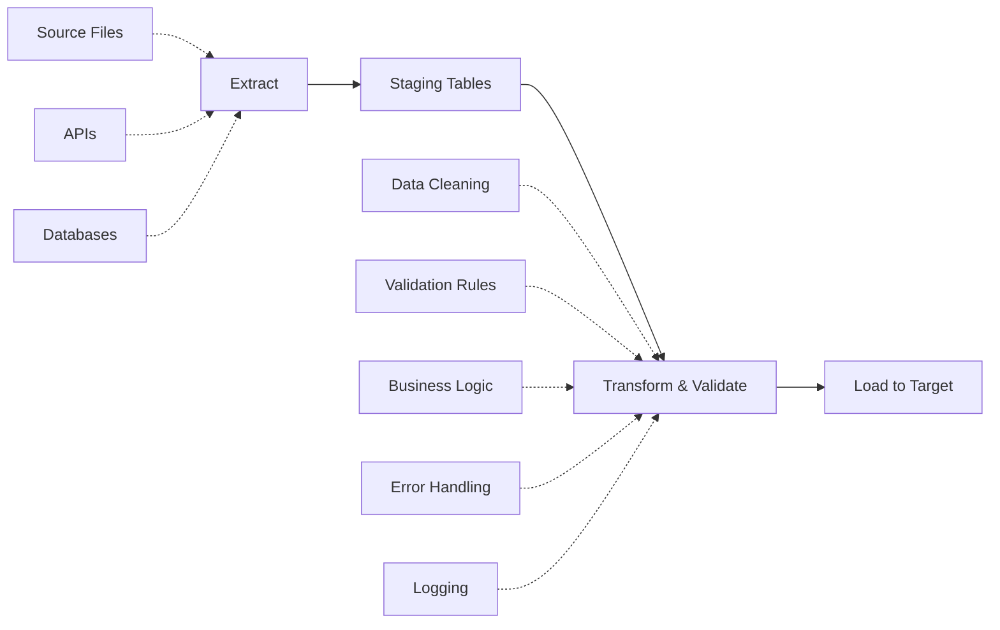
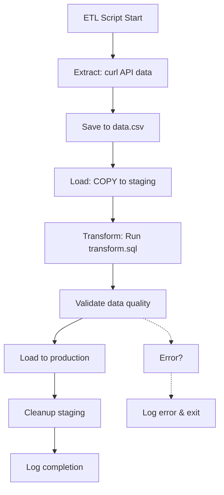

# Data Import & ETL

**Level:** Intermediate  
**Time Estimate:** 40 minutes  
**Prerequisites:** Basic SQL, file handling.

## TL;DR
Import data efficiently using bulk loaders like COPY. Use staging tables for validation and transformation in ETL pipelines to ensure data quality.

## Learning Objectives
By the end of this lesson, you'll be able to:
- Use COPY for fast data imports.
- Implement staging and validation in ETL.
- Handle common import pitfalls (encodings, nulls).
- Automate ETL with scripts.

## Motivation & Real-World Scenario
A company needs to load daily sales data from CSV files. Direct inserts are slow; bulk loading with validation prevents bad data from corrupting reports.

## Theory: ETL Basics

### Extract
- Pull data from sources (files, APIs, DBs).

### Transform
- Clean, validate, aggregate data.

### Load
- Insert into target tables efficiently.

### Staging
- Temporary tables for processing before final load.

**Visual ETL Pipeline Flow:**


## Worked Examples

### Basic COPY Import (Postgres)
```sql
-- Create staging table
CREATE TABLE staging_sales (date DATE, product TEXT, amount NUMERIC);

-- Import CSV
COPY staging_sales FROM '/data/sales.csv' WITH CSV HEADER;

-- Validate and load
INSERT INTO sales (sale_date, product_id, amount)
SELECT date, (SELECT id FROM products WHERE name = product), amount
FROM staging_sales
WHERE amount > 0;  -- Validation
```

**Visual Staging Table Workflow:**
```
Raw CSV File
     ↓
   COPY Command
     ↓
Staging Table (staging_sales)
     ↓
Validation & Transformation
- Convert product names to IDs
- Filter invalid amounts
- Apply business rules
     ↓
Target Table (sales)
     ↓
Production Database
```

### Handling Errors
```sql
-- With error logging
COPY staging_sales FROM '/data/sales.csv' WITH CSV HEADER LOG ERRORS INTO error_log;
```

### Upsert Pattern
```sql
INSERT INTO products (name, price)
SELECT name, price FROM staging_products
ON CONFLICT (name) DO UPDATE SET price = EXCLUDED.price;
```

**Visual Upsert Logic:**
```
New Row?
├── Yes → INSERT
└── No → Conflict on (name)?
    ├── Yes → UPDATE existing row
    └── No → INSERT (no conflict)
    
Result: Table always has latest data
```

### ETL Script Example
```bash
#!/bin/bash
# Extract
curl -o data.csv https://api.example.com/data

# Load to staging
psql -c "COPY staging FROM 'data.csv' CSV HEADER;"

# Transform and load
psql -f transform.sql
```

**Visual ETL Script Flow:**


## Quick Checklist / Cheatsheet
- Use staging tables for validation.
- Handle encodings: `COPY ... ENCODING 'UTF8'`
- Batch large imports to avoid locks.
- Monitor for duplicates with constraints.

## Exercises

1. **Easy:** Import a CSV into a staging table and count rows.
2. **Medium:** Add validation (e.g., check dates) before loading.
3. **Hard:** Implement incremental load (only new rows).

## Solutions

1. `COPY staging FROM 'file.csv' CSV HEADER; SELECT COUNT(*) FROM staging;`

2. `INSERT INTO target SELECT * FROM staging WHERE date >= '2020-01-01';`

3. Use a timestamp column: `WHERE last_updated > (SELECT MAX(last_updated) FROM target)`

## Notes: Vendor Differences / Performance Tips
- MySQL: `LOAD DATA INFILE`
- SQL Server: `BULK INSERT`
- For big data, use tools like Apache Airflow or dbt.

## Next Lessons
- Migration & Backup (for data movement).
- SQL Testing & Automation (for ETL validation).

