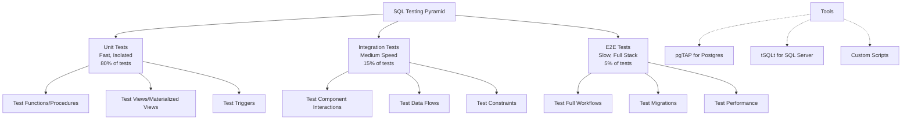
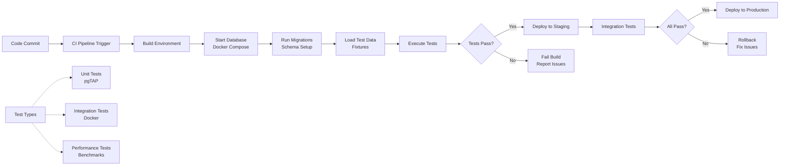

# SQL Testing & Automation

**Level:** Intermediate  
**Time Estimate:** 30 minutes  
**Prerequisites:** Basic SQL, scripting.

## TL;DR
Test SQL logic with frameworks like pgTAP. Automate tests in CI to catch regressions early. Use Docker for reproducible environments.

## Learning Objectives
By the end of this lesson, you'll be able to:
- Write unit tests for SQL functions.
- Set up integration tests with Docker.
- Automate testing in CI pipelines.
- Generate test data programmatically.

## Motivation & Real-World Scenario
A stored procedure changes, breaking reports. Without tests, bugs go unnoticed. Automated tests ensure code quality and prevent regressions.

## Theory: Testing Levels

### Unit Tests
- Test individual functions/procedures.

### Integration Tests
- Test interactions between components.

### Automation
- Run tests on code changes (CI).

**Testing Pyramid for SQL:**


## Worked Examples

### pgTAP Unit Test
```sql
-- Install pgTAP
CREATE EXTENSION pgtap;

-- Test function
CREATE OR REPLACE FUNCTION add_numbers(a INT, b INT) RETURNS INT AS $$
BEGIN
  RETURN a + b;
END;
$$ LANGUAGE plpgsql;

-- Test
SELECT plan(2);
SELECT is(add_numbers(1, 2), 3, 'adds correctly');
SELECT is(add_numbers(0, 0), 0, 'handles zero');
SELECT finish();
```

### Integration Test with Docker
In CI:
```yaml
- name: Run SQL tests
  run: |
    docker-compose -f devtools/docker/docker-compose.yml up -d
    sleep 10
    psql -h localhost -U sqluser -d sqldb -f devtools/tests/sql-smoke/test_sample.sql
    docker-compose -f devtools/docker/docker-compose.yml down
```

**CI/CD Pipeline for SQL Testing:**


### Test Data Factory
```sql
CREATE OR REPLACE FUNCTION create_test_user() RETURNS INT AS $$
DECLARE user_id INT;
BEGIN
  INSERT INTO users (name, email) VALUES ('Test User', 'test@example.com') RETURNING id INTO user_id;
  RETURN user_id;
END;
$$ LANGUAGE plpgsql;
```

**Test Data Generation Patterns:**
```
Test Data Factory Pattern:
┌─────────────────────────────────────┐
│ Test Setup                          │
├─────────────────────────────────────┤
│ 1. Factory Functions                │
│    ├── create_test_user()           │
│    ├── create_test_order()          │
│    └── create_test_product()        │
│                                     │
│ 2. Fixture Tables                   │
│    ├── test_users                   │
│    ├── test_products                │
│    └── test_orders                  │
│                                     │
│ 3. Data Relationships               │
│    └── Maintain referential integrity│
└─────────────────────────────────────┘

Test Data Strategies:
├── Static Fixtures: Pre-loaded test data
├── Dynamic Factories: Generate on-demand
├── Hybrid Approach: Base fixtures + factories
└── Cleanup: Truncate or rollback after tests

Benefits:
├── Consistent test data across runs
├── Isolated tests (no interference)
├── Fast test execution
└── Easy maintenance
```

## Quick Checklist / Cheatsheet
- Use pgTAP for Postgres tests.
- Seed test data in setup scripts.
- Run tests in isolated environments.
- Assert expected vs actual results.

## Exercises

1. **Easy:** Write a pgTAP test for a simple function.
2. **Medium:** Set up a Docker-based test for a query.
3. **Hard:** Implement a test suite with fixtures.

## Solutions

1. `SELECT is(my_function(1), 2, 'test description');`

2. Use docker-compose to start DB, run psql with test queries, check output.

3. Create setup.sql for data, test.sql for assertions, run in sequence.

## Notes: Vendor Differences / Performance Tips
- MySQL: Use dbUnit or custom scripts.
- SQL Server: tSQLt framework.
- Keep tests fast; use in-memory DBs if possible.

## Next Lessons
- Error Handling & Exceptions (for test robustness).
- Monitoring & Observability (for test metrics).

