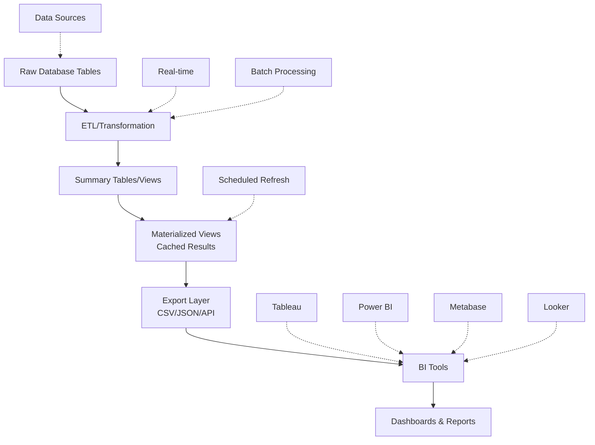
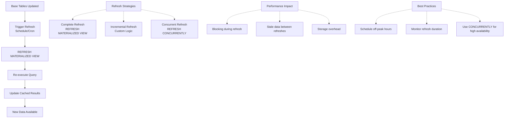
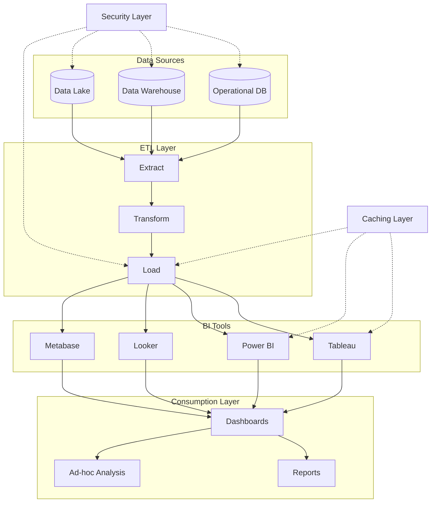

# Visualization & BI Integration

**Level:** Intermediate  
**Time Estimate:** 35 minutes  
**Prerequisites:** Aggregations, views.

## TL;DR
Prepare data for BI tools by creating summary views and tables. Use materialized views for performance and schedule refreshes to keep data current.

## Learning Objectives
By the end of this lesson, you'll be able to:
- Create summary tables for dashboards.
- Use materialized views for caching.
- Export data to BI tools.
- Optimize queries for visualization.

## Motivation & Real-World Scenario
Dashboards load slowly with raw data queries. Pre-aggregated views speed up reports, improving user experience and reducing server load.

## Theory: Data Preparation for BI

### Aggregation
- Summarize data for charts (e.g., monthly totals).

### Materialized Views
- Cached results of complex queries.

### Export
- CSV/JSON for external tools.

**Data Flow: Database to BI Dashboard:**


## Worked Examples

### Summary Table
```sql
CREATE TABLE monthly_sales AS
SELECT date_trunc('month', order_date) AS month, product_id, SUM(quantity) AS total_qty
FROM orders
GROUP BY month, product_id;
```

### Materialized View
```sql
CREATE MATERIALIZED VIEW top_products AS
SELECT product_id, SUM(sales) AS total_sales
FROM sales_data
GROUP BY product_id
ORDER BY total_sales DESC
LIMIT 10;

-- Refresh
REFRESH MATERIALIZED VIEW top_products;
```

**Materialized View Refresh Cycle:**


### Export to CSV
```sql
COPY (SELECT * FROM monthly_sales) TO '/output/sales.csv' WITH CSV HEADER;
```

### BI Query Pattern
```sql
-- For Tableau/Metabase
SELECT region, SUM(revenue) AS revenue
FROM sales
WHERE date >= '2023-01-01'
GROUP BY region
ORDER BY revenue DESC;
```

## BI Tool Integration Patterns

### Direct Database Connection
```sql
-- Tableau/Power BI connection string
-- Host: your-server.com
-- Port: 5432
-- Database: analytics_db
-- Schema: public
```

### API-Based Integration
```sql
-- Create API endpoint for BI tools
CREATE OR REPLACE FUNCTION get_dashboard_data(
    start_date DATE,
    end_date DATE
)
RETURNS TABLE (
    category TEXT,
    revenue NUMERIC,
    orders INTEGER
)
LANGUAGE SQL
AS $$
    SELECT 
        category,
        SUM(revenue) AS revenue,
        COUNT(*) AS orders
    FROM sales
    WHERE order_date BETWEEN start_date AND end_date
    GROUP BY category;
$$;
```

**BI Integration Architecture:**


## Quick Checklist / Cheatsheet
- Use views for dynamic summaries.
- Refresh materialized views on schedule.
- Index summary tables for fast queries.
- Validate data before export.

## Exercises

1. **Easy:** Create a view for daily sales totals.
2. **Medium:** Materialize a top-10 list and refresh it.
3. **Hard:** Export aggregated data and import into a BI tool.

## Solutions

1. `CREATE VIEW daily_sales AS SELECT date, SUM(amount) FROM sales GROUP BY date;`

2. `CREATE MATERIALIZED VIEW top10 AS SELECT ... LIMIT 10; REFRESH MATERIALIZED VIEW top10;`

3. Use COPY to export, then load in tool like Metabase.

## Notes: Vendor Differences / Performance Tips
- MySQL: Use summary tables instead of materialized views.
- SQL Server: Indexed views for similar effect.
- Schedule refreshes during low-traffic times.

## Next Lessons
- Query Plans & Cost Models (for optimizing BI queries).
- Partitioning & Sharding (for large datasets).

