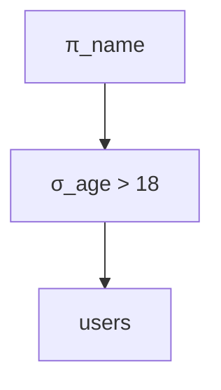
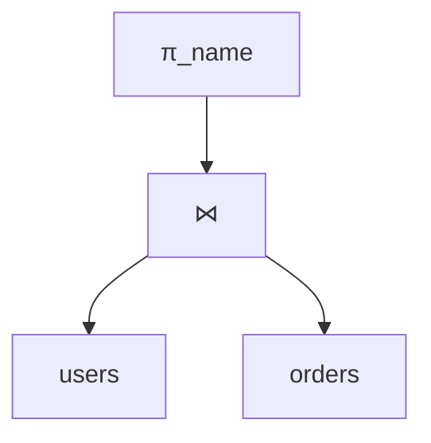

# Relational Algebra

**Level:** Intermediate  
**Time Estimate:** 25 minutes  
**Prerequisites:** Basic SQL, set theory.

## TL;DR
Relational algebra provides the theoretical foundation for SQL operations like joins, unions, and filters through mathematical operators.

## Learning Objectives
By the end of this lesson, you'll be able to:
- Understand core relational operators.
- Map SQL queries to algebra expressions.
- Apply algebra for query optimization.

## Motivation & Real-World Scenario
Understanding algebra helps optimize complex queries by breaking them into logical steps, improving performance in data warehouses.

## Theory: Core Operators

### Basic Operators
- **Projection (π)**: Select columns. `SELECT col1, col2`
- **Selection (σ)**: Filter rows. `WHERE condition`
- **Cartesian Product (×)**: All combinations. `FROM a, b`
- **Union (∪)**: Combine rows. `UNION`
- **Difference (−)**: Subtract rows. `EXCEPT`
- **Rename (ρ)**: Alias tables/columns.

**Visual Overview of Key Operators:**
```
Projection (π):     Selection (σ):      Join (⋈):
Table with cols     Table with rows      Two tables
A B C D             A B C D              A B | C D
--------            --------             --------
1 2 3 4    π_A,C →  1 2 3 4             1 2 | 3 4
5 6 7 8             5 6 7 8    σ_B>3 →  5 6 | 7 8
9 0 1 2             9 0 1 2                    ↓
                   (filtered)            Combined result
```

### Join Operators
- **Natural Join (⋈)**: Join on common columns.
- **Theta Join**: Join with condition.
- **Outer Joins**: Left, right, full.

## Worked Examples

### Simple Selection & Projection
Find names of users over 18:

Algebra: π_name (σ_age > 18 (users))

**Visual Representation:**


SQL:
```sql
SELECT name FROM users WHERE age > 18;
```

### Join Example
Users with orders:

π_name (users ⋈ orders)

**Visual Representation:**


SQL:
```sql
SELECT u.name FROM users u JOIN orders o ON u.id = o.user_id;
```

### Union
All products from two categories:

(products_cat1 ∪ products_cat2)

**Visual Representation:**
```
products_cat1    products_cat2
     |                |
     +-------+--------+
             |
          ∪ (Union)
             |
         Result
         (all products from both categories)
```

SQL:
```sql
SELECT * FROM products WHERE category = 'A'
UNION
SELECT * FROM products WHERE category = 'B';
```

## Quick Checklist / Cheatsheet
- Projection: Columns
- Selection: Rows
- Join: Combine tables
- Union/Difference: Set operations

## Exercises

1. **Easy:** Express "SELECT name FROM users WHERE city = 'NYC'" in algebra.
2. **Medium:** Find users without orders using difference.
3. **Hard:** Optimize a query using algebra steps.

## Solutions

1. π_name (σ_city = 'NYC' (users))

2. π_name (users − π_user_id (orders ⋈ users))

   **Visual for Solution 2:**
   ```
   π_name
     |
     − (Difference)
    / \
   users  π_user_id
           |
           ⋈
          / \
       orders users
   ```

3. Break into selection, join, projection.

## Notes: Vendor Differences / Performance Tips
- All RDBMS support these concepts.
- Use algebra to understand query plans.

## Next Lessons
- Query Plans & Cost Models (for optimization).

