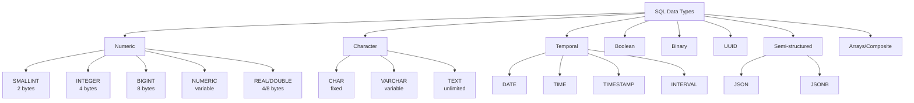

## Overview

Choosing correct data types is critical for correctness, storage efficiency, and performance. This guide focuses on commonly used types in PostgreSQL, with notes where other vendors differ.

**Visual Data Type Classification:**


## Numeric types

- SMALLINT (2 bytes): -32768 to 32767. Good for small counters.
- INTEGER / INT (4 bytes): common default for ids and counts.
- BIGINT (8 bytes): large counters, timestamps in ms, high-volume ids.
- NUMERIC / DECIMAL(precision, scale): exact arithmetic for money and financial calculations. Use when fractional precision matters.
- REAL / DOUBLE PRECISION: floating point approximations — avoid for money.

**Storage Size Comparison:**
```
Numeric Types Storage Requirements:
┌─────────────┬─────────────┬─────────────────┬─────────────────┐
│ Type        │ Size        │ Range           │ Use Case        │
├─────────────┼─────────────┼─────────────────┼─────────────────┤
│ SMALLINT    │ 2 bytes     │ -32K to 32K     │ Small counters  │
│ INTEGER     │ 4 bytes     │ -2B to 2B       │ IDs, counts     │
│ BIGINT      │ 8 bytes     │ -9Q to 9Q       │ Large counters  │
│ NUMERIC     │ variable    │ unlimited       │ Money, precise  │
│ REAL        │ 4 bytes     │ ~6 decimal      │ Approximations  │
│ DOUBLE      │ 8 bytes     │ ~15 decimal     │ Approximations  │
└─────────────┴─────────────┴─────────────────┴─────────────────┘

Precision Loss Risk:
NUMERIC(10,2) → $12345678.90 (exact)
REAL/DOUBLE   → $12345678.90 (approximate)
```

Example:

```sql
CREATE TABLE accounts (
	id BIGSERIAL PRIMARY KEY,
	balance NUMERIC(12,2) NOT NULL DEFAULT 0
);
```

## Character types

- CHAR(n): fixed-length, padded with spaces. Rarely needed.
- VARCHAR(n): variable-length with limit. Use when you want max-length enforcement.
- TEXT: unlimited length (Postgres). Most forgiving and common.

Guideline: prefer `TEXT` for application fields unless you must enforce a strict maximum length.

## Date & Time

- DATE: calendar date (no time)
- TIME / TIME WITH TIME ZONE: time of day
- TIMESTAMP WITHOUT TIME ZONE: absolute timestamp without timezone info
- TIMESTAMP WITH TIME ZONE (aka TIMESTAMPTZ): preferred for storing points in time; Postgres normalizes to UTC on storage
- INTERVAL: durations

Example:

```sql
CREATE TABLE events (
	id BIGSERIAL PRIMARY KEY,
	occurred_at TIMESTAMPTZ NOT NULL DEFAULT now()
);
```

## Boolean

`BOOLEAN` stores TRUE, FALSE, or NULL. Use it for flags.

## Binary

- `BYTEA` (Postgres) and `BLOB` (MySQL) store binary data. For large files, prefer external object stores and store paths/ids in the DB.

## UUID

Use `UUID` when you need globally unique identifiers. In Postgres, generate with the `pgcrypto` or `uuid-ossp` extension.

```sql
CREATE EXTENSION IF NOT EXISTS "pgcrypto";
INSERT INTO items (id) VALUES (gen_random_uuid());
```

## JSON / JSONB

- `JSON` stores text JSON; `JSONB` stores a decomposed binary representation in Postgres and is faster for querying.
- Use JSONB for semi-structured and flexible attributes, but avoid abusing it for columns that should be normalized.

Indexing JSONB:

```sql
CREATE INDEX idx_events_data_gin ON events USING GIN (data);
```

**JSON vs JSONB Structure:**
```
JSON (Text Storage):
{"user":{"name":"Alice","age":30},"tags":["admin","premium"]}

JSONB (Binary Storage):
┌─────────────────────────────────────────────────────────────┐
│ JSONB Document                                             │
├─────────────────────────────────────────────────────────────┤
│ user → object: {"name":"Alice","age":30}                   │
│   ├── name → "Alice"                                        │
│   └── age → 30                                              │
│ tags → array: ["admin","premium"]                           │
│   ├── [0] → "admin"                                         │
│   └── [1] → "premium"                                       │
└─────────────────────────────────────────────────────────────┘

Query Performance:
JSON:  SELECT * FROM events WHERE data::text LIKE '%Alice%'
JSONB: SELECT * FROM events WHERE data->>'user'->>'name' = 'Alice'
       (faster with proper indexing)
```

## Arrays & Composite Types (Postgres)

Postgres supports array columns (`int[]`, `text[]`) and composite types. These are powerful but can complicate querying and indexing.

## Type conversion and casts

Be explicit with casts when needed. Implicit casts vary by vendor.

```sql
SELECT '2025-09-26'::date;
```

## Exercises

1. Create a `measurements` table with `sensor_id UUID`, `value NUMERIC(8,3)`, `collected_at TIMESTAMPTZ`.
2. Insert sample rows and write a query to find the average value per hour.

