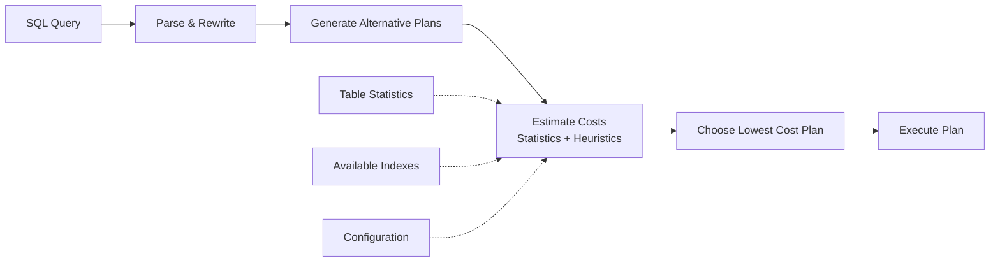
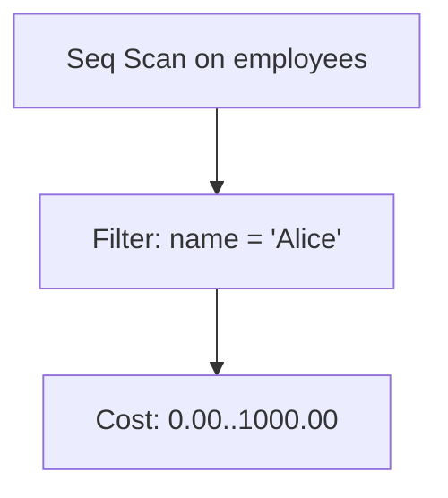
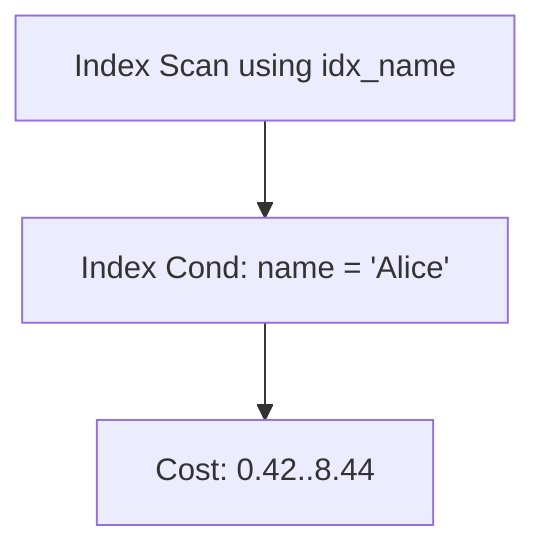
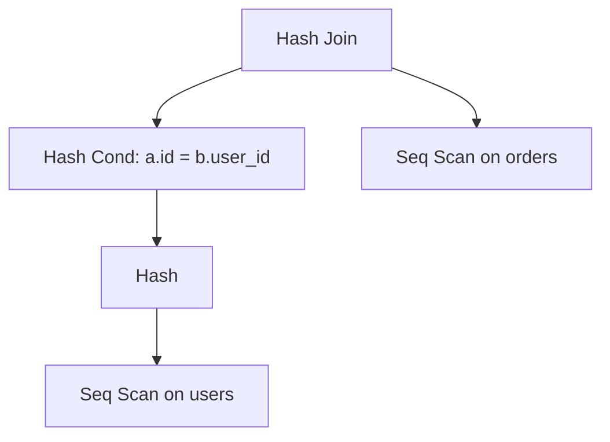

# Query Plans, Indexes, and Cost Models

**Level:** Intermediate to Advanced  
**Time Estimate:** 50 minutes  
**Prerequisites:** Basic SQL, understanding of tables.

## TL;DR
Indexes are special lookup tables that speed up data retrieval. Understanding how the database planner uses them to create an execution plan is one of the fastest ways to improve query performance. This lesson explains indexes, the planner's cost model, how to read `EXPLAIN`, and gives a practical optimization checklist.

## Motivation & Real-World Scenario
A query on a large table is slow because the database has to scan every single row. By adding an index on the column you are filtering by, the database can find the required rows almost instantly, dramatically improving performance.

## Theory: Indexes and The Planner

### What is an Index?
An index is a performance-tuning method that allows faster retrieval of records. It's a special lookup table that the database search engine can use to speed up data retrieval by providing a direct pointer to the data's location on disk. You create an index on a column of a table.

```sql
-- Creates an index on the 'name' column of the 'employees' table
CREATE INDEX idx_name ON employees(name);
```

Indexes are most beneficial on columns that are frequently used in `WHERE` clauses, `JOIN` conditions, and `ORDER BY` clauses.

### The Query Planner

When you submit SQL, the planner:

1. Parses and rewrites the query.
2. Estimates the cost of alternative plans using statistics and heuristics.
3. Chooses a plan with a (theoretically) lowest cost.

Key input to the planner: table/column statistics (from `ANALYZE`), available indexes, and configuration (`work_mem`, etc.).

**Visual Representation of Query Planning Process:**


## Common Plan Nodes

- **Seq Scan**: Full table scan; cheap for small tables, expensive for large ones.
- **Index Scan / Index Only Scan**: Uses an index to retrieve rows. An Index Only Scan avoids touching the table data at all if the index contains all needed columns.
- **Bitmap Index Scan + Bitmap Heap Scan**: Good for combining multiple index conditions.
- **Hash Join**: Builds a hash table on the smaller input and probes it with the larger input — good for equality joins.
- **Merge Join**: Merges two pre-sorted inputs — efficient for range joins.
- **Nested Loop**: For each row in the outer input, scans the inner table. Fast when the outer result is small and the inner table is indexed on the join key.

**Visual Examples of Plan Trees:**

**Sequential Scan (no index):**


**Index Scan (with index):**


**Hash Join Example:**


## EXPLAIN vs EXPLAIN ANALYZE

- `EXPLAIN` shows the planner's estimated plan and costs without executing the query.
- `EXPLAIN ANALYZE` **executes the query** and shows actual timing and row counts, which is essential for real-world performance analysis.

```sql
EXPLAIN ANALYZE SELECT * FROM employees WHERE name = 'Alice';
```

Always compare the `rows` (estimated) vs `actual rows` values in the output. Big discrepancies point to outdated statistics.

**Visual Comparison:**
```
EXPLAIN (Planning Only):
┌─────────────────────────────────────┐
│ Query Plan                         │
│ ├── Estimated costs and row counts │
│ └── No actual execution            │
└─────────────────────────────────────┘

EXPLAIN ANALYZE (Planning + Execution):
┌─────────────────────────────────────┐
│ Query Plan                         │
│ ├── Estimated costs and row counts │
│ ├── Actual execution time          │
│ ├── Actual row counts              │
│ └── Buffer usage statistics        │
└─────────────────────────────────────┘
```

## Common Causes of Bad Plans

- **Outdated or missing statistics**: Run `ANALYZE table_name;` on large tables after significant data changes.
- **Missing indexes**: The most common cause. Add indexes on columns used for filtering and joining.
- **Incorrect data types** or implicit casts preventing index use.

## Optimization Checklist (Practical)

1. Run `ANALYZE table_name;` to refresh statistics.
2. Use `EXPLAIN ANALYZE` on the slow query.
3. If you see a `Seq Scan` on a large table with a selective `WHERE` clause, add an index on the filter columns.
4. For joins, ensure join columns are indexed on both tables.
5. Use `EXPLAIN (ANALYZE, BUFFERS)` to see I/O behavior (buffer hits vs. disk reads).
6. If a `Hash Join` or `Sort` is spilling to disk (check with `EXPLAIN ANALYZE BUFFERS`), consider increasing `work_mem` for that session.
7. Rewrite the query if necessary: replace correlated subqueries with joins/CTEs, avoid `SELECT *`, and filter early.

## Exercises

1. Describe what you would do if `EXPLAIN ANALYZE` shows `Seq Scan` on a 50M-row table for a selective WHERE clause.
2. Given an output where `actual rows=10000` but `estimated rows=10`, list two possible reasons and the primary remedy.
3. Write a query against `orders(order_date, customer_id, amount)` to find top customers last month. Run `EXPLAIN` and suggest a helpful index.