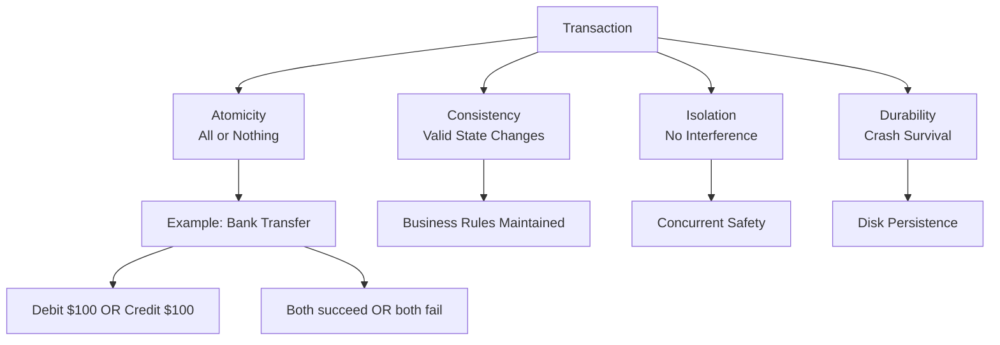
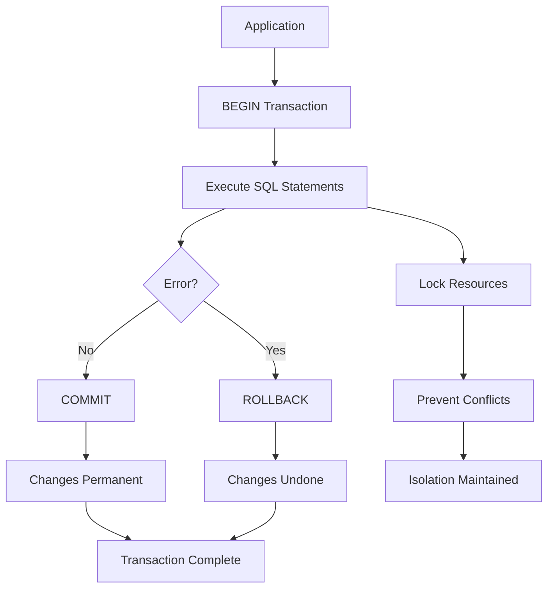

# Transactions, Isolation, and Concurrency

**Level:** Intermediate  
**Time Estimate:** 45 minutes  
**Prerequisites:** Basic SQL commands, understanding of tables and keys.

## TL;DR
Transactions ensure data integrity in multi-user databases. ACID properties guarantee reliable operations, while isolation levels control concurrency behavior to prevent issues like dirty reads.

## Learning Objectives
By the end of this lesson, you'll be able to:
- Explain the ACID properties and why they matter.
- Use `BEGIN`, `COMMIT`, and `ROLLBACK` for transaction control.
- Choose appropriate isolation levels for different scenarios.
- Identify and resolve common concurrency problems.

## Motivation & Real-World Scenario
Imagine an e-commerce site where two users buy the last item simultaneously. Without transactions, both might succeed, causing overselling. Transactions prevent this by ensuring operations are atomic and isolated.

## Theory: ACID and Transaction Lifecycle

### ACID Properties
- **Atomicity:** All operations in a transaction succeed or none do (all-or-nothing).
- **Consistency:** Transactions move the database from one valid state to another.
- **Isolation:** Concurrent transactions don't interfere with each other.
- **Durability:** Committed changes survive failures.

**Visual ACID Properties:**


### Transaction Commands
- `BEGIN`: Start a transaction.
- `COMMIT`: Save changes permanently.
- `ROLLBACK`: Undo changes since `BEGIN`.

Example (Postgres):
```sql
BEGIN;
UPDATE accounts SET balance = balance - 100 WHERE id = 1;
UPDATE accounts SET balance = balance + 100 WHERE id = 2;
COMMIT;  -- Or ROLLBACK if error
```

**Transaction Lifecycle:**


### Isolation Levels
Control how transactions interact:
- **READ UNCOMMITTED:** Allows dirty reads (rarely used).
- **READ COMMITTED:** Default in Postgres; prevents dirty reads but allows non-repeatable reads.
- **REPEATABLE READ:** Prevents non-repeatable and dirty reads; allows phantom reads.
- **SERIALIZABLE:** Strongest; prevents all anomalies by serializing transactions.

Anomalies:
- **Dirty Read:** Reading uncommitted data.
- **Non-Repeatable Read:** Same query returns different results in a transaction.
- **Phantom Read:** New rows appear during a transaction.

**Isolation Levels Comparison:**
```
Isolation Levels & Anomalies:
┌─────────────────┬─────────────┬─────────────────┬─────────────┐
│ Level           │ Dirty Read  │ Non-Repeatable │ Phantom Read │
├─────────────────┼─────────────┼─────────────────┼─────────────┤
│ READ UNCOMMITTED│ ✓ Allowed   │ ✓ Allowed      │ ✓ Allowed   │
│ READ COMMITTED  │ ✗ Prevented │ ✓ Allowed      │ ✓ Allowed   │
│ REPEATABLE READ │ ✗ Prevented │ ✗ Prevented    │ ✓ Allowed   │
│ SERIALIZABLE    │ ✗ Prevented │ ✗ Prevented    │ ✗ Prevented │
└─────────────────┴─────────────┴─────────────────┴─────────────┘

Performance vs Safety Trade-off:
SERIALIZABLE (Safest) ←───→ READ UNCOMMITTED (Fastest)
    High locking        Balanced        Low isolation
```

## Worked Examples

### Basic Transfer
```sql
BEGIN;
-- Check balance
SELECT balance FROM accounts WHERE id = 1;
-- Deduct
UPDATE accounts SET balance = balance - 100 WHERE id = 1;
-- Add to recipient
UPDATE accounts SET balance = balance + 100 WHERE id = 2;
COMMIT;
```

### Handling Errors
```sql
BEGIN;
UPDATE accounts SET balance = balance - 100 WHERE id = 1;
-- Simulate error: insufficient funds
IF (SELECT balance FROM accounts WHERE id = 1) < 0 THEN
  ROLLBACK;
ELSE
  COMMIT;
END IF;
```

### Isolation Level Demo
Set isolation:
```sql
SET TRANSACTION ISOLATION LEVEL SERIALIZABLE;
BEGIN;
-- Your queries here
COMMIT;
```

## Quick Checklist / Cheatsheet
- Always wrap multi-statement operations in `BEGIN ... COMMIT`.
- Use `ROLLBACK` in error handlers.
- For high concurrency, consider `READ COMMITTED` or `REPEATABLE READ`.
- Test with concurrent sessions to verify isolation.

## Exercises

1. **Easy:** Write a transaction to transfer $50 from account A to B, with a balance check.
2. **Medium:** Explain why `READ COMMITTED` allows non-repeatable reads with an example.
3. **Hard:** Simulate a phantom read scenario and show how `SERIALIZABLE` prevents it.

## Solutions

1. ```sql
   BEGIN;
   IF (SELECT balance FROM accounts WHERE id = 'A') >= 50 THEN
     UPDATE accounts SET balance = balance - 50 WHERE id = 'A';
     UPDATE accounts SET balance = balance + 50 WHERE id = 'B';
     COMMIT;
   ELSE
     ROLLBACK;
   END IF;
   ```

2. In `READ COMMITTED`, if transaction T1 reads a row, then T2 updates it and commits, T1's re-read sees the new value — non-repeatable.

3. In `READ UNCOMMITTED` or `READ COMMITTED`, a `SELECT COUNT(*)` might return different counts if another transaction inserts rows. `SERIALIZABLE` blocks such conflicts.

## Notes: Vendor Differences / Performance Tips
- Postgres defaults to `READ COMMITTED`; MySQL to `REPEATABLE READ`.
- High isolation levels reduce concurrency; use only when needed.
- For distributed systems, consider two-phase commit or sagas.

## Next Lessons
- Query Plans & Cost Models (for performance tuning).
- Error Handling & Exceptions (for robust transactions).

