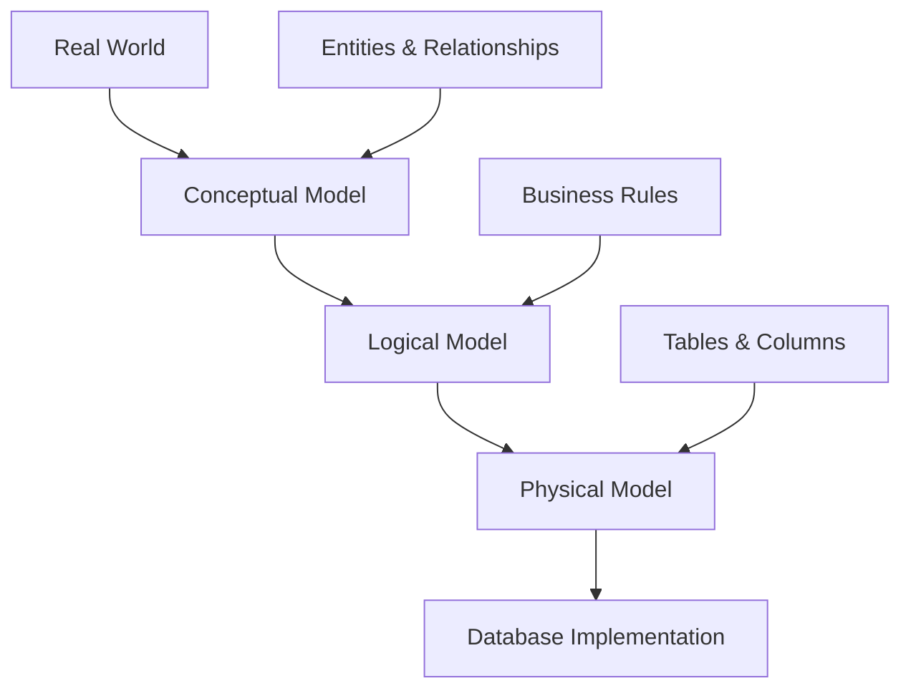

# Data Modeling Techniques

**Level:** Intermediate-Advanced  
**Time Estimate:** 50 minutes  
**Prerequisites:** Database design, normalization, ERD concepts.

## TL;DR
Data modeling is the process of creating a visual and conceptual representation of data structures and relationships in a database. It involves designing entities, attributes, relationships, and business rules that govern how data flows and connects within the system.

## Learning Objectives
By the end of this lesson, you'll be able to:
- Create comprehensive Entity-Relationship Diagrams (ERDs)
- Apply advanced data modeling techniques and patterns
- Model complex relationships including recursive and ternary relationships
- Design for different types of systems (OLTP vs OLAP)
- Implement business rules through data structure

## Motivation & Real-World Scenario
A healthcare company needed to track patients, doctors, appointments, treatments, and billing in a complex system. Without proper data modeling, they faced issues with data inconsistency, difficulty in generating reports, and problems tracking patient history. A well-designed data model solved these issues and enabled efficient operations.

## Theory: Data Modeling Approaches

### 1. Conceptual Data Modeling
High-level model focusing on entities and relationships without implementation details.

**Key Components:**
- **Entities**: Real-world objects (Person, Product, Order)
- **Attributes**: Properties of entities (name, price, date)
- **Relationships**: Connections between entities
- **Cardinalities**: One-to-one, one-to-many, many-to-many

### 2. Logical Data Modeling
Detailed model that includes all entities, attributes, relationships, and business rules without physical implementation details.

### 3. Physical Data Modeling
Implementation-specific model that includes tables, columns, data types, constraints, and indexes.

**Visual Representation of Modeling Levels:**


## Advanced Relationship Types

### Recursive Relationships
When an entity has a relationship with itself.

**Example: Employee hierarchy**
```
        Manager
           |
         reports
           |
        Employee
```

```sql
CREATE TABLE employees (
    employee_id INT PRIMARY KEY,
    name VARCHAR(100),
    manager_id INT,  -- References another employee
    FOREIGN KEY (manager_id) REFERENCES employees(employee_id)
);
```

### Ternary Relationships
Relationships involving three entities simultaneously.

**Example: Student enrolls in Course taught by Instructor**
```
Student --(enrolls)--> [Course] <--(teaches)-- Instructor
```

```sql
CREATE TABLE student_course_instructor (
    student_id INT,
    course_id INT,
    instructor_id INT,
    enrollment_date DATE,
    PRIMARY KEY (student_id, course_id, instructor_id),
    FOREIGN KEY (student_id) REFERENCES students(id),
    FOREIGN KEY (course_id) REFERENCES courses(id),
    FOREIGN KEY (instructor_id) REFERENCES instructors(id)
);
```

### Weak Entities
Entities that depend on another entity for their existence.

**Example: Order and Order Items**
```sql
-- Strong entity
CREATE TABLE orders (
    order_id INT PRIMARY KEY,
    customer_id INT,
    order_date DATE
);

-- Weak entity (identified by order_id + item_id combination)
CREATE TABLE order_items (
    order_id INT,  -- Part of primary key
    item_id INT,   -- Part of primary key
    product_id INT,
    quantity INT,
    price DECIMAL(10,2),
    PRIMARY KEY (order_id, item_id),
    FOREIGN KEY (order_id) REFERENCES orders(order_id),
    FOREIGN KEY (product_id) REFERENCES products(product_id)
);
```

## Data Modeling Patterns

### 1. Type Pattern (Entity Subtyping)
When entities have distinct subtypes with different attributes.

```sql
-- Superclass table
CREATE TABLE vehicles (
    vehicle_id INT PRIMARY KEY,
    vehicle_type VARCHAR(20) NOT NULL,  -- 'car', 'truck', 'motorcycle'
    make VARCHAR(50),
    model VARCHAR(50),
    year INT
);

-- Subclass-specific attributes
CREATE TABLE cars (
    vehicle_id INT PRIMARY KEY,
    doors INT,
    trunk_capacity INT,
    FOREIGN KEY (vehicle_id) REFERENCES vehicles(vehicle_id)
);

CREATE TABLE trucks (
    vehicle_id INT PRIMARY KEY,
    payload_capacity INT,
    towing_capacity INT,
    FOREIGN KEY (vehicle_id) REFERENCES vehicles(vehicle_id)
);
```

### 2. History/Archive Pattern
To track changes over time.

```sql
-- Current records
CREATE TABLE customer_current (
    customer_id INT PRIMARY KEY,
    name VARCHAR(100),
    address VARCHAR(200),
    phone VARCHAR(20),
    last_updated TIMESTAMP
);

-- Historical records
CREATE TABLE customer_history (
    history_id SERIAL PRIMARY KEY,
    customer_id INT,
    name VARCHAR(100),
    address VARCHAR(200),
    phone VARCHAR(20),
    valid_from TIMESTAMP,
    valid_to TIMESTAMP,
    change_reason VARCHAR(200)
);
```

### 3. Audit Trail Pattern
To track who made changes and when.

```sql
CREATE TABLE products (
    product_id SERIAL PRIMARY KEY,
    name VARCHAR(200),
    price DECIMAL(10,2),
    created_by INT,
    created_at TIMESTAMP DEFAULT CURRENT_TIMESTAMP,
    updated_by INT,
    updated_at TIMESTAMP DEFAULT CURRENT_TIMESTAMP
);

CREATE TABLE product_audit (
    audit_id SERIAL PRIMARY KEY,
    product_id INT,
    column_name VARCHAR(50),
    old_value TEXT,
    new_value TEXT,
    changed_by INT,
    changed_at TIMESTAMP DEFAULT CURRENT_TIMESTAMP,
    operation_type VARCHAR(10)  -- INSERT, UPDATE, DELETE
);
```

## Data Modeling for Different Systems

### OLTP (Online Transaction Processing)
Optimized for transactional operations (CRUD).

**Characteristics:**
- Normalized schema (often 3NF)
- Focused on data integrity
- Fast transaction processing
- Good for operational systems

### OLAP (Online Analytical Processing)
Optimized for analytical queries and reporting.

**Characteristics:**
- Denormalized schema (star/snowflake schemas)
- Pre-calculated aggregations
- Optimized for complex queries
- Good for reporting and analytics

**Star Schema Example:**
```
    DimDate          DimProduct        DimCustomer
       |                   |                |
       |                   |                |
       +-------- FACT_SALES --------+-------+
                |         |         |
                |         |         |
           order_date  product_id  customer_id
```

## Worked Examples

### Example 1: University Data Model
Complete data model for a university system:

```sql
-- Core entities
CREATE TABLE students (
    student_id SERIAL PRIMARY KEY,
    student_number VARCHAR(20) UNIQUE NOT NULL,
    first_name VARCHAR(50) NOT NULL,
    last_name VARCHAR(50) NOT NULL,
    email VARCHAR(100) UNIQUE NOT NULL,
    enrollment_date DATE,
    status VARCHAR(20) DEFAULT 'active'
);

CREATE TABLE departments (
    dept_id SERIAL PRIMARY KEY,
    name VARCHAR(100) UNIQUE NOT NULL,
    description TEXT,
    budget DECIMAL(12,2)
);

CREATE TABLE courses (
    course_id SERIAL PRIMARY KEY,
    course_code VARCHAR(20) UNIQUE NOT NULL,
    title VARCHAR(200) NOT NULL,
    credits INT NOT NULL,
    dept_id INT,
    FOREIGN KEY (dept_id) REFERENCES departments(dept_id)
);

CREATE TABLE instructors (
    instructor_id SERIAL PRIMARY KEY,
    employee_id VARCHAR(20) UNIQUE NOT NULL,
    first_name VARCHAR(50) NOT NULL,
    last_name VARCHAR(50) NOT NULL,
    email VARCHAR(100) UNIQUE NOT NULL,
    dept_id INT,
    FOREIGN KEY (dept_id) REFERENCES departments(dept_id)
);

-- Junction tables for many-to-many relationships
CREATE TABLE course_sections (
    section_id SERIAL PRIMARY KEY,
    course_id INT NOT NULL,
    instructor_id INT,
    semester VARCHAR(20) NOT NULL,
    year INT NOT NULL,
    classroom VARCHAR(50),
    schedule VARCHAR(100),
    max_enrollment INT DEFAULT 30,
    current_enrollment INT DEFAULT 0,
    FOREIGN KEY (course_id) REFERENCES courses(course_id),
    FOREIGN KEY (instructor_id) REFERENCES instructors(instructor_id),
    UNIQUE (course_id, semester, year)  -- Prevent duplicate sections
);

CREATE TABLE enrollments (
    enrollment_id SERIAL PRIMARY KEY,
    student_id INT NOT NULL,
    section_id INT NOT NULL,
    enrollment_date TIMESTAMP DEFAULT CURRENT_TIMESTAMP,
    grade CHAR(2),  -- A+, A, A-, B+, etc.
    status VARCHAR(20) DEFAULT 'enrolled',
    FOREIGN KEY (student_id) REFERENCES students(student_id),
    FOREIGN KEY (section_id) REFERENCES course_sections(section_id),
    UNIQUE (student_id, section_id)  -- Prevent duplicate enrollment
);
```

### Example 2: E-commerce Data Model with Advanced Patterns

```sql
-- Flexible product attributes using EAV pattern (carefully designed)
CREATE TABLE products (
    product_id SERIAL PRIMARY KEY,
    name VARCHAR(200) NOT NULL,
    base_price DECIMAL(10,2) NOT NULL,
    category_id INT,
    created_at TIMESTAMP DEFAULT CURRENT_TIMESTAMP,
    FOREIGN KEY (category_id) REFERENCES categories(category_id)
);

CREATE TABLE product_attribute_types (
    type_id SERIAL PRIMARY KEY,
    name VARCHAR(50) NOT NULL,  -- 'color', 'size', 'weight'
    data_type VARCHAR(20) NOT NULL,  -- 'string', 'number', 'boolean'
    validation_rule TEXT
);

CREATE TABLE product_attribute_values (
    value_id SERIAL PRIMARY KEY,
    product_id INT NOT NULL,
    type_id INT NOT NULL,
    text_value TEXT,
    number_value DECIMAL(10,2),
    date_value DATE,
    FOREIGN KEY (product_id) REFERENCES products(product_id),
    FOREIGN KEY (type_id) REFERENCES product_attribute_types(type_id),
    UNIQUE (product_id, type_id)
);

-- Price history tracking
CREATE TABLE product_price_history (
    history_id SERIAL PRIMARY KEY,
    product_id INT NOT NULL,
    old_price DECIMAL(10,2),
    new_price DECIMAL(10,2),
    change_date TIMESTAMP DEFAULT CURRENT_TIMESTAMP,
    changed_by INT,
    reason VARCHAR(200),
    FOREIGN KEY (product_id) REFERENCES products(product_id)
);
```

## Best Practices for Data Modeling

1. **Start with Business Requirements**
   - Document all business rules
   - Understand reporting requirements
   - Consider future growth needs

2. **Use Consistent Naming Conventions**
   - Singular table names (user, not users)
   - Descriptive column names
   - Consistent foreign key naming (user_id, not id_user)

3. **Design for Query Patterns**
   - Analyze how data will be accessed
   - Consider denormalization for reporting
   - Plan indexes based on queries

4. **Plan for Data Integrity**
   - Use constraints (NOT NULL, CHECK, UNIQUE)
   - Implement proper referential integrity
   - Consider using triggers for complex business rules

5. **Document Your Model**
   - Include business rule explanations
   - Add sample data for each table
   - Create visual ERD diagrams

## Data Modeling Tools

### ERD Creation Tools
- **Draw.io (diagrams.net)**: Free, web-based tool
- **Lucidchart**: Collaborative online tool
- **dbdiagram.io**: Database-specific diagramming
- **MySQL Workbench**: Built-in modeling for MySQL
- **pgAdmin**: For PostgreSQL databases

### Model Validation
- Check for referential integrity
- Verify all relationships have proper foreign keys
- Ensure primary keys are defined for all tables
- Validate normalization rules as appropriate

## Quick Checklist / Cheatsheet

- **Entities**: Capitalized, singular (User, Order, Product)
- **Attributes**: Descriptive, consistent casing (user_id, firstName, created_at)
- **Relationships**: Proper foreign keys with constraints
- **Cardinality**: Clearly defined (1:1, 1:N, M:N)
- **Constraints**: Appropriate NOT NULL, UNIQUE, CHECK constraints
- **Documentation**: Comments explaining business logic

## Exercises

1. **Easy**: Create an ERD for a library system (books, members, loans).
2. **Medium**: Design a data model for a social media platform (users, posts, comments, likes).
3. **Hard**: Create a comprehensive data model for a ride-sharing service (drivers, passengers, rides, payments, ratings).

## Notes: Advanced Considerations

- Consider database-specific features (PostgreSQL JSONB, MySQL JSON)
- Plan for horizontal scaling (sharding strategies)
- Account for data privacy and compliance requirements
- Design for backup and recovery procedures
- Consider using surrogate keys vs natural keys based on requirements

## Next Steps

- Learn about advanced indexing strategies
- Study dimensional modeling for data warehouses
- Practice creating ERDs for complex systems
- Explore database design tools and CASE tools