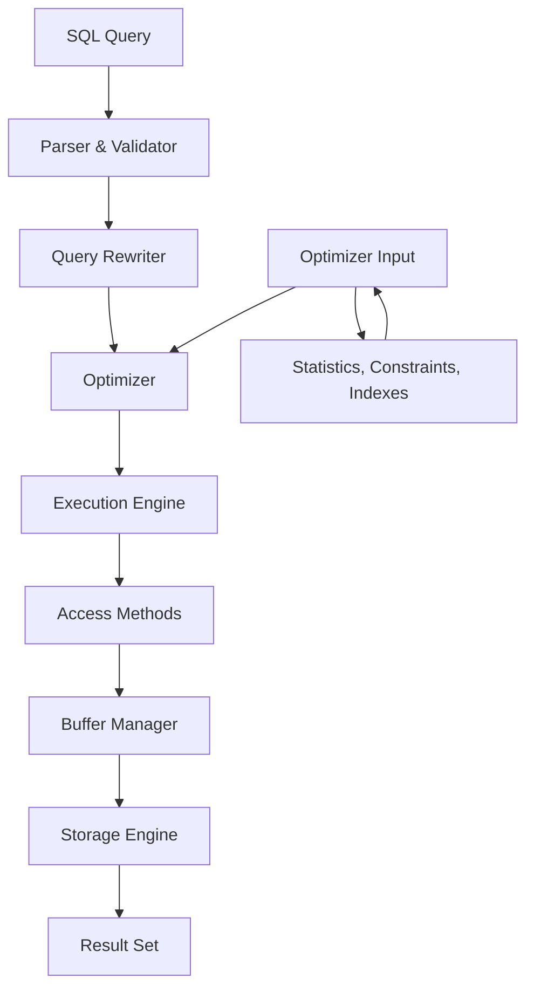

# Performance Tuning

**Level:** Advanced  
**Time Estimate:** 50 minutes  
**Prerequisites:** Basic SQL, query optimization, execution plans.

## TL;DR
Performance tuning is the process of optimizing database systems and queries to achieve maximum speed and efficiency. This involves analyzing query execution plans, creating appropriate indexes, optimizing table structures, and configuring database settings.

## Learning Objectives
By the end of this lesson, you'll be able to:
- Analyze query execution plans to identify performance bottlenecks
- Create and optimize database indexes for better query performance
- Identify and resolve common performance issues
- Optimize queries using best practices
- Configure database settings for optimal performance

## Motivation & Real-World Scenario
An e-commerce website was experiencing slow page loads and timeouts during peak hours. Queries that took seconds during development took minutes in production. By implementing proper indexing, query optimization, and configuration tuning, response times improved from minutes to under a second, increasing customer satisfaction and sales.

## Theory: Query Execution and Performance

### Query Execution Process

Understanding how the database executes queries is crucial for optimization:



### Execution Plan Analysis

The execution plan shows how the database will execute your query. Key components include:
- **Sequential Scan**: Reading entire table row by row
- **Index Scan**: Using an index to find rows
- **Index Only Scan**: Getting data directly from index without accessing table
- **Bitmap Index Scan**: Using index to identify rows, then retrieving in physical order
- **Hash Join**: Creating hash table for joining
- **Merge Join**: Sorting both tables then joining
- **Nested Loop**: For each row in first table, scan second table

## Worked Examples

### Example 1: Basic Query Performance Analysis

**Poor Performance Query:**
```sql
-- Slow query without index
SELECT * FROM users WHERE email = 'john@example.com';
```

**Execution Plan:**
```
Seq Scan on users (cost=0.00..1833.00 rows=1 width=200)
  Filter: ((email)::text = 'john@example.com'::text)
```

**Solution - Adding Index:**
```sql
CREATE INDEX idx_users_email ON users(email);
```

**Improved Execution Plan:**
```
Index Scan using idx_users_email on users (cost=0.28..8.30 rows=1 width=200)
  Index Cond: ((email)::text = 'john@example.com'::text)
```

### Example 2: Composite Index Optimization

**Scenario: Query with multiple WHERE conditions**
```sql
-- Query frequently filters by status and date
SELECT * FROM orders 
WHERE status = 'pending' 
AND created_date >= '2024-01-01';
```

**Before Index:**
```
Seq Scan on orders (cost=0.00..542.00 rows=50 width=200)
  Filter: ((status)::text = 'pending'::text AND (created_date >= '2024-01-01'::date))
```

**Composite Index Solution:**
```sql
-- Create composite index (order matters!)
CREATE INDEX idx_orders_status_date ON orders(status, created_date);
```

**After Index:**
```
Index Scan using idx_orders_status_date on orders (cost=0.28..4.30 rows=50 width=200)
  Index Cond: ((status)::text = 'pending'::text AND (created_date >= '2024-01-01'::date))
```

### Example 3: Avoiding Full Table Scans

**Inefficient Query:**
```sql
-- Using function in WHERE clause prevents index usage
SELECT * FROM users WHERE EXTRACT(YEAR FROM created_at) = 2023;
```

**Better Approach:**
```sql
-- Use range comparison instead of function
SELECT * FROM users 
WHERE created_at >= '2023-01-01' 
AND created_at < '2024-01-01';
```

## Indexing Strategies

### 1. When to Create Indexes
- Columns frequently used in WHERE clauses
- Foreign key columns
- Columns used in JOIN conditions
- Columns used in ORDER BY clauses
- Columns used in GROUP BY clauses

### 2. When NOT to Create Indexes
- Tables with frequent INSERT/UPDATE/DELETE operations
- Columns with low cardinality (few distinct values)
- Tables that are read infrequently
- Columns that are already covered by other indexes

### 3. Index Types
```sql
-- B-Tree (default): Good for equality and range queries
CREATE INDEX idx_users_name ON users(name);

-- Hash: Good for equality only
CREATE INDEX idx_users_status_hash ON users USING hash(status);

-- Partial: Index with WHERE condition
CREATE INDEX idx_active_users ON users(email) WHERE status = 'active';

-- Expression: Index on computed values
CREATE INDEX idx_lower_email ON users(LOWER(email));

-- Multi-column: For queries with multiple conditions
CREATE INDEX idx_users_status_created ON users(status, created_at);
```

## Query Optimization Techniques

### 1. Avoid SELECT *
```sql
-- Bad: Retrieves all columns
SELECT * FROM users JOIN orders ON users.id = orders.user_id;

-- Good: Only retrieve needed columns
SELECT users.name, users.email, orders.order_date, orders.total 
FROM users JOIN orders ON users.id = orders.user_id;
```

### 2. Use EXISTS vs IN
```sql
-- IN can be slow with large subqueries
SELECT * FROM users WHERE id IN (SELECT user_id FROM orders WHERE status = 'shipped');

-- EXISTS is often more efficient
SELECT * FROM users 
WHERE EXISTS (SELECT 1 FROM orders WHERE orders.user_id = users.id AND status = 'shipped');
```

### 3. Limit Results When Possible
```sql
-- Always use LIMIT when you only need a few records
SELECT * FROM products ORDER BY created_date DESC LIMIT 10;
```

### 4. Optimize JOINs
```sql
-- Start with the most selective table (smallest result set)
-- Use appropriate JOIN types
SELECT u.name, o.order_date, p.name as product_name
FROM orders o
JOIN users u ON o.user_id = u.id
JOIN order_items oi ON o.id = oi.order_id
JOIN products p ON oi.product_id = p.id
WHERE o.status = 'completed';
```

## Performance Monitoring

### Using EXPLAIN and EXPLAIN ANALYZE

**EXPLAIN**: Shows the query plan without executing
```sql
EXPLAIN SELECT * FROM users WHERE email = 'test@example.com';
```

**EXPLAIN ANALYZE**: Executes the query and shows actual vs estimated costs
```sql
EXPLAIN ANALYZE SELECT * FROM users WHERE email = 'test@example.com';
```

**Key Metrics to Watch:**
- **Cost**: Estimated cost (startup_cost..total_cost)
- **Rows**: Estimated number of rows processed
- **Width**: Average row size in bytes
- **Actual vs Estimated**: How accurate the optimizer was

### Common Performance Issues and Solutions

| Issue | Symptom | Solution |
|-------|---------|----------|
| Full Table Scans | High cost, sequential scans | Add appropriate indexes |
| Inefficient JOINs | Nested loop instead of hash/merge | Rewrite query, ensure proper indexes |
| Poor Cardinality Estimation | Actual rows ≠ estimated rows | Update table statistics |
| Lock Contention | Slow transactions | Optimize transaction scope, use row-level locking |

## Database Configuration Tuning

### Memory Settings (PostgreSQL Example)
```sql
-- Shared buffer: Cache for database pages
ALTER SYSTEM SET shared_buffers = '256MB';  -- Typically 25% of RAM

-- Work memory: Memory for operations like sorts
ALTER SYSTEM SET work_mem = '4MB';  -- Per operation

-- Effective cache size: Hint to planner
ALTER SYSTEM SET effective_cache_size = '1GB';  -- 50-75% of RAM
```

### Table Statistics Updates
```sql
-- Update table statistics for better query planning
ANALYZE table_name;

-- Update for specific table
ANALYZE users;

-- Update for all tables
ANALYZE;
```

### Vacuum Operations (PostgreSQL)
```sql
-- Regular vacuum to reclaim space
VACUUM table_name;

-- Analyze and vacuum together
VACUUM ANALYZE table_name;

-- Full vacuum (exclusive lock)
VACUUM FULL table_name;  -- Use with caution
```

## Performance Tuning Checklist

### Query Level
- [ ] Use specific columns instead of SELECT *
- [ ] Add appropriate WHERE clauses to limit results
- [ ] Use indexes on frequently queried columns
- [ ] Avoid functions in WHERE clauses
- [ ] Use LIMIT when appropriate
- [ ] Check execution plans with EXPLAIN

### Schema Level
- [ ] Normalize appropriately (but denormalize where needed for performance)
- [ ] Use appropriate data types
- [ ] Add foreign key constraints
- [ ] Create proper indexes
- [ ] Partition large tables

### Database Level
- [ ] Configure memory settings appropriately
- [ ] Set up proper backup and maintenance schedules
- [ ] Update statistics regularly
- [ ] Monitor performance metrics

## Quick Checklist / Cheatsheet

- **Index First**: Add indexes to frequently queried columns
- **EXPLAIN Always**: Check execution plans before and after changes
- **SELECT Specific**: Retrieve only needed columns
- **WHERE Selective**: Use selective conditions first
- **JOIN Efficient**: Use appropriate JOIN strategies
- **LIMIT Results**: Use LIMIT for queries that don't need all results
- **ANALYZE Regularly**: Update statistics for accurate planning

## Exercises

1. **Easy**: Analyze the execution plan for a slow query and suggest an index.
2. **Medium**: Optimize a query that joins 3-4 tables with multiple WHERE conditions.
3. **Hard**: Design a performance tuning strategy for a high-traffic e-commerce database.

## Notes: Advanced Performance Considerations

- Consider read replicas for read-heavy applications
- Use connection pooling to reduce connection overhead
- Implement partitioning for very large tables
- Monitor query patterns to understand optimization needs
- Consider using materialized views for complex aggregations
- Plan for maintenance windows for heavy optimization tasks

## Next Steps

- Learn about database partitioning strategies
- Study advanced indexing techniques (covering indexes, etc.)
- Explore query optimization in different database systems
- Practice performance tuning on real-world datasets